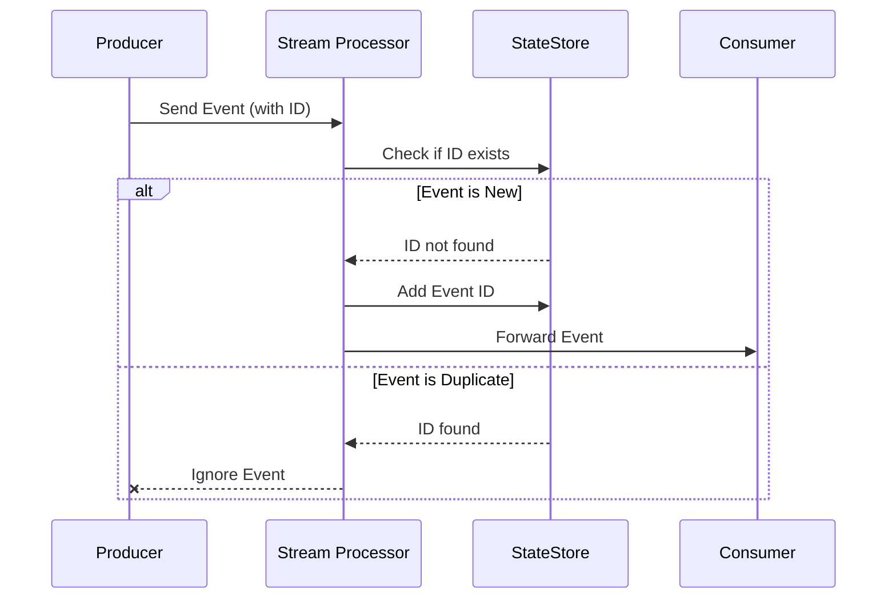

## Description
Duplicate event detection is critical in stream processing systems to ensure that repeated events are identified and managed appropriately to avoid erroneous processing. This pattern is essential for maintaining data integrity and consistency in systems that might encounter retries, network glitches, or any form of accidental re-emission of events.

## Architectural Approach
The architectural approach to duplicate event detection involves creating systems capable of recognizing patterns or identifiers unique to each event. Typically, this involves:

1. **Stateful Stream Processing**: Maintaining a state across streams to identify previously processed records. Tools like Apache Flink or Kafka Streams provide functionalities to handle stateful processing.

2. **Event ID Tracking**: Assigning unique identifiers (UUIDs or timestamps) to events to distinguish between distinct occurrences. You can store these identifiers in a distributed cache or database to keep track of processed events.

3. **Windowing Mechanisms**: Implementing time or count-based windows to process streams. These windows help in setting boundaries for evaluating repeated events within a specific time frame or quantity.

4. **Checkpointing**: Regularly persist the state to provide system recovery in case of failures—minimizing loss or duplication from restarted processes.

## Example Code
Here's an example of using Kafka Streams to detect and filter duplicate events based on a unique event ID.

```java
StreamsBuilder builder = new StreamsBuilder();
String inputTopic = "event-input";
String outputTopic = "event-output";

KStream<String, String> eventStream = builder.stream(inputTopic);

eventStream
    .filter((key, value) -> !isDuplicate(key, value))
    .to(outputTopic);

private boolean isDuplicate(String key, String value) {
    boolean isDuplicate = false;
    // Logic to check if event ID is already processed
    // Possibly by querying a database or state store
    return isDuplicate;
}

// Configuration and start for Kafka Stream
```

## Diagrams

### Sequence Diagram



## Related Patterns

- **Idempotent Receiver**: Ensures that processing a message more than once does not affect the system.
- **Out-of-Order Event Handling**: Manage and reorder events that arrive out-of-sequence.
- **CQRS for Streaming**: Separates reading and writing data paths to handle concurrent data streams efficiently.

## Additional Resources

- [Kafka Streams Documentation](https://kafka.apache.org/documentation/streams/)
- [Stateful Stream Processing with Flink](https://ci.apache.org/projects/flink/flink-docs-stable/dev/stream/state/state.html)
- [Event Sourcing and CQRS](https://martinfowler.com/eaaDev/EventSourcing.html)

## Summary
Duplicate Event Detection is an integral part of stream processing patterns. By implementing tracking and filtering mechanisms, systems can ensure robust operations free from inaccuracies due to event duplication. Tools like Kafka and Flink, combined with best practices for state management, provide the necessary capabilities to design reliable and effective processing architectures in real-time data ecosystems.
