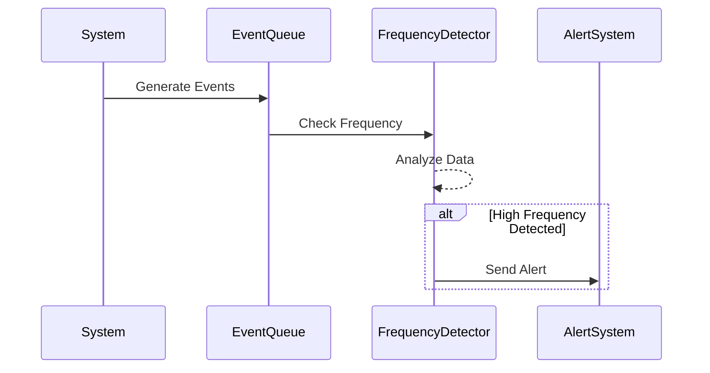

## Frequency Analysis Design Pattern

### Overview

The Frequency Analysis design pattern involves monitoring the frequency of specific events within a system over time. This stream processing design pattern is used to detect anomalies or sudden changes which could be indicative of a problem or area needing attention. It is widely used in applications related to cybersecurity, performance monitoring, health diagnostics, and more.

### Detailed Explanation

In Frequency Analysis, the focus is on understanding the count or rate of occurrence of certain events, messages, or actions, and promptly reacting to deviations from the norm.

#### Key Concepts

- **Event Frequency**: The number of times an event occurs within a given timeframe. This count is compared against historical averages or thresholds.
- **Anomaly Detection**: Identifying patterns in data that do not conform to expected behavior. For instance, a spike in login attempts could suggest a brute force attack.
- **Threshold Alarms**: Predefined limits that, when exceeded, trigger alerts or automated actions.

### Architectural Approaches

1. **Batch Processing vs. Stream Processing**: 
   - **Batch Processing** relies on accumulating data over a period and processing it at once. Useful for retrospective analysis but unsuitable for real-time detection.
   - **Stream Processing** allows for real-time detection by processing data as it flows through the system.

2. **Use of Windowing in Stream Processing**: By dividing the data into manageable windows (e.g., tumbling, sliding, or session windows), event frequency can be gauged over short, impactful periods.

3. **Cluster Analysis**: Determines typical behavior patterns, helping to set dynamic thresholds and recognize anomalies.

### Best Practices

- **Set Appropriate Thresholds**: Develop baselines through historical data to establish what normal frequency patterns look like.
- **Real-time Feedback Loops**: Implement mechanisms for rapid alerting and response to anomalies detected by the system.
- **Scalability**: Ensure the system can handle varying loads without significant degradation in performance.
- **Visualization Tools**: Use dashboards to provide intuitive real-time and historical views of frequency trends.

### Example Code

Below is a simplified example in Scala using Apache Kafka and Kafka Streams to implement a frequency analysis check:

```scala
import org.apache.kafka.streams.KafkaStreams
import org.apache.kafka.streams.StreamsBuilder
import org.apache.kafka.streams.kstream.KStream
import org.apache.kafka.streams.kstream.TimeWindows
import org.apache.kafka.streams.kstream.Materialized

object FrequencyAnalysisApp {
  def main(args: Array[String]): Unit = {
    val builder = new StreamsBuilder()
    val events: KStream[String, String] = builder.stream("events-topic")
    val frequencyAnalysis = events
      .groupByKey()
      .windowedBy(TimeWindows.ofSizeWithNoGrace(Duration.ofMinutes(1)))
      .count()(Materialized.as("frequency-analysis-store"))

    // Analyze the frequency count and set alerts
    frequencyAnalysis.toStream.foreach((windowed, count) => {
      if (count > 100) {
        println(s"Alert: High frequency detected for ${windowed.key()}")
      }
    })

    val streams = new KafkaStreams(builder.build(), MyKafkaConfig)
    streams.start()
  }
}
```

### Diagrams

Here is a Mermaid sequence diagram illustrating a simplified flow of frequency analysis in action:



### Related Patterns

- **Event Sourcing**: Storing all changes to an application state as a sequence of events.
- **Complex Event Processing**: Combining data from multiple sources to infer complex patterns.

### Additional Resources

- [Understanding Stream Processing](https://www.oreilly.com/library/view/stream-processing-with/9781789342838/)
- [Apache Kafka Documentation](https://kafka.apache.org/documentation/streams/)
- [Real-time Event Processing Patterns](https://martinfowler.com/articles/201701-event-driven.html)

### Summary

Frequency Analysis is essential in monitoring applications by evaluating event occurrences to detect and respond to abnormal activities promptly. This design pattern is critical for proactive anomaly detection in cyber-security, fraud detection, and performance monitoring scenarios. It emphasizes real-time processing, dynamic thresholding, and fast incident response.
