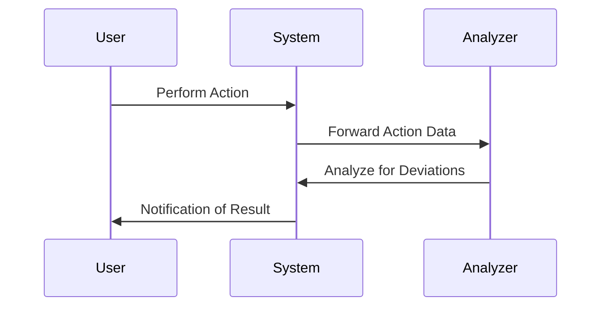

## Introduction

Behavioral Pattern Analysis is a critical design pattern within the realm of stream processing. It focuses on monitoring and interpreting user behavior to flag significant deviations that could suggest changes in user interest or potential threats such as fraud. For example, an e-commerce platform might use this pattern to notice when an electronics shopper suddenly turns to financial services, indicating either a new interest or a security breach.

## Detailed Explanation

In the era of big data, processing user actions in real-time to detect behavioral shifts can provide businesses with actionable insights. Behavioral Pattern Analysis enables organizations to react promptly to changes, offer personalized services, and mitigate risks.

### Core Components

1. **Data Collection**: Aggregate real-time data from various sources, such as web browsers, mobile apps, and transaction systems.

2. **Pattern Recognition**: Use machine learning models to establish typical behavioral patterns from historical data.

3. **Deviation Detection**: Implement algorithms to detect deviations from established patterns. This could involve statistical methods or more advanced techniques like anomaly detection models using neural networks.

4. **Response Mechanism**: Define procedures for handling detected deviations, ranging from sending alerts to automatically adjusting system operations.

## Architectural Approaches

### Streaming Architecture

Implement a streaming architecture to handle continuous data flow, using tools like Apache Kafka or Amazon Kinesis. These platforms allow for near real-time processing and pattern recognition, essential for timely Behavioral Pattern Analysis.

### Model Serving

Deploy machine learning models on platforms like TensorFlow Serving or Databricks for efficient prediction and anomaly detection. This ensures the system can assess user behaviors against expected patterns swiftly.

### Scalable Databases

Use NoSQL databases like MongoDB or Cassandra for storing ongoing and historical user behavior data, allowing efficient querying and analysis.

## Best Practices

- **Real-time Data Processing**: Leverage stream processing frameworks like Apache Flink or Apache Spark Streaming to achieve low-latency data handling.

- **Adaptive Learning**: Continuously update machine learning models with new data to adjust to evolving user behaviors.

- **Security and Privacy**: Ensure that user data is handled in compliance with relevant data protection regulations like GDPR to maintain user trust.

## Example Code

```scala
import org.apache.flink.streaming.api.scala._
import org.apache.flink.streaming.api.windowing.time.Time

// Define a simple data stream processing job to detect behavior deviations
case class UserAction(userId: String, actionType: String, amount: Double, timestamp: Long)

object BehavioralPatternAnalysis {

  def main(args: Array[String]): Unit = {
    val env = StreamExecutionEnvironment.getExecutionEnvironment

    val actions: DataStream[UserAction] = // Assume this stream is initialized with user actions

    val deviationThreshold = 1000.00

    val deviatedActions = actions
      .keyBy(_.userId)
      .timeWindow(Time.minutes(5))
      .reduce((action1, action2) => 
        if (Math.abs(action1.amount - action2.amount) > deviationThreshold) {
          println(s"Deviation detected for user: ${action1.userId}")
          action2
        } else action2
      )

    env.execute("Behavioral Pattern Analysis")
  }
}
```

## Diagrams



## Related Patterns

- **Anomaly Detection**: Similar focus on identifying deviations but applied broadly across various domains.
- **Event Stream Processing**: Deals with processing streams of data by understanding and reacting to events.

## Additional Resources

- [Apache Kafka Documentation](https://kafka.apache.org/documentation/)
- [Flink: Scalable Stream and Batch Data Processing](https://flink.apache.org/)
- [AWS Streaming Data Solutions](https://aws.amazon.com/streaming-data/)

## Summary

Behavioral Pattern Analysis leverages advanced data processing and machine learning techniques to identify significant changes in individual user behavior. By employing state-of-the-art streaming architectures and data handling practices, businesses can not only detect anomalies and trends efficiently but also respond to them effectively, enhancing decision-making capabilities and operational security.
