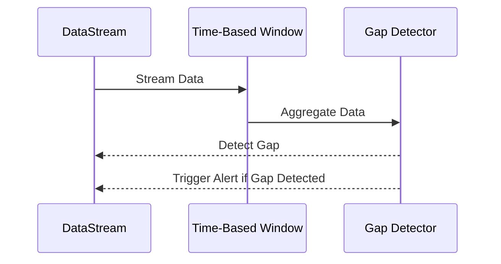

## Introduction

In the realm of stream processing and real-time data analysis, it is crucial to continuously monitor data streams to ensure that data is arriving as expected. The Time Gap Detection pattern is designed to identify unexpected gaps in event occurrences, which can indicate potential issues such as system failures, communication breakdowns, or anomalies in operation.

## Problem Statement

In highly distributed applications or systems where data is streamed in real-time, maintaining the expected frequency of data reporting is critical. A sudden lapse in data reporting might signal issues that require immediate attention. Traditional methods might not be effective in promptly identifying these gaps, especially in systems with high data throughput.

## Solution

Implement the Time Gap Detection pattern to monitor data streams effectively. Here’s how it works:

- **Establish Thresholds**: Define expected intervals for data events.
- **Monitor Streams**: Use a stream processing framework such as Apache Kafka Streams or Apache Flink to continuously monitor incoming data.
- **Detect Gaps**: Employ time-based window operators to detect gaps exceeding predefined thresholds.
- **Trigger Alerts**: Notify stakeholders or trigger automated remediation actions when anomalous gaps are detected.

### Example Code

#### Apache Kafka Streams Example

```java
StreamsBuilder builder = new StreamsBuilder();
KStream<String, Event> eventsStream = builder.stream("events-topic");

KStream<String, Event> gapsDetectedStream = eventsStream
    .groupByKey()
    .windowedBy(TimeWindows.of(Duration.ofMinutes(1)))
    .aggregate(
        () -> new EventAccumulator(),
        (aggKey, newEvent, agg) -> agg.add(newEvent),
        Materialized.with(Serdes.String(), EventAccumulatorSerde())
    )
    .toStream()
    .filter((windowedKey, accumulator) -> accumulator.detectGap());

gapsDetectedStream.to("gaps-detected-topic", Produced.with(Serdes.String(), /* Event Serde */ Serdes.String()));
```

### Example Code Explained

- **eventsStream**: Captures the incoming data stream from a topic.
- **TimeWindows**: Defines a time window of one minute to monitor the event frequency.
- **Aggregate**: Accumulates events within the defined time window.
- **Filter**: Checks if the data gap condition is met and passes the event downstream.
  
## Diagrams

Here is a simple Mermaid diagram illustrating the Time Gap Detection process:



## Related Patterns

- **Change Data Capture**: Capture changes to data within the system to monitor changes over time.
- **Data Enrichment**: Enhance incoming streams with additional contextual data to make more informed gap-detection decisions.
- **Event Sourcing**: Use past events to understand the state and behavior of the system, aiding in interpreting gaps.

## Best Practices

- **Fine-Tuning**: Configure time windows and thresholds after analyzing historical data and system behavior to minimize false positives and misses.
- **Scalability**: Design your system to handle varying loads by leveraging scalable platforms like Apache Kafka and Kubernetes.
- **Alert Mechanisms**: Integrate with alert systems such as PagerDuty or ServiceNow for effective response to detected gaps.

## Additional Resources

- [Stream Processing with Apache Kafka](https://kafka.apache.org/documentation/streams/)
- [Real-Time Processing with Apache Flink](https://ci.apache.org/projects/flink/flink-docs-release-1.13/)
- [Building Fault-Tolerant Stream Processing Applications](https://www.confluent.io/stream-processing-101)

## Summary

The Time Gap Detection pattern is essential for systems that depend on continuous real-time data streams. By implementing effective time-based monitoring, systems can identify and respond to unexpected occurrences in data transmission, ensuring system reliability and performance.
