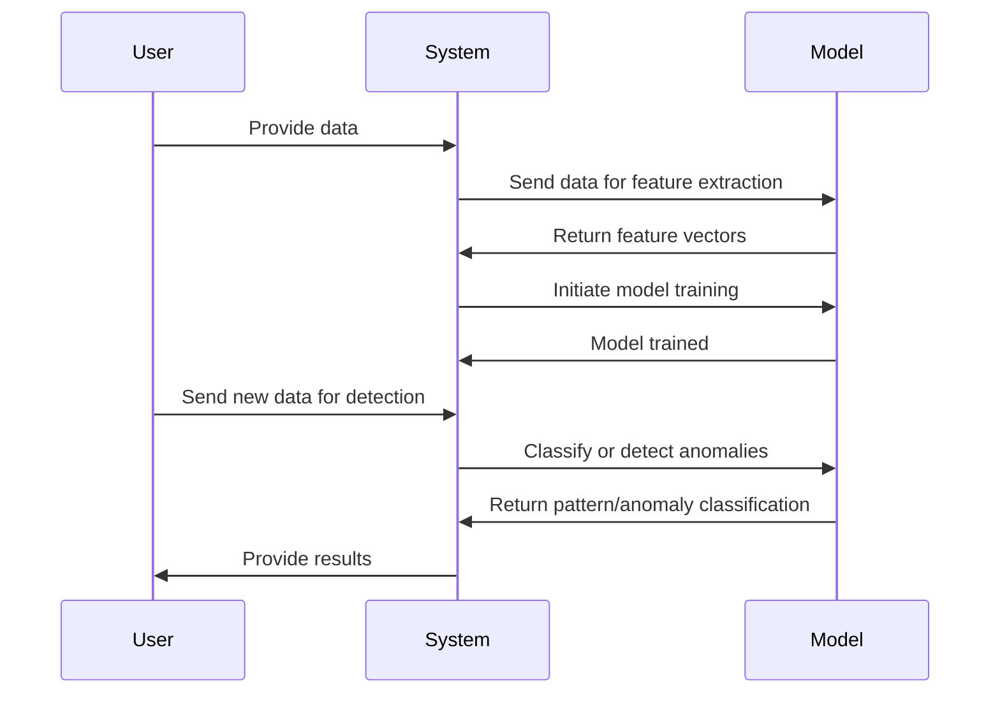

## Description

Statistical Pattern Recognition refers to the process of classifying data based on probabilistic statistical models. This method is employed extensively in identifying both structured patterns and deviations, such as anomalies, in datasets. The underlying principle is to leverage statistical computations and models to estimate the likelihood of data fitting into predefined classes or distributions. A common application of this pattern is detecting unusual traffic behaviors in network systems by applying Gaussian models.

## Architectural Approaches

1. **Feature Extraction**: Begin by transforming raw data into a feature vector that's both descriptive and discriminative. The selected features should capture the critical aspects of the data relevant to the pattern recognition task.
   
2. **Model Selection**: Choose a suitable statistical model. Common models include Gaussian distributions, Hidden Markov Models (HMM), and Support Vector Machines (SVM). Gaussian models are particularly effective for anomaly detection due to their simplicity and robustness in modeling normal distributions of data.

3. **Training and Calibration**: Train the model using historical data. This phase includes parameter estimation where you refine your model's parameters such that they best fit the training data. Methods like Maximum Likelihood Estimation (MLE) or Bayesian estimation are often used.

4. **Detection and Classification**: Use the trained model to classify data into predefined patterns or to flag deviations as anomalies. For instance, in Gaussian anomaly detection, data points that deviate significantly from the mean of the Gaussian distribution can be classified as anomalies.

## Best Practices

- **Data Quality**: Ensure high-quality and relevant data is used for training to improve the accuracy and generalization of the model.
- **Parameter Tuning**: Regularly tune parameters and validate models with new data to maintain model performance over time.
- **Model Evaluation**: Use techniques like cross-validation and ROC curves to assess model performance.
- **Real-time Processing**: Implement techniques like sliding windows or incremental learning to support real-time data streams.

## Example Code

Here's a simplistic Python example using a Gaussian model for anomaly detection:

```python
import numpy as np
from sklearn.covariance import EllipticEnvelope

np.random.seed(0)
X = 0.3 * np.random.randn(100, 2)
X_train = np.r_[X + 2, X - 2]
X_test = np.random.randn(20, 2)

cov = EllipticEnvelope().fit(X_train)

anomalies = cov.predict(X_test)
print("Detected anomalies: ", anomalies)
```

## Diagrams

Below is a simple Mermaid sequence diagram to depict the workflow of statistical pattern recognition:



## Related Patterns

- **Anomaly Detection Patterns**: Focuses specifically on identifying unusual deviations within datasets using various criteria beyond statistical metrics.
- **Data Transformation Patterns**: Focuses on transforming raw data into formats suitable for further analysis or processing, often serving as a precursor to pattern recognition.

## Additional Resources

1. [Pattern Recognition and Machine Learning by Christopher M. Bishop](https://www.springer.com/gp/book/9780387310732)
2. [The Elements of Statistical Learning by Trevor Hastie, Robert Tibshirani, and Jerome Friedman](https://web.stanford.edu/~hastie/ElemStatLearn/)

## Summary

Statistical Pattern Recognition is a cornerstone of data science that utilizes statistical models to identify patterns and anomalies. While effective, the power of this pattern lies in its ability to generalize across different datasets and applications, such as network anomaly detection using Gaussian models. Employing this pattern involves feature extraction, model selection, training, and real-time detection for successful application in domains relying on reliable pattern identification and anomaly detection.
