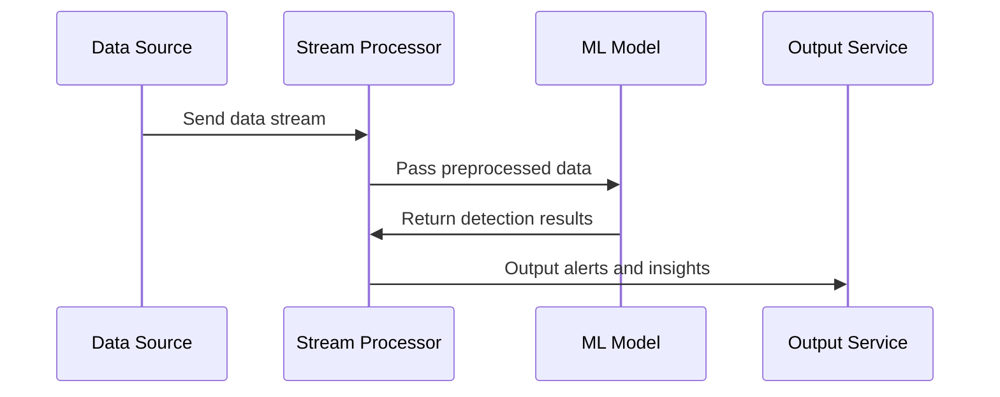

## Machine Learning-Based Detection

### Description

Machine Learning-Based Detection leverages machine learning models to identify intricate and often hidden patterns within data streams. By employing algorithms such as clustering, regression, and neural networks, this pattern uncovers insights and anomalies that traditional rule-based systems might miss. This is particularly useful in applications where flexibility and adaptability to evolving data trends are crucial.

### Example

Consider a retail company seeking to uncover unusual customer behaviors that might indicate fraud or emerging buying trends. By employing clustering algorithms, such as K-Means or DBSCAN, the company can automatically group similar purchasing patterns and flag those that deviate significantly as potentially suspicious or worth further investigation.

### Architectural Approaches

- **Supervised Learning**: Models are trained on labeled datasets to detect known patterns and predict future behavior.
- **Unsupervised Learning**: Algorithms explore the data without predefined labels to find naturally occurring patterns or anomalies.
- **Semi-Supervised Learning**: Combines labeled and unlabeled data to improve model performance when labeled data is sparse.
- **Reinforcement Learning**: Utilizes agents that learn optimal detections based on feedback from the environment.

### Best Practices

- **Feature Engineering**: Carefully select and transform relevant features to improve model accuracy and reliability.
- **Continuous Learning**: Regularly update models with new data to maintain accuracy over time.
- **Scalable Infrastructure**: Utilize scalable platforms (e.g., Apache Kafka, Apache Flink) for processing large volumes of streaming data in real-time.
- **Data Quality and Preprocessing**: Ensure data integrity and perform preprocessing steps such as normalization or outlier removal to enhance detection quality.

### Example Code

Here's a basic example of implementing a clustering algorithm using Python's `scikit-learn` library:

```python
from sklearn.cluster import KMeans
import numpy as np

customer_data = np.array([
    [5, 3], [10, 15], [24, 10], [30, 22],
    [85, 70], [71, 80], [60, 78], [55, 52]
])

kmeans = KMeans(n_clusters=2)
kmeans.fit(customer_data)

print("Cluster centers:\n", kmeans.cluster_centers_)
print("Cluster labels:", kmeans.labels_)
```

### Diagrams

#### UML Sequence Diagram



### Related Patterns with Descriptions

- **Event-Driven Architecture**: Facilitates real-time processing where application components respond to events, integrating seamlessly with ML-based detections.
- **Lambda Architecture**: Combines batch processing and real-time streaming, allowing ML models to process and learn from data in both modes.
- **CQRS (Command Query Responsibility Segregation)**: Distinguishes command (mutation) from query (read) models to optimize performance and effectiveness of ML processes.

### Additional Resources

- **Books**: "Hands-On Machine Learning with Scikit-Learn, Keras, and TensorFlow" by Aurélien Géron.
- **Videos**: "Real-Time Data Processing and Machine Learning" by various tech conferences on YouTube.
- **Courses**: Coursera and Udacity offer robust online courses on real-time machine learning and data stream processing.

### Summary

Machine Learning-Based Detection in stream processing enhances the ability to visualize and react to complex data patterns in real-time. This pattern's adaptability makes it perfect for applications demanding rapid, intelligent responses to incoming data streams, and its integration with scalable architectures unlocks a wide spectrum of potential use cases ranging from fraud detection to dynamic personalization and beyond. By leveraging continuous learning and real-time data processing, organizations can remain agile and insightful amidst ever-changing market demands and opportunities.
