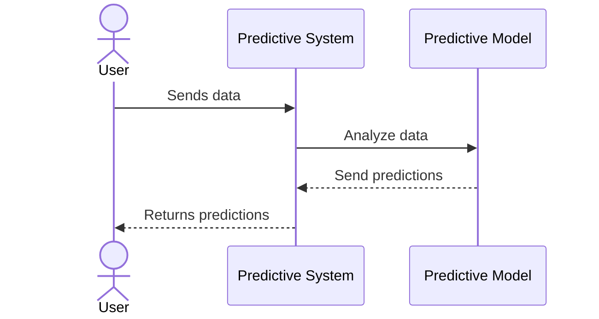

## Introduction to Predictive Analytics

Predictive Analytics is a method used to make forecasts about future events by analyzing patterns in historical data. It combines various techniques from statistics, modeling, machine learning, and data mining to process data and construct predictive models.

In the context of stream processing design patterns, predictive analytics plays a pivotal role in real-time processing and decision making, especially when dealing with continuous data streams.

## Key Components

1. **Data Collection**: Gather data from various sources, including historical databases and streaming input from IoT devices, logs, etc.
2. **Data Preprocessing**: Cleanse and transform raw data into a suitable format for analysis. This stage involves data validation, normalization, and feature extraction.
3. **Modeling**: Apply machine learning algorithms to build predictive models. Common methods include regression analysis, time-series analysis, neural networks, and decision trees.
4. **Validation**: Ensure model accuracy using techniques like cross-validation and holdout sample testing.
5. **Deployment**: Implement models into a production environment to generate predictions in real time.

## Architectural Approaches

- **Model Training Pipeline**: Batch process historical data to train models periodically, leveraging distributed computing platforms like Apache Spark or TensorFlow for large-scale data processing.
  
- **Real-Time Prediction Service**: Utilize online learning algorithms that continuously update the model as new data streams in. Platforms such as Apache Kafka Streams, Apache Flink, or Apache Samza can provide the necessary infrastructure.

- **Hybrid Systems**: Implement a mix of batch and stream processing to leverage the strengths of both approaches, optimizing resource utilization and prediction accuracy.

## Best Practices

- **Feature Engineering**: Invest significant effort in feature engineering to enhance prediction accuracy; select and transform relevant variables carefully.

- **Model Tuning**: Regularly tune hyperparameters of machine learning models to maintain optimal performance.

- **Scalability**: Ensure the system is scalable to handle data volume growth, spikes in data rates, and model complexity.

- **Monitoring**: Continuously monitor prediction results to detect model drift and promptly retrain models as necessary.

## Example Code

Here is a basic example using Python and Scikit-Learn to create a predictive model.

```python
from sklearn.model_selection import train_test_split
from sklearn.linear_model import LinearRegression
import pandas as pd

data = pd.read_csv('historical_data.csv')

X = data.drop('target', axis=1)
y = data['target']

X_train, X_test, y_train, y_test = train_test_split(X, y, test_size=0.3, random_state=42)

model = LinearRegression()
model.fit(X_train, y_train)

predictions = model.predict(X_test)
```

## Diagrams

### Sequence Diagram



## Related Patterns

- **Event Sourcing**: Capture immutable sequences of event history for retrospective predictions.
- **CQRS (Command Query Responsibility Segregation)**: Split data handling into operations that mutate data and those that query, optimizing performance.

## Additional Resources

- [Predictive Analytics with TensorFlow](https://www.tensorflow.org/guide/)
- [Stream Processing with Apache Kafka](https://kafka.apache.org/documentation/streams/)

## Summary

Predictive Analytics in stream processing design patterns facilitates foresight by deriving insights from historical data in real-time. Employing predictive models can significantly enhance decision-making processes, optimize resource utilization, and minimize operational risks. With the right blend of technology and methodology, predictive analytics becomes an indispensable tool for modern data-driven enterprises.
