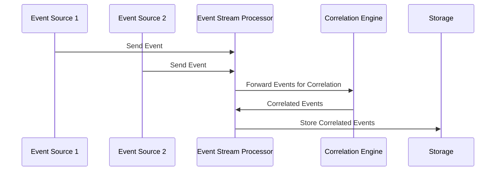

## Introduction

Event Correlation is a design pattern commonly used in event-driven architectures and stream processing systems. It involves linking events from various sources to detect complex patterns, derive insights, or identify anomalies. This pattern is particularly useful in environments where the sheer volume of events can make it challenging to identify underlying trends or issues.

## Architectural Approach

Event correlation systems are usually composed of several components:

1. **Event Collectors**: These are responsible for gathering data from various sources such as logs, APIs, sensors, etc.

2. **Event Stream Processor**: This component processes and analyzes streams of events in real-time, looking for specific patterns or correlations between events.

3. **Correlation Engine**: This is the core component where the actual correlation logic is implemented. It applies rules or algorithms to associate related events.

4. **Storage and Reporting**: After identifying correlated events, data is stored in a database for further analysis and reporting purposes.

## Example Code

Here's a simple example using a stream processing library like Apache Kafka Streams in Java to demonstrate event correlation:

```java
import org.apache.kafka.streams.KafkaStreams;
import org.apache.kafka.streams.StreamsBuilder;
import org.apache.kafka.streams.kstream.KStream;

public class EventCorrelationExample {

    public static void main(String[] args) {
        StreamsBuilder builder = new StreamsBuilder();
        KStream<String, String> sourceStream = builder.stream("event-input-topic");

        // Event correlation processing
        KStream<String, String> correlatedStream = sourceStream
            .filter((key, value) -> value.contains("click"))
            .join(sourceStream,
                (clickValue, apiValue) -> "Correlated Event: " + clickValue + " and " + apiValue,
                JoinWindows.of(Duration.ofMinutes(5)),
                Joined.with(Serdes.String(), Serdes.String(), Serdes.String())
            );

        correlatedStream.to("event-output-topic");

        KafkaStreams streams = new KafkaStreams(builder.build(), getConfig());
        streams.start();
    }

    private static Properties getConfig() {
        Properties props = new Properties();
        props.put(StreamsConfig.APPLICATION_ID_CONFIG, "event-correlation-app");
        props.put(StreamsConfig.BOOTSTRAP_SERVERS_CONFIG, "localhost:9092");
        props.put(StreamsConfig.DEFAULT_KEY_SERDE_CLASS_CONFIG, Serdes.String().getClass());
        props.put(StreamsConfig.DEFAULT_VALUE_SERDE_CLASS_CONFIG, Serdes.String().getClass());
        return props;
    }
}
```

## Diagram

Here is a simplified MermaID sequence diagram showing the process flow of events through an event correlation system:



## Related Patterns

- **Event Sourcing**: Captures and stores all changes to the application state as a sequence of events.
- **CQRS (Command Query Responsibility Segregation)**: A design pattern that separates read and write operations in event-driven architectures.
- **Complex Event Processing (CEP)**: A method of tracking and analyzing streams of data about events to derive patterns and correlations.

## Additional Resources

- [Apache Kafka](https://kafka.apache.org/): A distributed event streaming platform.
- [Apache Flink](https://flink.apache.org/): Another robust option for stream processing and event correlation.
- [AWS EventBridge](https://aws.amazon.com/eventbridge/): Can be used to build event-driven architectures on AWS.

## Summary

Event Correlation is a critical pattern for analyzing and understanding behaviors in systems that produce large volumes of event data. By associating related events across different sources, organizations can detect complex patterns, troubleshoot issues, and make data-driven decisions to improve system performance and user experience.
