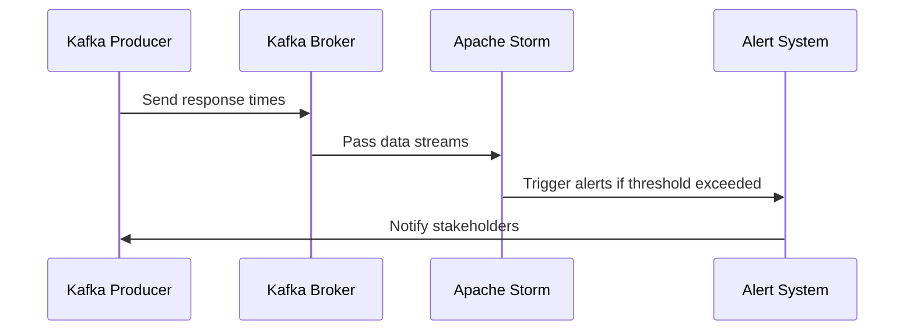

## Description

Real-time monitoring is a design pattern centered around the continuous observation of system health or performance metrics. This proactive approach is crucial for maintaining the smooth operation of systems by ensuring immediate response to anomalies, such as performance degradation or unexpected behavior. In an environment where rapid detection and resolution of issues are critical, real-time monitoring provides visibility into application layers, infrastructure components, and network fluency.

The primary goal is to facilitate immediate corrective actions and maintain service level agreements (SLAs) by detecting and addressing issues as they arise.

## Architectural Approaches

Real-time monitoring can be architected using a combination of the following approaches:

- **Streaming Data**: Leveraging frameworks like Apache Kafka, Apache Flink, or Apache Storm to process and analyze data streams in real-time.
- **Event-Driven Architecture**: Implementing mechanisms that react to specific events (e.g., a significant increase in response time or failure rates), emphasizing rapid information flows.
- **Data Pipelines**: Constructing pipelines using tools like Apache NiFi or AWS Kinesis to ingest and process data.
- **Microservices**: Deploying small, independently deployable services that can be monitored individually.
- **Serverless Computing**: Utilizing serverless services from cloud providers (AWS Lambda, Azure Functions) for scalable event processing.

## Best Practices

- **Define Clear Metrics**: Identify key performance indicators (KPIs) and metrics that are critical to business needs.
- **Effective Alerting**: Set threshold-based alerts and notifications to prevent alert fatigue.
- **Scalable Architecture**: Design systems that can handle increasing data volumes without compromising performance.
- **Data Visualization**: Use dashboards to present data in an easily digestible format, facilitating quick insights.
- **Redundancy and Failover**: Ensure that monitoring systems are highly available with failover capabilities to maintain continuous observation.

## Example Code

Here’s a sample implementation of real-time monitoring using Apache Kafka and Apache Storm to monitor web application response times:

### Apache Kafka Producer Configuration
```java
Properties props = new Properties();
props.put("bootstrap.servers", "localhost:9092");
props.put("key.serializer", "org.apache.kafka.common.serialization.StringSerializer");
props.put("value.serializer", "org.apache.kafka.common.serialization.StringSerializer");

Producer<String, String> producer = new KafkaProducer<>(props);
long timestamp = System.currentTimeMillis();
String message = String.format("response_time_%d,%d", timestamp, responseTime);

producer.send(new ProducerRecord<>("responseTimes", "key", message));
producer.close();
```

### Storm Topology for Real-Time Processing
```java
TopologyBuilder builder = new TopologyBuilder();
builder.setSpout("kafka-spout", new KafkaSpout(config));

builder.setBolt("response-time-bolt", new BaseRichBolt() {
    @Override
    public void execute(Tuple input) {
        String[] data = input.getStringByField("value").split(",");
        long responseTime = Long.parseLong(data[1]);
        if (responseTime > THRESHOLD) {
            System.err.println("High response time detected: " + responseTime);
        }
    }
}).shuffleGrouping("kafka-spout");

StormTopology topology = builder.createTopology();
Config conf = new Config();
conf.setDebug(true);

LocalCluster cluster = new LocalCluster();
cluster.submitTopology("real-time-monitoring", conf, topology);
```

## Diagrams

### Real-Time Monitoring Flow



## Related Patterns

- **Circuit Breaker**: Prevents a system from trying to execute an operation likely to fail.
- **Health Check**: Actively or passively measures the health of various application components.
- **Retry Pattern**: Attempts to reestablish connectivity or operation after failure.

## Additional Resources

- [Martin Fowler's Microservices](https://martinfowler.com/microservices/)
- [Apache Kafka Documentation](https://kafka.apache.org/documentation/)
- [Apache Storm Documentation](http://storm.apache.org/releases/current/Documentation.html)

## Summary

Real-time monitoring is a critical design pattern in modern cloud environments to detect, analyze, and address performance and reliability issues on-the-fly. By leveraging stream processing frameworks and implementing robust, scalable architecture patterns, organizations can ensure high availability and adherence to performance standards, ultimately delivering a consistent experience to their users. Embracing best practices and utilizing appropriate architectural patterns can significantly enhance the monitoring capabilities within enterprise systems.
