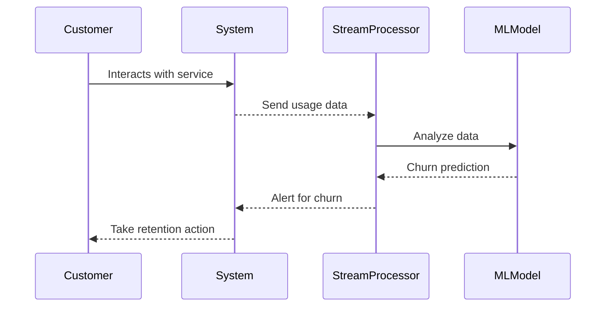

## Introduction

Churn Prediction is a design pattern focused on identifying the likelihood that a customer will cease using a product or service. It plays a crucial role in Customer Relationship Management (CRM), enabling businesses to take proactive measures to retain customers and enhance loyalty.

In the context of stream processing, Churn Prediction involves analyzing real-time data to identify early warning signs of customer churn, such as decreased engagement, reduced usage frequency, or negative feedback. By leveraging machine learning models and data analytics, organizations can predict churn and implement targeted strategies to mitigate it.

## Design Pattern Description

### Components

1. **Data Ingestion**: Collect data from a variety of customer touchpoints including web interactions, mobile app usage, customer service interactions, etc.
2. **Feature Engineering**: Extract relevant features that can aid in identifying churn patterns, such as usage frequency, session duration, purchase history, etc.
3. **Model Training**: Use historical data to train machine learning models capable of predicting churn. Common algorithms include Logistic Regression, Decision Trees, Random Forests, and Neural Networks.
4. **Real-Time Processing**: Implement stream processing tools (e.g., Apache Kafka, Apache Flink) to analyze incoming data in real-time.
5. **Prediction and Alerting**: Deploy models to predict churn in real-time and generate alerts for at-risk customers.

### Workflow

1. **Collect**: Gather data continuously from multiple sources.
2. **Process**: Apply transformations and feature engineering in real-time.
3. **Analyze**: Use trained models to evaluate the likelihood of churn.
4. **Act**: Trigger notifications or automated responses to engage customers who are predicted to churn.

## Example Code

Below is a simplified example using Python and a machine learning model trained with the Scikit-learn library to predict churn:

```python
from sklearn.model_selection import train_test_split
from sklearn.ensemble import RandomForestClassifier
from sklearn.metrics import classification_report
import pandas as pd

data = pd.read_csv('customer_data.csv')

X = data[['feature1', 'feature2', 'feature3']]  # Example features
y = data['churn']  # Target variable

X_train, X_test, y_train, y_test = train_test_split(X, y, test_size=0.2, random_state=42)

model = RandomForestClassifier(n_estimators=100, random_state=42)
model.fit(X_train, y_train)

predictions = model.predict(X_test)

print(classification_report(y_test, predictions))
```

## Diagrams



## Related Patterns with Descriptions

- **Anomaly Detection**: Identifies unusual patterns in data that could indicate potential issues, similar to predicting churn by identifying irregular customer behavior.
- **Event Sourcing**: Captures a series of changes to application state, providing historical insights that aid in understanding customer journeys.
- **Change Data Capture**: Continuously monitors and processes data changes to ensure up-to-date analyses for real-time predictions.

## Additional Resources

- [Predictive Analytics for Customer Insights](https://example.com/predictive-analytics)
- [Stream Processing with Apache Kafka](https://example.com/apache-kafka-streams)
- [Machine Learning for Churn Prediction](https://example.com/ml-churn-prediction)

## Summary

The Churn Prediction design pattern leverages stream processing and machine learning to forecast customer churn, enabling businesses to address potential losses proactively. By integrating real-time data processing with predictive analytics, companies can stay ahead of churn trends and enhance customer retention strategies. This pattern embodies a combination of data engineering, real-time analytics, and machine learning, forming a robust solution for modern CRMs.
