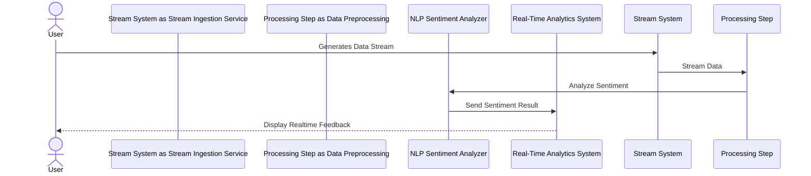

## Introduction

In the realm of stream processing design patterns, Sentiment Analysis stands as a transformative tool, empowering businesses and organizations to analyze textual data streams for sentiment changes. By leveraging machine learning and natural language processing, this pattern can monitor social media feeds or customer reviews to gauge real-time public reaction.

## Design Pattern Overview

Sentiment Analysis in stream processing is the automatic assessment of emotions or opinions within a text stream, such as comments or reviews. For organizations looking to grasp the public mood towards a specific event or product launch, implementing a sentiment analysis system can be instrumental.

### Use Case Example

Consider a company launching a new product. They can extract and analyze data from platforms like Twitter and Facebook to understand the public's immediate reaction. This continuous feedback loop allows the company to address concerns, capitalize on positive sentiment quickly, and adjust strategies on-the-fly.

## Architectural Approaches

### 1. Preprocessing Stream Data

Data is ingested from various sources like social media streams using platforms such as Apache Kafka or Amazon Kinesis. Text data is preprocessed to remove noise (e.g., URLs, special characters) and extract sentiment-relevant features.

### 2. Sentiment Analysis with Machine Learning

Utilize machine learning models such as deep learning and natural language processing (NLP) models (e.g., Bidirectional Encoder Representations from Transformers (BERT), or Long Short-Term Memory networks (LSTM)) to analyze emotional tone and classify sentiment in textual data as positive, negative, or neutral.

### 3. Real-time Monitoring and Response

Architecture can include a dashboard for real-time sentiment monitoring, using tools like Apache Flink or Spark Streaming for processing. Alerts can be configured to notify teams of drastic sentiment changes.

##### Sequence Diagram - Stream Sentiment Analysis

## Best Practices

- **Data Cleaning**: Ensure robust preprocessing to improve accuracy by cleaning and tokenizing text and eliminating irrelevant data.

- **Model Selection**: Choose the right model based on the scale and complexity needed. LSTM and transformer models are recommended for nuanced analysis.

- **Scalability**: Implement your architecture on cloud platforms like AWS or Azure to dynamically handle load fluctuations and ensure high availability.

## Related Patterns

- **Event Stream Processing Pattern**: Complementary in scenarios where sentiment trends need to be correlated with other real-time events.
  
- **Real-Time Dashboard Pattern**: Critical for visualization each sentiment change, offering a holistic view of performance and insights.

## Additional Resources

- [Understanding Sentiment Analysis](https://link.to/resource1)
- [Real-time Analytics with Apache Kafka Streams](https://link.to/resource2)
- [Natural Language Processing for Stream Data](https://link.to/resource3)

## Summary

Sentiment Analysis within the stream processing scope is essential for contemporary businesses desiring to have a finger on the pulse of public sentiment in real time. By architecting a scalable, responsive, and intelligent system focusing on sentiment detection, companies can act quickly based on public perception, maintaining relevancy and enhancing customer experience.
