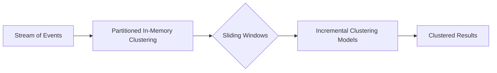

## Clustering Patterns

Clustering patterns is a fundamental design pattern in stream processing where the main goal is to group a series of events or behaviors based on their similarity. The objective is to discern natural groupings within a data set, which are referred to as clusters. This pattern is integral for analyzing vast volumes of data generated in real-time to uncover hidden structures, detect anomalies, or identify natural segments over continuous streams of data.

### Detailed Explanation

At its core, clustering is an unsupervised learning technique used extensively within machine learning and data mining. Unlike classification models that work with labeled datasets, clustering operates on an unlabeled dataset to discover the inherent groupings within the data points. In stream processing, this design pattern becomes crucial because it allows systems to continuously organize data as it arrives in real time, enabling dynamic adaptation to the ongoing influx of data.

#### Key Components:

- **Data Segmentation**: Applies algorithms to partition data dynamically as it streams from IoT devices, logs, social media posts, or other sources.
- **Real-time Analysis**: Provides immediate insights, crucial for time-sensitive applications like fraud detection or network security.
- **Dynamic Adaptation**: Automatically adjusts clusters as new data streams in, ensuring current clustering accuracy.

### Architectural Approaches

1. **Partitioned in-memory clustering**: Utilizes an in-memory data grid or streaming platform like Apache Kafka with Kafka Streams for clustering computations as data predominantly resides in memory.
2. **Sliding or Tumbling Windows**: Applies time-based or count-based windows for clustering intermittent data segments in frameworks like Apache Flink or Apache Spark Streaming.
3. **Incremental Clustering Models**: Employs models that grow incrementally as new data arrives, such as DBSCAN (Density-Based Spatial Clustering of Applications with Noise) adapted for streaming data.

### Best Practices

- Employ efficient data structures such as KD-trees or R-trees to optimize spatial clustering.
- Utilize dimensionality reduction algorithms like PCA (Principal Component Analysis) before clustering to maintain performance with high-dimensional data.
- Regularly validate clustering results against known benchmarks to ensure the effectiveness of dynamic clustering approaches.

### Example Code

```scala
import org.apache.spark.streaming._
import org.apache.spark.streaming.dstream._
import org.apache.spark.mllib.clustering.StreamingKMeans
import org.apache.spark.mllib.linalg.Vectors

// Initialize Streaming Context
val conf = new SparkConf().setMaster("local[2]").setAppName("NetworkClustering")
val ssc = new StreamingContext(conf, Seconds(1))

// Simulated Input Stream for network traffic activity (each entry is a feature vector)
val lines: DStream[String] = ssc.socketTextStream("localhost", 9999)
val parsedData = lines.map(_.split(' ').map(_.toDouble)).map(Vectors.dense)

// Streaming K-Means model
val numClusters = 5
val numDimensions = 3  // Assume 3 features per event
val model = new StreamingKMeans()
  .setK(numClusters)
  .setDecayFactor(1.0)
  .setInitialCenters(Array.fill(numClusters)(Vectors.dense(Array.fill(numDimensions)(0.0))), Array.fill(numClusters)(1.0))

// Train the model on incoming data streams
model.trainOn(parsedData)

// Start and await completion of streaming operations
ssc.start()
ssc.awaitTermination()
```

### Diagrams



### Related Patterns and Concepts

- **Event Sourcing**: Rebuilds the state of clusters by analyzing past events from stored streams.
- **Anomaly Detection Patterns**: Identifies unusual clusters or outliers that do not fit existing groups.
- **CQRS (Command Query Responsibility Segregation)**: Utilized to handle scale and modify cluster update strategies separately from query paths.

### Additional Resources

- [“Mining of Massive Datasets” by Anand Rajaraman](http://www.mmds.org/)
- [Apache Kafka's Documentation on Streams API](https://kafka.apache.org/documentation/streams/)
- [Cluster Algorithms in Machine Learning – IBM](https://developer.ibm.com/articles/clustering-machine-learning/)

### Summary

Clustering Patterns in stream processing provide an effective method for dynamically grouping similar events in real-time, allowing systems to autonomously identify patterns and anomalies across data streams. Leveraging frameworks such as Apache Kafka and Apache Spark Streaming, this pattern harnesses the capability of real-time decision-making, integral for applications where immediate insights are paramount like network security and fraud detection.
