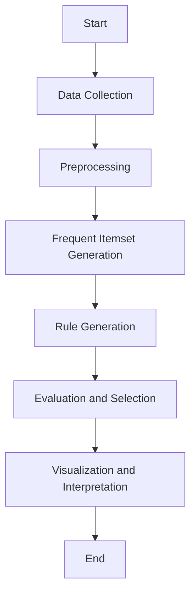

## Overview

Association Rule Mining is a key technique in data mining for discovering interesting relationships, correlations, and associations among a set of items in transactional databases, relational databases, or any data repository. It is widely used in market basket analysis, cross-marketing, catalog design, and other domains.

### Key Concepts

- **Itemsets**: A collection of one or more items. An itemset in the context of market basket analysis could refer to products bought together in a transaction.
- **Support**: A measure of how frequently an itemset appears in the dataset. It is calculated as the proportion of transactions in the dataset that contain the itemset.
- **Confidence**: The likelihood that a rule holds, given the presence of a precursor. It is quantified as the probability of consequent items in transactions containing exactly the precedent items.
- **Lift**: A measure of how much more likely the consequent of a rule is given the antecedent. Lift above 1 suggests positive correlation between antecedent and consequent.

### Architectural Approach

1. **Data Collection**: Gather transactional data from different sources.
2. **Preprocessing**: Clean and transform data into a suitable format. Handle missing values, discretize continuous variables, and encode categorical variables.
3. **Frequent Itemset Generation**: Use algorithms like Apriori or FP-Growth to discover itemsets that meet minimum support threshold.
4. **Rule Generation**: Derive association rules from frequent itemsets based on minimum confidence threshold.
5. **Evaluation and Selection**: Assess rules using metrics like support, confidence, and lift to determine the most interesting and relevant rules.
6. **Visualization and Interpretation**: Present results using visual tools and provide actionable insights.

### Examples

#### Market Basket Analysis
```scala
// Example using a data mining library in Scala

import org.apache.spark.mllib.fpm.FPGrowth
import org.apache.spark.rdd.RDD

val data: RDD[Array[String]] = // Load transactional data

val fpg = new FPGrowth().setMinSupport(0.2).setNumPartitions(10)
val model = fpg.run(data)

model.freqItemsets.collect().foreach { itemset =>
  println(itemset.items.mkString("[", ",", "]") + ": " + itemset.freq)
}

val minConfidence = 0.8
model.generateAssociationRules(minConfidence).collect().foreach { rule =>
  println(
    rule.antecedent.mkString("[", ",", "]") + " => " +
    rule.consequent.mkString("[", ",", "]") + " [conf: " + rule.confidence + ", lift: " + rule.lift + "]"
  )
}
```

### Diagram



### Related Patterns

- **Sequence Pattern Mining**: Focused on discovering sequences of events, not just associations.
- **Data Stream Mining**: Techniques used for mining associations on continuous data streams.

### Additional Resources

- **Books**: "Data Mining: Concepts and Techniques" by Jiawei Han, Micheline Kamber, and Jian Pei.
- **Libraries**: Spark MLlib, Weka, and Scikit-learn for implementing association rule mining.
- **Courses**: Online courses on data mining and machine learning, available on platforms like Coursera and edX.

### Summary

Association Rule Mining is a powerful technique that helps uncover hidden patterns and relationships within data. By focusing on frequent patterns, correlation between items, and generating actionable rules, it plays a crucial role in both strategic decision-making and operational adjustments across various industries.
