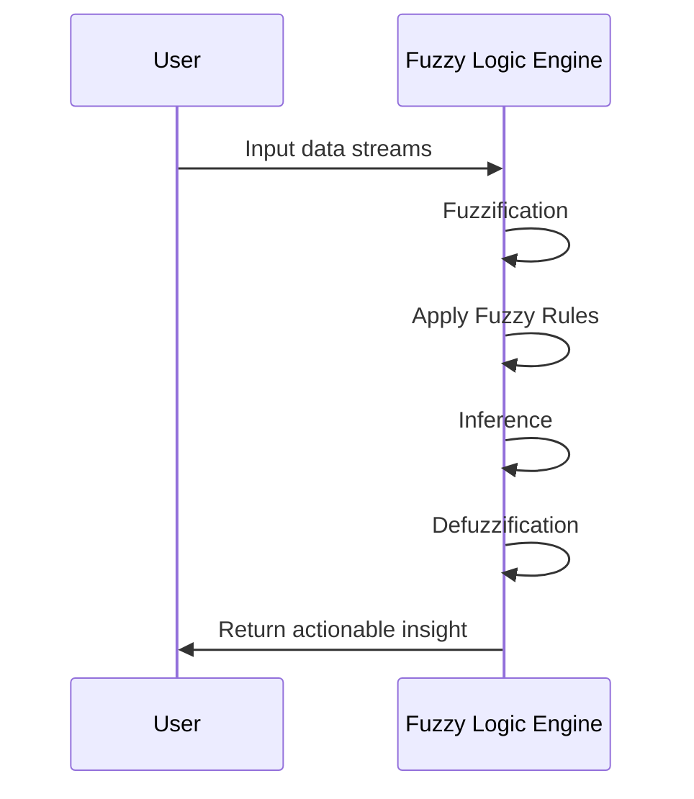

## Fuzzy Logic Patterns

### Overview

Fuzzy Logic Patterns are implemented to manage uncertainty and partial truth in data, making them essential in scenarios where binary true-or-false evaluations are insufficient. This pattern involves the application of fuzzy logic principles within stream processing systems to facilitate more nuanced pattern detection in data characterized by ambiguity.

### Architectural Approach

The architectural approach to implementing Fuzzy Logic Patterns involves:

1. **Defining Fuzzy Sets**: Establishing sets with elements that have degrees of membership, enabling partial truths to be represented numerically between 0 and 1.

2. **Formulating Fuzzy Rules**: Developing rules that mimic human reasoning by evaluating data against fuzzy sets. For example, rules might use linguistic terms like "high", "medium", and "low" to define risk levels.

3. **Fuzzification**: Converting crisp inputs from data streams into degrees of membership by mapping them into fuzzy sets.

4. **Inference**: Applying fuzzy rules to determine the fuzzified input using methods like Mamdani or Sugeno inference models to synthesize information from multiple rules.

5. **Defuzzification**: Translating fuzzy results back into a crisp output, often numeric, to be actionable by systems or decision-makers.

### Example Code

```scala
import org.cloudstream.fuzzy.FuzzyLogicEngine

val transactionAmount = 1500
val accountAgeInDays = 180

val fuzzyLogicEngine = new FuzzyLogicEngine()

fuzzyLogicEngine.addFuzzySet("LowRiskAmount", (0, 500))
fuzzyLogicEngine.addFuzzySet("MediumRiskAmount", (501, 2000))
fuzzyLogicEngine.addFuzzySet("HighRiskAmount", (2001, 10000))

fuzzyLogicEngine.addFuzzyRule(
  "IF Amount IS MediumRiskAmount AND AccountAge IS Short THEN Risk IS Medium"
)

val fuzzyResult = fuzzyLogicEngine.evaluate(
  "Amount" -> transactionAmount,
  "AccountAge" -> accountAgeInDays
)

val crispRiskLevel = fuzzyLogicEngine.defuzzify(fuzzyResult)

println(s"Risk assessment: $crispRiskLevel")
```

### Sequence Diagram



### Related Patterns

- **Complex Event Processing (CEP)**: While Fuzzy Logic Patterns focus on uncertainty, CEP patterns handle real-time event stream processing by defining discrete event conditions or state transitions.

- **Machine Learning Patterns**: These involve training models to predict outcomes with certain probabilities, which can complement the probabilistic aspect of fuzzy logic.

### Best Practices

- **Define Clear Membership Functions**: Critical for accuracy, as this determines how real-world quantities map to fuzzy values.
  
- **Careful Rule Formulation**: Rules should reflect real-world scenarios and capture the nuanced relationships between input parameters.

- **Performance Monitoring**: Continuously evaluate the performance of the fuzzy logic system, especially in real-time stream processing tasks, to ensure efficient processing and correct outputs.

### Additional Resources

- [Fuzzy Logic for Business, Finance, and Decision Making]()
- [Complex Event Processing: Information Flow](https://cep-book.org/)
- [Understanding Fuzzy Logic: Practical Applications and Examples](https://fuzzy-logic-book.org/)

### Summary

Fuzzy Logic Patterns offer an invaluable approach for handling uncertain or imprecise information, particularly in real-time stream processing environments. By utilizing fuzzy sets and logical rules that account for variability and partial truth, developers can create systems capable of nuanced decision-making. This pattern is especially pertinent in applications like risk assessment in financial transactions, where crisp logic falls short of capturing the full spectrum of potential risks.
