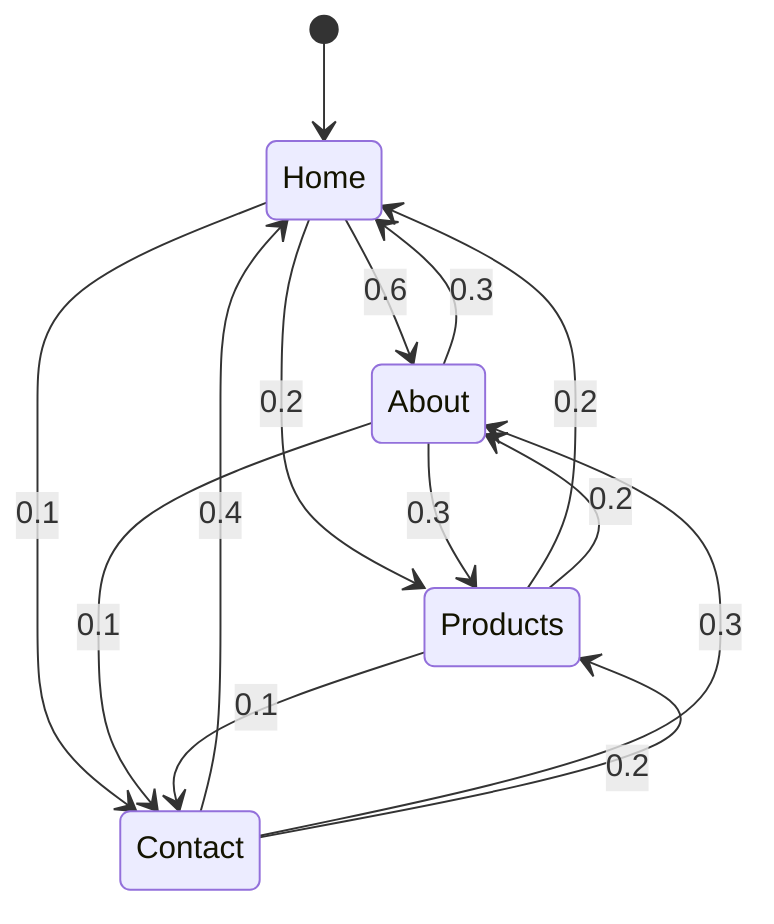

Markov Chain Patterns leverage the mathematical framework known as Markov Chains to model random processes that undergo transitions from one state to another. The pattern is based on the assumption that the future state of a process only depends on the current state, and not on the sequence of events that preceded it. This property is known as the 'Markov Property'.

## Key Concepts

### Markov Chains

A Markov Chain is defined by a set of states, and the probabilities of moving from one state to another. The transition between states is described by a transition matrix. This matrix defines the probability of moving from any given state to any other state, including the possibility of remaining in the same state.

### Use Cases

Markov models are ideal for:

- Predicting the next steps in web navigation for user experience optimization.
- Modeling customer behavior in retail for targeted marketing and recommendations.
- Forecasting weather patterns where the next state depends only on the current observed state.

### Example Code

Below is a simple example in Python using a third-party library to create and utilize a Markov Chain:

```python
import numpy as np
import random

class MarkovChain:
    def __init__(self, states, transition_matrix):
        self.states = states
        self.transition_matrix = np.array(transition_matrix)
        self.current_state = random.choice(self.states)
    
    def next_state(self):
        current_index = self.states.index(self.current_state)
        self.current_state = random.choices(
            self.states, 
            weights=self.transition_matrix[current_index],
            k=1
        )[0]
        return self.current_state
        
states = ['Home', 'About', 'Products', 'Contact']
transition_matrix = [
    [0.1, 0.6, 0.2, 0.1],  # Probabilities of transitioning from 'Home'
    [0.3, 0.3, 0.3, 0.1],  # From 'About'
    [0.2, 0.2, 0.5, 0.1],  # From 'Products'
    [0.4, 0.3, 0.2, 0.1]   # From 'Contact'
]

website_navigation_chain = MarkovChain(states, transition_matrix)

next_page = website_navigation_chain.next_state()
print(f"The next page is: {next_page}")
```

## Diagrams

Here is a state diagram of a simple Markov Chain:



## Best Practices

- **Data Preparation**: Ensure your transition probabilities accurately reflect real-world data. The quality of the prediction heavily relies on the accuracy of these transition matrices.
- **State Space Design**: Keep your state space manageable. Too many states can cause computational inefficiencies, while too few may lead to oversimplification.
- **Validation**: Utilize historical data to validate and refine your transition matrix for improved accuracy.

## Related Patterns

- **Hidden Markov Models (HMMs)**: Useful for when you also need to infer hidden states from observable sequences.
- **Bayesian Networks**: For more complex dependencies and non-Markovian properties.
- **State Machine Patterns**: If deterministic state control and explicit state transitions are desired.

## Additional Resources

- [Markov Chains on Wikipedia](https://en.wikipedia.org/wiki/Markov_chain)
- **Book**: "Markov Chains: From Theory to Implementation and Experimentation" by Paul A. Gagniuc
- **Tutorial**: [Introduction to Markov Chains with Python](https://www.analyticsvidhya.com/blog/2018/10/introduction-to-markov-chains/)

## Summary

Markov Chain Patterns provide an effective way to predict future events in systems where each event only directly depends on the state attained in the previous event. They are extensively used in modeling sequential data across various domains such as web analytics, finance, and more. By utilizing Victor-wise simplifications and harnessing the power of probabilistic state transitions, Markov Chains help in making better predictive decisions.
