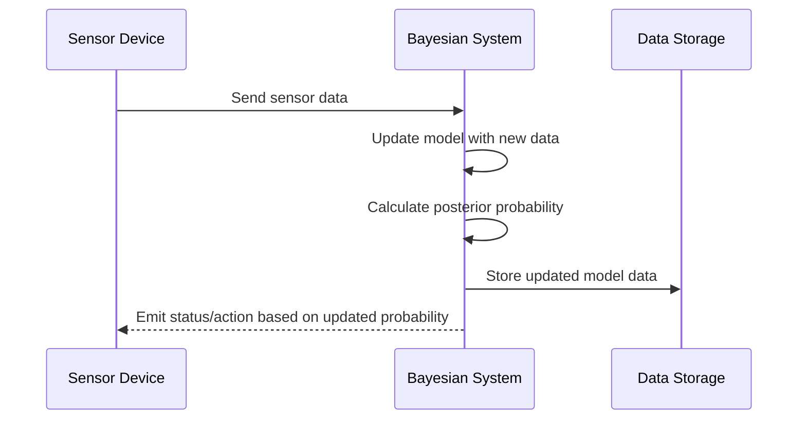

## Bayesian Inference Patterns

### Description

Bayesian Inference is a powerful statistical technique that involves updating the probability of a hypothesis as more evidence or data becomes available. This method applies the principles of Bayesian probability, allowing systems to make informed predictions and decisions based on dynamic datasets. It is particularly useful in areas where continuous data streams are available, enabling real-time analytics and decision-making.

### Architectural Approaches

1. **Dynamic System Analysis**: Building systems that require continuous inputs to refine their understanding based on environmental signals and past data.
  
2. **Real-time Data Processing**: Utilizing stream processors such as Apache Kafka and Apache Flink to handle live data feeds, ensuring timely updates to the probability models.

3. **Event-driven Architecture**: Implementing systems where events trigger the re-calculation of hypotheses probabilities, for example, in IoT systems with sensor data streaming.

4. **Cloud Services Utilization**: Leveraging cloud-based AI and ML services (like AWS SageMaker or GCP's AI Platform) to deploy scalable Bayesian models that can handle large-scale data.

### Paradigms and Best Practices

- **Asynchronous Data Handling**: Due to the nature of real-time data streams, handle data asynchronously to avoid bottlenecks in prediction updates.
  
- **Model Accuracy Over Time**: Continuously validate and adjust models to ensure accuracy as they ingest fresh data.

- **Resource Optimization**: Monitor and adjust cloud resources to balance cost and compute needs, as Bayesian models can be computationally expensive.

- **Scalable Infrastructure**: Design systems for scalability from the ground up, enabling easy scaling as data volumes grow.

### Example Code

Here's a simple example using Python and PyMC3, a probabilistic programming library, for Bayesian inference on live data:

```python
import pymc3 as pm
import numpy as np

def bayesian_update(sensor_data):
    # Prior belief about component failure rate (initial guess)
    prior_failure_rate = 0.01
    
    with pm.Model() as model:
        # Define a probabilistic model
        failure_rate = pm.Beta('failure_rate', alpha=2, beta=200)

        # Probability model for observed data
        observations = pm.Bernoulli('obs', p=failure_rate, observed=sensor_data)

        # Posterior distribution
        posterior = pm.sample(1000, return_inferencedata=False)

    return np.mean(posterior['failure_rate'])

sensor_readings = [0, 0, 1, 0, 1, 0, 1]

updated_failure_rate = bayesian_update(sensor_readings)
print(f"Updated failure rate probability: {updated_failure_rate}")
```

### Diagrams

Below is a simple sequence diagram showing the interaction in a Bayesian Inference system using live sensor data:



### Related Patterns

- **Event Sourcing**: Captures all changes to an application state as a sequence of events, supporting historical data for Bayesian updates.
  
- **CQRS (Command and Query Responsibility Segregation)**: Separating reads and writes to improve performance, especially useful in high-volume stream processing applications.

- **Lambda Architecture**: Combines real-time and batch processing to manage large-scale data efficiently.

### Additional Resources

- *"Bayesian Reasoning and Machine Learning"* by David Barber - a comprehensive guide on Bayesian methods.
  
- PyMC3 Documentation: [PyMC3 Official Docs](https://docs.pymc.io/)

- Apache Kafka and Flink official websites for stream processing setup

### Summary

Bayesian Inference Patterns empower systems to adapt and make informed decisions based on dynamically updated data, enhancing the predictive analytics capability of modern applications. By integrating Bayesian methods into stream processing and real-time data systems, organizations can ensure that their analytics remain accurate and contextually relevant as new data is processed. This pattern is fundamental to developing intelligent systems that must continuously learn and adapt to changing environments.
