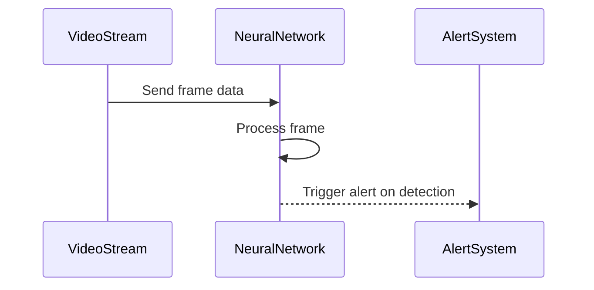

## Overview

Neural Network Patterns focus on leveraging neural networks' capabilities to perform complex pattern recognition tasks in various domains, particularly in real-time stream processing environments. These patterns are essential for tasks where traditional algorithms may falter due to the complexity or scale of data.

## Description

Neural networks, especially deep learning architectures, excel at identifying patterns and structures in large datasets. When applied to stream processing, they allow for the near-instantaneous recognition and analysis of data patterns as they are produced. This is invaluable for applications like security surveillance, where immediate identification and reaction to specific patterns (e.g., identifying suspicious activities in video streams) are critical.

### Key Components

- **Data Stream Input**: Continuous data, such as video frames in security footage, feeds into the neural network for processing.
- **Neural Network Architecture**: Structures like Convolutional Neural Networks (CNNs) and Recurrent Neural Networks (RNNs) are tailored to handle tasks like image recognition and sequential data analysis respectively.
- **Feature Extraction**: Layers within the neural network are responsible for identifying relevant features within the data stream autonomously.
- **Pattern Recognition**: The network applies learned patterns to classify or predict outcomes in real-time.
- **Feedback Loop (Optional)**: Enhancements in learning through incorporating feedback whether predictions were accurate or adjustments are needed.

## Example Use Case

Consider a security surveillance system deployed in a large public area. Real-time video streams are continuously fed into a neural network designed to detect specific threats or suspicious behaviors. The network quickly analyzes each frame for patterns indicative of such behaviors, triggering alarms or alerts as necessary. 

### Example Code

Here's a simple example using a neural network for image recognition with TensorFlow:

```python
import tensorflow as tf
from tensorflow.keras.models import Sequential
from tensorflow.keras.layers import Conv2D, MaxPooling2D, Flatten, Dense

model = Sequential([
    Conv2D(32, (3, 3), activation='relu', input_shape=(64, 64, 3)),
    MaxPooling2D(pool_size=(2, 2)),
    Flatten(),
    Dense(128, activation='relu'),
    Dense(1, activation='sigmoid')
])

model.compile(optimizer='adam', loss='binary_crossentropy', metrics=['accuracy'])

# model.fit(train_images, train_labels, epochs=5, validation_data=(test_images, test_labels))
```

## Diagrams



## Related Patterns

- **Real-time Analytics**: Using analytics engines to process and analyze data streams in real-time.
- **Pattern Detection Engines**: General systems designed to process and identify patterns across various datasets.

## Additional Resources

- TensorFlow Documentation: [TensorFlow.org](https://www.tensorflow.org)
- PyTorch Documentation: [PyTorch.org](https://pytorch.org)
- Book: "Deep Learning" by Ian Goodfellow, Yoshua Bengio, and Aaron Courville

## Summary

Neural Network Patterns offer transformative possibilities in the domain of pattern recognition by leveraging the power of neural networks specifically tailored for stream processing tasks. These are most effective when the complexity of patterns requires more than traditional methods, particularly in scenarios demanding real-time responses like security surveillance, financial fraud detection, or autonomous vehicle navigation.
