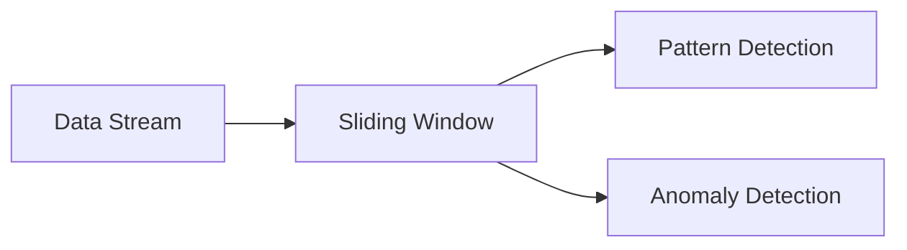

## Introduction

Temporal Patterns relate to the identification and analysis of patterns over time within data streams, which is crucial for understanding behaviors that repeat periodically or represent significant deviations from the norm. This pattern is prevalent in applications like network analysis, financial services, or proactive maintenance systems.

## Detailed Explanation

Temporal Patterns draw insights from data streams by evaluating time-based events. These patterns often include periodic spikes, cycles, trends, or anomalies in data that recur over specific intervals.

### Key Characteristics

- **Periodicity**: Regular intervals at which data exhibits predictable spikes or declines, such as daily sales peaks.
- **Trend Detection**: Long-term movement analysis, capturing increasing or decreasing trends over time.
- **Seasonality**: Regular fluctuations influenced by seasonal factors.
- **Anomaly Detection**: Identifying outliers or anomalies that do not conform to established periodic behavior.

## Architectural Approaches

### Time-Windowing

Utilizing fixed or sliding window operations to analyze stream data over specific intervals:

- **Fixed windows**: Process collected data within a static time frame, suitable for constant-period observations.
- **Sliding windows**: Use overlapping intervals to provide continuous, real-time analysis.

### Temporal Join

Correlate data from different streams by timestamps to identify concurrent events:

- **Use case**: Combining network and application logs to identify combined end-user actions.

### State Management

Maintain state across time windows to facilitate detection of long-term patterns:

- **Example**: Accumulate values over time to compute averages or identify data sequences.

## Best Practices

- **Optimal Windowing**: Choose windowing strategies tailored to data eriodicity and expected patterns.
- **Resource Management**: Ensure efficient state management to handle large-scale data streams, utilizing appropriate storage mechanisms like Apache Kafka or Apache Flink.
- **Event Time Processing**: Prefer event-time processing over processing time to accurately reflect the temporal nature of events.
- **Robust Anomaly Detection**: Employ machine learning algorithms where applicable, such as Seasonal Decomposition of Time Series (STL) or Long Short-Term Memory (LSTM) networks, to enhance anomaly detection.

## Example Code

Here's a simple demonstration of how you might process time-based data streams using Apache Flink:

```scala
import org.apache.flink.streaming.api.scala._
import org.apache.flink.streaming.api.windowing.time.Time

object TemporalPatternDetection {
  def main(args: Array[String]): Unit = {
    val env = StreamExecutionEnvironment.getExecutionEnvironment
    val stream = env.socketTextStream("localhost", 9999)

    stream
      .map(record => {
        val data = record.split(",")
        (data(0), data(1).toDouble)
      })
      .keyBy(_._1)
      .timeWindow(Time.minutes(15))
      .sum(1)
      .print()

    env.execute("Temporal Pattern Detection")
  }
}
```

## Diagrams

Below is a simple Mermaid diagram that visualizes a sliding window operation detecting temporal patterns:



## Related Patterns

- **Event Sourcing**: Retains all changes to state as a sequence of events, complimenting temporal queries.
- **CQRS (Command Query Responsibility Segregation)**: Separates read and update operations to optimize detection and pattern responses.
- **Time Series Database**: A database optimized for time-stamped or time-series data storage, ideal for implementing Temporal Patterns.

## Additional Resources

- [Apache Flink Documentation](https://flink.apache.org/documentation/)
- [Real-time Analytics with Apache Kafka and Flink](https://www.confluent.io/resources)

## Summary

Temporal Patterns are essential for applications where the time-sensitive context is key to uncover actionable insights from data, enabling real-time analytics and dynamic response systems. The expert implementation of these patterns can significantly enhance the ability to monitor, predict and react to key events, addictions benefiting various sectors and systems.
