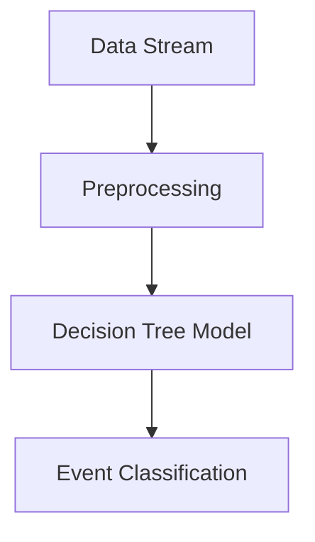

## Overview

Decision Tree Patterns are powerful tools in stream processing for achieving real-time classification and prediction. Leveraging decision trees, these patterns enable systems to make decisions based on the classification of data into predefined categories or the prediction of outcomes based on historical data collected and processed as streams.

## Architectural Approaches

1. **Data Ingestion and Preprocessing**:
   - Utilize tools like Apache Kafka or AWS Kinesis for ingesting data streams.
   - Employ data preprocessing frameworks such as Apache Flink, Apache Beam, or Spark Structured Streaming to clean and transform data prior to model execution.

2. **Model Training and Deployment**:
   - Train decision tree models using platforms like scikit-learn, TensorFlow Decision Forests, or AWS SageMaker.
   - Deploy models in a serverless environment using AWS Lambda, Google Cloud Functions, or Azure Functions for scalable operations.

3. **Execution and Evaluation**:
   - Implement continuous evaluation of predictions using feedback loops to improve model accuracy.
   - Integrate with persistent and scalable storage solutions like Amazon S3 or Google Cloud Storage for maintaining model states and processing large datasets.

## Example Code

Here is a simple example of using scikit-learn to train a decision tree model for classifying support ticket categories:

```python
from sklearn.tree import DecisionTreeClassifier
from sklearn.feature_extraction.text import CountVectorizer
from sklearn.model_selection import train_test_split
from sklearn.pipeline import make_pipeline

tickets = [
    "Unable to access my account",
    "Payment processing error",
    "Unable to login",
    "Incorrect billing amount"
]
categories = ["Account", "Payment", "Account", "Billing"]

pipeline = make_pipeline(
    CountVectorizer(),
    DecisionTreeClassifier()
)

X_train, X_test, y_train, y_test = train_test_split(tickets, categories, test_size=0.25)

pipeline.fit(X_train, y_train)

new_ticket = ["Login issue with error code"]
predicted_category = pipeline.predict(new_ticket)
print(f"Predicted category: {predicted_category[0]}")
```

## Diagram



## Related Patterns

- **Event Sourcing Pattern**:
  Use event logs as a basis for training models. Event sourcing allows you to replay past events for model improvement.

- **CQRS Pattern**:
  Separate the query functionality used by decision tree predictions from the command operations to maintain model states and configurations.

- **Data Lake Pattern**:
  Store raw and processed data for extensive training and back-testing of decision models.

## Best Practices

- Always preprocess data to ensure quality inputs for decision tree models.
- Regularly update models with new data to handle concept drift in streaming data.
- Use feature selection techniques to deal with overfitting and improve model interpretability.

## Additional Resources

- [Scikit-learn Documentation](https://scikit-learn.org/stable/modules/tree.html)
- [AWS SageMaker Decision Trees](https://aws.amazon.com/sagemaker/)
- [Google Cloud AI Platform](https://cloud.google.com/ai-platform)

## Summary

Decision Tree Patterns offer a structured method to derive insights and make predictions from streaming data. They are crucial in domains demanding quick decisions such as automated support ticket categorization. By employing a combination of preprocessing pipelines, model frameworks, and serverless architectures, these patterns provide scalable and efficient means to harness decision-making capabilities in real-time environments.
