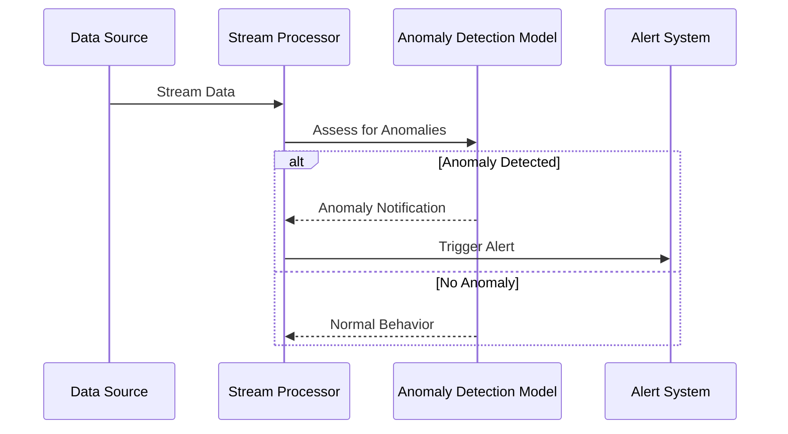

## Anomaly Detection

### Overview

Anomaly Detection is a critical design pattern in stream processing systems, used to identify deviations from established patterns or behaviors in real-time data streams. This design pattern is instrumental in applications such as fraud detection, network security, and operational monitoring.

### Description

Anomaly Detection involves applying algorithms to continuously assess streaming data against predefined business rules or models to find occurrences that differ significantly from the norm. Identified anomalies, such as unusual user login times or locations, can indicate unauthorized access or system faults.

### Architectural Approach

Key approaches to implement the Anomaly Detection pattern include:

- **Unary Streaming Pipelines**: Use a single stream processing pipeline to assess data and detect anomalies.
- **Threshold-Based Techniques**: Define static or dynamic thresholds to determine when a data point is considered anomalous.
- **Machine Learning Models**: Train models on historical data to detect anomalies by recognizing patterns that do not conform to the learned model.

### Best Practices

- **Robust Data Preprocessing**: Clean and preprocess data to improve model accuracy.
- **Real-time Feedback Loops**: Implement feedback mechanisms to refine anomaly detection models based on flagged events.
- **Scalable Architecture**: Use scalable cloud-native solutions to handle high-velocity data streams.

### Example Code

Below is an example of anomaly detection implementation using Python and Apache Kafka for real-time data streaming.

```python
from kafka import KafkaConsumer
from sklearn.ensemble import IsolationForest
import json

consumer = KafkaConsumer('sensor-data', bootstrap_servers='localhost:9092')

model = IsolationForest(contamination=0.01)
trained_data = []  # Assume this has historical normal data for training
model.fit(trained_data)

for message in consumer:
    data_point = json.loads(message.value)
    prediction = model.predict([data_point['value']])
    if prediction == -1:
        print(f"Anomaly detected: {data_point}")
```

### Diagrams

Below is a high-level sequence diagram illustrating the Anomaly Detection pattern in a stream processing pipeline.



### Related Patterns

- **Event Sourcing**: Captures application state changes as a sequence of events for accurate historical analysis.
- **Circuit Breaker**: Prevents system failures from anomalous event processing by managing error-prone components.

### Additional Resources

- "Anomaly Detection for Dummies" by Wiley: An in-depth introduction to anomaly detection techniques.
- "Practical Machine Learning & AI" by Cesar Santos: Focuses on deploying machine learning models practically.

### Summary

The Anomaly Detection pattern is a reliable method for monitoring and identifying unusual activities in data streams. By integrating robust data preprocessing, employing machine learning algorithms, and maintaining scalable architectures, effective anomaly detection bolsters system security and operational efficiency. With the growing complexity of data systems, leveraging smart detection algorithms is indispensable for maintaining integrity and functionality in real time.
