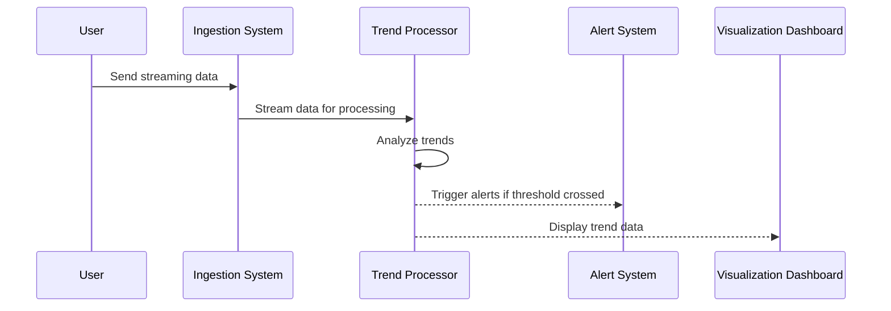

## Trend Detection Pattern

### Description

The Trend Detection pattern is employed to identify significant upward or downward trends in streaming data over time. This pattern is crucial for spotting early signals of change in dynamic systems and acting upon them swiftly. The pattern applies statistical or machine learning models to assess the direction and strength of these trends within continuous data streams. By monitoring these trends, organizations can adapt their strategies accordingly, enhancing decision-making and operational effectiveness.

### Context

In an era of real-time data overflow, detecting trends as they emerge is critical for a wide range of domains, such as finance, healthcare, e-commerce, and social media analytics. As a result, analyzing these data streams iteratively as new data arrives, rather than waiting for batch processing, provides distinct advantages in terms of immediacy and agility.

### Problem

Identify real-time changes in data patterns to harness actionable insights and facilitate informed decision-making processes or automated responses.

### Solution

The solution involves several stages, notably:

1. **Data Collection**: Use data stream ingestion technologies like Apache Kafka, Apache Flink, or Amazon Kinesis to collect live data.
   
2. **Data Preprocessing**: Filter, normalize, and transform data to focus only on relevant signals and remove noise.

3. **Trend Detection Algorithms**: Apply analytical models such as moving averages, exponential smoothing, or machine learning techniques like unsupervised clustering and anomaly detection that are capable of detecting trends.

4. **Evaluation and Alerts**: Assess the significance of identified trends. Use predefined thresholds or statistical tests to understand their relevance and trigger alerts.

5. **Visualization and Reporting**: Deploy tools to visualize trends over time, simplifying interpretation and communication of results to stakeholders.

### Example

Consider a scenario in a customer service department where a surge in complaint calls might indicate a bug in a new software update. By leveraging the Trend Detection pattern, the organization can automatically discern anomalous spikes, investigate the root cause, and deploy fixes swiftly, reducing customer dissatisfaction and protecting the company's reputation.

### Sample Code

Here is an example implementation of a simple trend detection in Java using Apache Kafka and a moving average filter.

```java
// Import required classes
import org.apache.kafka.streams.KafkaStreams;
import org.apache.kafka.streams.StreamsBuilder;
import org.apache.kafka.streams.kstream.KStream;
import org.apache.kafka.streams.kstream.Materialized;
import org.apache.kafka.streams.kstream.TimeWindows;
import java.time.Duration;

public class TrendDetectionApp {

    public static void main(String[] args) {
        // Configure and initialize your streams builder
        StreamsBuilder builder = new StreamsBuilder();
        
        // Create a KStream from the Kafka topic
        KStream<String, Long> inputStream = builder.stream("input-topic");
        
        // Perform trend detection using a moving average
        KStream<String, Long> trendStream = inputStream
            .groupByKey()
            .windowedBy(TimeWindows.of(Duration.ofMinutes(1)))
            .reduce(Long::sum, Materialized.as("trend-store"))
            .toStream()
            .mapValues((windowedKey, aggregateValue) ->
                aggregateValue > TREND_THRESHOLD ? "TRENDS_UP" : "STABLE");
        
        // Output the detected trends
        trendStream.to("output-topic");

        // Start the Kafka Streams application
        KafkaStreams streams = new KafkaStreams(builder.build(), getConfig());
        streams.start();
    }

    private static Properties getConfig() {
        // Set necessary Kafka properties
        Properties props = new Properties();
        props.put("bootstrap.servers", "localhost:9092");
        props.put("application.id", "trend-detection-app");
        return props;
    }
}
```

### Diagram

Here's a basic UML sequence diagram for the Trend Detection process using Mermaid:



### Related Patterns

- **Anomaly Detection**: Identify irregular patterns that do not conform to expected behavior.
- **Real-time Aggregation**: Aggregate data in real-time to summarize trends or patterns quickly.
- **Event Sourcing**: Store all changes to the system state as a series of time-ordered events.

### Additional Resources

- [Apache Kafka Streams](https://kafka.apache.org/documentation/streams/) - A powerful, lightweight library for creating real-time applications and microservices.
- [Understanding Trends in Data](https://linktr.eesm/data-trends) - A detailed guide to the mathematical underpinnings of trend analysis.

### Summary

The Trend Detection pattern is pivotal for recognizing variations in streaming data early, enabling proactive adjustments in operations or strategies. By continuously analyzing data for trends, businesses maintain a competitive edge through informed real-time decisions, ensuring they remain agile and responsive in rapidly changing environments.
