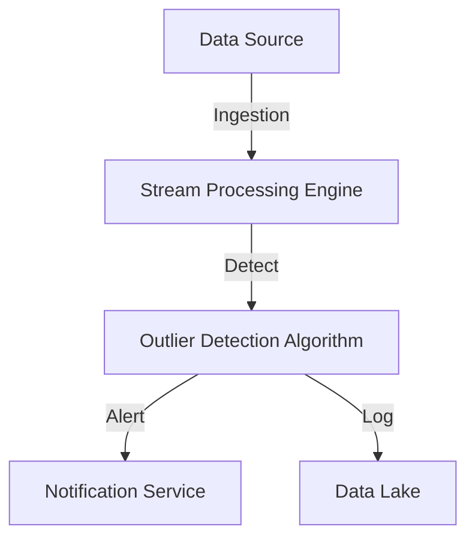

## Introduction

In the realm of big data and stream processing, identifying data points that significantly deviate from the norm can be crucial for various applications such as fraud detection, predictive maintenance, and monitoring system health. Outlier Detection design pattern provides a systematic approach to detect anomalies in real-time data streams.

## Problem

The challenge is to detect anomalies in a data stream, whereby an outlier is any data point that appears abnormal compared to other observations. Outliers may indicate errors, fraudulent activities, or unexpected environmental conditions that need immediate attention. Traditional batch processing techniques are often inadequate for real-time applications due to latency and resource constraints.

## Solution

Outlier Detection is implemented by continuously monitoring incoming data and applying statistical or machine learning techniques to identify and flag anomalies. This pattern utilizes thresholds, clustering, or density-based methods, such as:
- **Z-Score Analysis**: Determines how far a data point is from the mean.
- **DBSCAN (Density-Based Spatial Clustering of Applications with Noise)**: Identifies outliers as noise points outside dense regions.
- **Isolation Forest**: Constructs decision trees to isolate outliers quicker.

### Architectural Approach

To implement Outlier Detection in stream processing systems, the architecture typically includes:

- **Data Ingestion Layer**: Collects and preprocesses incoming data streams.
- **Processing Layer**: Analyzes data using chosen detection algorithms.
- **Alerting & Action Layer**: Generates alerts or triggers automated responses when anomalies are detected.

### Example Code: Using Apache Flink for Outlier Detection

```scala
import org.apache.flink.streaming.api.scala._
import org.apache.flink.streaming.api.windowing.time.Time

object OutlierDetectionJob {
  def main(args: Array[String]): Unit = {
    val env = StreamExecutionEnvironment.getExecutionEnvironment

    val dataStream: DataStream[Transaction] = // Assume source is defined
    
    val alerts = dataStream
      .keyBy(_.accountID)
      .timeWindow(Time.minutes(5))
      .apply(new OutlierDetectionFunction)

    alerts.print()

    env.execute("Outlier Detection Job")
  }
}

class OutlierDetectionFunction
  extends WindowFunction[Transaction, Alert, String, TimeWindow] {

  override def apply(
    key: String, 
    window: TimeWindow, 
    input: Iterable[Transaction], 
    out: Collector[Alert]): Unit = {

    val transactions = input.toList
    val amounts = transactions.map(_.amount)
    val mean = amounts.sum / amounts.size
    val stdDev = Math.sqrt(amounts.map(a => Math.pow(a - mean, 2)).sum / amounts.size)

    transactions.foreach { transaction =>
      val zScore = (transaction.amount - mean) / stdDev
      if (Math.abs(zScore) > 3) { // Example threshold
        out.collect(Alert(transaction.accountID, transaction.amount, "Possible Fraud"))
      }
    }
  }
}
```

### Diagram: Outlier Detection Workflow



## Best Practices

1. **Select Appropriate Algorithms**: Tailor the detection algorithm to fit the nature of the data and application domain.
2. **Define Clear Thresholds**: Choose thresholds for anomaly detection carefully to balance false positives and negatives.
3. **Real-time Tuning**: Allow system parameter tweaking in real-time to adapt to changing data patterns.
4. **Scalability**: Design the system to scale as data volume and velocity grow.

## Related Patterns

- **Change Data Capture**: Monitors and captures changes in data, essential for detecting transactions leading to outliers.
- **Event-Driven Processing**: Reactively handles anomalies using events, integrating seamlessly with Outlier Detection.

## Additional Resources

- [Flink Documentation on Window Functions](https://nightlies.apache.org/flink/flink-docs-release-1.15/docs/dev/datastream/operators/windows/)
- [Anomaly Detection in Streaming Data with Apache Kafka and Flink](https://developer.confluent.io/resources/tutorials/anomaly-detection)

## Summary

The Outlier Detection pattern plays a pivotal role in ensuring data integrity and system security in streaming applications. By leveraging statistical and machine learning techniques, organizations can identify and respond to anomalies in data in real-time, thus safeguarding against issues such as fraud or unexpected system behaviors.
