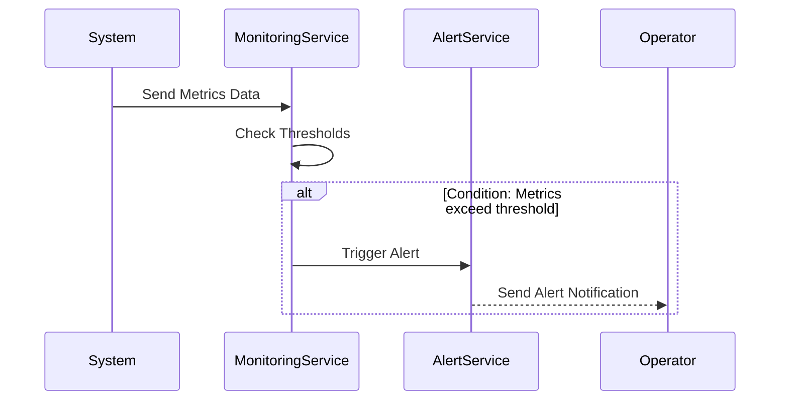

## Overview

Threshold-Based Alerts are a fundamental design pattern in monitoring and alert management systems, particularly within environments that require real-time data analysis, like cloud computing and enterprise IT operations. This pattern involves configuring alerts that are triggered when certain metrics — such as CPU usage, memory consumption, or network latency — exceed or fall below predefined thresholds. The goal is to enable rapid response to potential operational issues, maintaining system stability and performance.

## Detailed Explanation

In modern cloud environments and distributed systems, continuous monitoring is vital for maintaining service reliability. Threshold-Based Alerts provide a proactive monitoring approach by:

- **Detecting Anomalies:** Identifying when a metric goes beyond acceptable boundaries, which could indicate potential problems such as resource saturation, performance degradation, or security incidents.
- **Facilitating Rapid Response:** By alerting operators or initiating automated procedures upon threshold breaches, operational teams can act swiftly to mitigate risks.
- **Enabling Automated Scaling:** In cloud environments, threshold alerts are often tied to auto-scaling mechanisms, allowing resources to adjust dynamically based on current load and usage patterns.

## Best Practices

1. **Define Clear and Contextual Thresholds:** Establish thresholds based on historical data analysis and workload profiling. Ensure they make sense for the context (e.g., peak usage hours vs. idle times).
   
2. **Set Granular Alerts:** Use multiple thresholds with different severities (e.g., warning, critical) to indicate various stages of an issue. This helps in distinguishing between minor fluctuations and severe problems.

3. **Implement Automated Actions:** Couple alerts with automated scripts or workflows (e.g., restarting a service, scaling resources) to reduce the mean time to resolution.

4. **Regularly Review and Adjust Thresholds:** Periodically reassess thresholds and adjust based on changing usage patterns, application updates, or infrastructure changes.

5. **Integrate with Incident Management Systems:** Ensure alerts feed into an incident management system for logging, tracking, and resolution. This facilitates better response coordination across teams.

## Example Code

Below is a simplified example in TypeScript using a hypothetical library for monitoring metrics.

```typescript
class Monitor {
  constructor(private threshold: number, private duration: number) {}

  async monitorCPU() {
    const metrics = await this.getMetrics();
    const cpuUsage = metrics.cpuUsage;

    if (cpuUsage > this.threshold) {
      console.log('Warning: CPU usage exceeds threshold!');
      this.triggerAlert('CPU');
    }
  }

  private async getMetrics() {
    // Simulate fetching metrics
    return new Promise(resolve =>
      setTimeout(() => resolve({ cpuUsage: 94 }), 1000)
    );
  }

  private triggerAlert(metric: string) {
    // Simulate alert mechanics
    console.log(`Alert triggered for ${metric}. Initiate response.`);
  }
}

const cpuMonitor = new Monitor(90, 5);
cpuMonitor.monitorCPU();
```

## Diagrams

### Alert Triggering Sequence Diagram



## Related Patterns

- **Anomaly Detection:** Uses machine learning algorithms to identify unusual patterns in data.
- **Auto-Scaling:** Automatically adjusts resources based on current demand, often triggered by threshold-based alerts.

## Additional Resources

- **AWS CloudWatch Alarms** - [Documentation](https://docs.aws.amazon.com/AmazonCloudWatch/latest/monitoring/AlarmThatSendsEmail.html)
- **Prometheus Alertmanager** - [Official Guide](https://prometheus.io/docs/alerting/latest/alertmanager/)
- **Datadog Real-time Alerting** - [Datadog Alerts](https://www.datadoghq.com/blog/real-time-alerting/)

## Summary

Threshold-Based Alerts are essential for modern monitoring systems that necessitate timely detection and response to potential issues. By establishing predefined thresholds for key metrics, teams can automate much of their monitoring and incident response processes, ensuring systems remain robust and resilient amidst dynamic operational demands. Implementing this pattern effectively requires careful planning of thresholds, integration with incident systems, and ongoing adjustments based on metric performance and system evolution.
