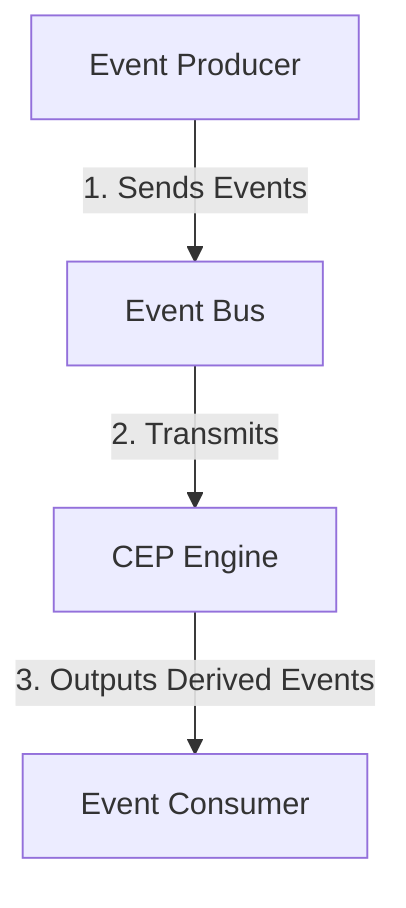

## Introduction to Complex Event Processing (CEP)

Complex Event Processing (CEP) is a powerful design pattern in the realm of data and stream processing that focuses on analyzing event patterns from one or more event streams to derive actionable insights or trigger automations. CEP aids in understanding complex relationships among events and allows making decisions based on aggregated and temporal views, which can be critical in many domains, including finance, telecommunications, and IoT.

## Detailed Explanation

### Core Concepts of CEP

1. **Event Streams**: Continuous flow of data elements generated by event sources, such as transactions in an e-commerce site or sensor outputs in an IoT setup.
   
2. **Event Patterns**: Defined templates or rules that describe how multiple events relate to each other over time.

3. **Streams Processing**:
   - **Filtering**: Selects events that satisfy a certain condition.
   - **Aggregation**: Combines multiple events into a higher-level summary.
   - **Correlation**: Identifies relationships between independent streams.
   - **Temporal Processing**: Uses timestamps to make time-based decisions.

4. **Derived Events**: Higher-level events that provide meaningful insights, often triggering subsequent actions or notifications.

### Architectural Components

- **Event Producer**: Source of the event data.
- **Event Bus**: Facilitates event transmission between producers and the CEP engine.
- **CEP Engine**: The core system that processes streams, applies patterns, and outputs derived insights.
- **Event Consumer**: Consumes derived events for further processing or action.

### Example Code: CEP with Apache Flink

```scala
import org.apache.flink.streaming.api.scala._
import org.apache.flink.cep.scala._
import org.apache.flink.cep.scala.pattern.Pattern

// Define the event class
case class StockEvent(symbol: String, price: Double)

// Create a streaming execution environment
val env = StreamExecutionEnvironment.getExecutionEnvironment
val stockEvents: DataStream[StockEvent] = env.fromElements(
  StockEvent("AAPL", 150.0),
  StockEvent("AAPL", 155.0),
  StockEvent("AAPL", 152.0)
)

// Define a pattern for price increase
val priceIncreasePattern = Pattern.begin[StockEvent]("start")
  .where(_.price > 150)
  .followedBy("end")
  .where(_.price > 152)

// Apply the pattern to the stream
val patternStream = CEP.pattern(stockEvents, priceIncreasePattern)

// Generate alerts for pattern matches
patternStream.select(patternMatch => {
  val startEvent = patternMatch("start").iterator.next()
  val endEvent = patternMatch("end").iterator.next()
  s"Alert: Price increased from ${startEvent.price} to ${endEvent.price} for ${startEvent.symbol}"
}).print()

// Execute the Flink job
env.execute("CEP Example")
```

### Diagrams

#### CEP Architecture Diagram



### Best Practices

- **Scalability**: Ensure the CEP system scales horizontally to manage increasing event volumes.
- **Latency Optimization**: Optimize processing latency for real-time insights.
- **Robust Pattern Design**: Design patterns that efficiently represent the business logic, enhancing accuracy and reliability.
- **Temporal Constraints**: Include time constraints to maintain context appropriateness in pattern detection.

### Related Patterns

- **Event Sourcing**: Keeping a record of all state changes in the form of a sequence of events.
- **Publish-Subscribe**: Distributing events to subscribers, decoupling producers from consumers.

### Additional Resources

- [Apache Flink Documentation](https://flink.apache.org/doc)
- [EsperTech, Event Series Analysis](https://www.espertech.com/)
- [Kafka Streams by Confluent](https://kafka.apache.org/documentation/streams/)

## Summary

Complex Event Processing is an essential pattern for interpreting multi-source event streams to derive high-level insights, critical in modern analytics-driven applications. By defining and detecting complex event sequences, systems can make informed decisions in real-time, applicable in diverse industry solutions from trading systems to IoT monitoring. Understanding and implementing CEP requires a comprehensive strategy and efficient use of streaming technologies like Apache Flink or Kafka Streams.
