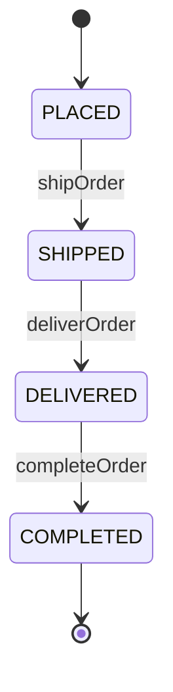

## Introduction

State Machine Patterns are fundamental for managing sequences of events, transitions, and states in stream processing and event-driven systems. By visualizing how an event progresses from one state to another through clearly defined transitions, these patterns help ensure that event sequences follow valid paths without missing essential steps or entering invalid states.

## Design Pattern Explanation

At its core, a state machine consists of:
- **States**: Defined points within a process. Each state represents a stage in the life cycle of an entity.
- **Transitions**: Actions or events causing the state to change. Transitions must follow well-defined rules.
- **Events**: Triggers that induce transitions between states.

State Machines are particularly valuable in domains where the sequence of events has significant logical meaning, such as in business processes, protocols, or user interactions.

## Architectural Approaches

- **Finite State Machine (FSM)**: A model with a limited number of states and transitions. FSMs are excellent for simple processes where the possible states are pre-defined and limited.
- **Extended State Machine**: Extends FSM by allowing conditions (guards) and actions. This is useful for more complex systems requiring context-aware state transitions.
- **Hierarchical State Machine**: Organizes states into a hierarchy, enabling the reuse of state logic at different levels—ideal for systems with deeply nested states.

## Best Practices

- **Define Clear States and Transitions**: Clearly define all states and permissible transitions to minimize the risk of errors and undefined behaviors.
- **Use Stateless Architecture**: Prefer stateless designs when possible, using external storage for state management to facilitate scalability.
- **Leverage Monitoring and Logging**: Implement robust logging and monitoring to observe transitions and manage unexpected issues efficiently.

## Example Code

Below is an example in JavaScript illustrating a basic implementation of a state machine for an order processing workflow:

```javascript
class OrderFSM {
  constructor() {
    this.state = 'PLACED';
  }

  transition(event) {
    const transitions = {
      PLACED: { to: 'SHIPPED', on: 'shipOrder' },
      SHIPPED: { to: 'DELIVERED', on: 'deliverOrder' },
      DELIVERED: { to: 'COMPLETED', on: 'completeOrder' }
    };

    const currentTransition = transitions[this.state];

    if (event === currentTransition.on) {
      this.state = currentTransition.to;
    } else {
      throw new Error(`Invalid transition from ${this.state} on ${event}`);
    }
  }
}

// Example usage:
let order = new OrderFSM();
order.transition('shipOrder'); // state becomes 'SHIPPED'
order.transition('deliverOrder'); // state becomes 'DELIVERED'
order.transition('completeOrder'); // state becomes 'COMPLETED'
```

## Diagrams

### Mermaid UML Diagram



## Related Patterns

- **Sagas**: Orchestrate long-lived transactions using compensation logic.
- **Event Sourcing**: Logs changes as an immutable sequence of events.

## Additional Resources

- *"Enterprise Integration Patterns" by Gregor Hohpe and Bobby Woolf*: Offers insights into using state machines in enterprise contexts.
- Online interactive tools like [State Machines Cat](https://xstate.js.org/viz/) for visualizing state machine designs.

## Summary

State Machine Patterns provide a robust framework for modeling and controlling sequences of events. By defining allowable state transitions, these patterns help maintain predictable and stable application behavior, especially in critical business processes and user workflows. Adopting Stateless architecture, leveraging external storage for state management, and implementing rigorous monitoring are best practices that can enhance the scalability and reliability of applications using state machines.
