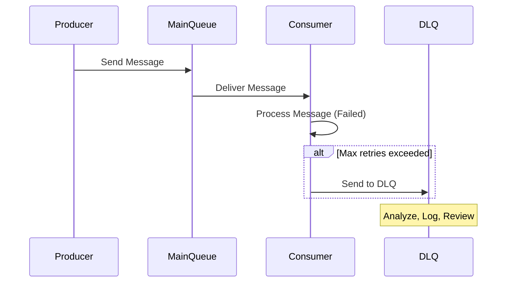

## Introduction to Dead Letter Queue Pattern

In distributed systems and service-oriented architectures, processing a large number of messages can often lead to situations where some messages cannot be handled properly due to various reasons such as system errors, invalid data, or application-specific issues. The Dead Letter Queue (DLQ) pattern is a design principle used to address such situations by rerouting these problematic messages to a dedicated storage queue. This allows system operators to later analyze, troubleshoot, and possibly reprocess these messages, ensuring continued operation of the system without blocking message processing pipelines.

## Detailed Explanation

### What is a Dead Letter Queue?

A Dead Letter Queue is a secondary queue into which messages that cannot be processed — due to errors, timeouts, or exceeding retry limits — are placed for later inspection and rectification. This allows for decoupling of error processing from main stream processing.

### Why Use a Dead Letter Queue?

- **Improved Reliability**: By offloading the problematic messages, the system can continue processing other healthy messages without disruption.
- **Enhanced Fault Tolerance**: The ability to handle message failures systematically improves the overall fault tolerance of your message processing system.
- **Simplified Troubleshooting**: Operators and developers can focus on the failed messages at their own pace without worrying about adding stress to live systems.
- **Reduced System Complexity**: Handles errors separately without clogging primary message flows, reducing pressure on message consumers.

## Architectural Approaches

1. **Single Dead Letter Queue**: A universal DLQ for all types of messages; simple but not as organized.
2. **Multiple Dead Letter Queues**: Dedicated DLQs for different types of messages or errors. This approach offers better organization, aiding easier categorization and prioritization of error handling.
3. **Dynamic Dead Letter Queues**: Automatically assigns messages to particular DLQs based on rules or contents of the message which has added complexity but offers fine-grain control.

### Implementation Strategy

- Define criteria and rules that determine when a message should be redirected to the DLQ (e.g., specific error codes, number of retries exceeded).
- Implement DLQ processing logic that periodically reviews, logs, and optionally reprocesses messages.
- Ensure appropriate monitoring and alert systems are in place to inform operators of growing DLQs that require attention.

## Example Code

An example implementation using AWS SQS with a DLQ configuration.

```javascript
const AWS = require('aws-sdk');
const sqs = new AWS.SQS();

const params = {
  QueueName: 'ProcessingQueue',
  Attributes: {
    RedrivePolicy: JSON.stringify({
      deadLetterTargetArn: 'arn:aws:sqs:your-region:your-account-id:DLQ',
      maxReceiveCount: '5'
    })
  }
};

sqs.createQueue(params, (err, data) => {
  if (err) console.log("Error", err);
  else console.log("Success", data.QueueUrl);
});
```

### Mermaid UML Sequence Diagram



## Related Patterns

- **Retry Pattern**: Reattempt the processing of a message before moving it to a DLQ.
- **Circuit Breaker Pattern**: Prevent system failures by limiting repeated attempts to process failing operations.

## Additional Resources

- [AWS Dead Letter Queues](https://docs.aws.amazon.com/AWSSimpleQueueService/latest/SQSDeveloperGuide/sqs-dead-letter-queues.html)
- [Azure Service Bus Dead-letter Queues](https://learn.microsoft.com/en-us/azure/service-bus-messaging/service-bus-dead-letter-queues)
- ["Enterprise Integration Patterns" - by Gregor Hohpe](https://www.enterpriseintegrationpatterns.com/)

## Summary

The Dead Letter Queue pattern is crucial for robust error handling in stream processing and messaging systems, helping maintain uninterrupted service and ensuring that engineers can inspect and address failures in a controlled and systematic manner. Implementing a DLQ allows for better system stability, reliability, and fault isolation by decoupling the processing of failed messages from the main application logic.
