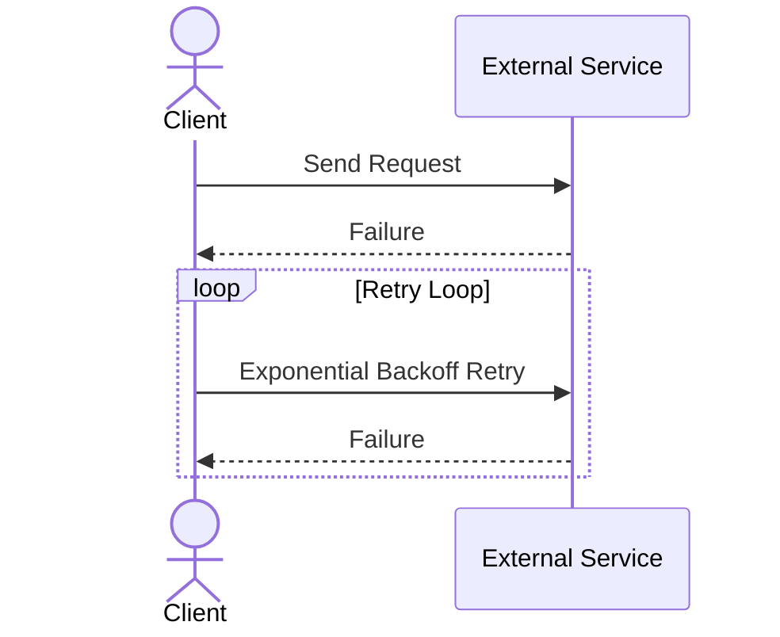

## Description
Backoff Strategies are important error handling mechanisms used in distributed and fault-tolerant systems. They provide a way to retry failed operations by imposing a waiting period between each attempt, thus preventing services from being overwhelmed. These strategies are crucial in stream processing, cloud-based applications, microservices, and anything involving distributed networking or communication.

Two common backoff strategies are:

- **Exponential Backoff**: The waiting time increases exponentially after each failure. This method is commonly used in network traffic management to reduce congestion by retrying less frequently over time.
  
- **Linear Backoff**: The waiting time increases linearly, offering predictable retry intervals. This can be used in scenarios where controlled, gradual increases in wait time are sufficient to handle temporary issues.

Implementing these strategies helps ensure that persistent issues are addressed efficiently and transient issues don’t escalate into prolonged service disruptions.

## Example

Here's a Java-based implementation of an exponential backoff strategy:

```java
public class ExponentialBackoff {
    private final int maxRetries;
    private final long initialDelay;
    private final long maxDelay;

    public ExponentialBackoff(int maxRetries, long initialDelay, long maxDelay) {
        this.maxRetries = maxRetries;
        this.initialDelay = initialDelay;
        this.maxDelay = maxDelay;
    }

    public boolean retry(Runnable task) {
        int retryCount = 0;
        long delay = initialDelay;

        while (retryCount < maxRetries) {
            try {
                task.run();
                return true;
            } catch (Exception e) {
                retryCount++;
                if (retryCount < maxRetries) {
                    try {
                        Thread.sleep(delay);
                    } catch (InterruptedException ie) {
                        Thread.currentThread().interrupt();
                        return false;
                    }
                    delay = Math.min(maxDelay, delay * 2);
                } else {
                    throw new RuntimeException("Max retries exceeded", e);
                }
            }
        }
        return false;
    }
}
```

In this example, a task is retried with an exponentially increasing delay, starting from an initial duration, and doubling each time up to a maximum cap.

## Diagrams

### Exponential Backoff Sequence Diagram



## Related Patterns

- **Circuit Breaker**: Often used with backoff strategies to prevent a failing operation from being continually retried, enhancing system stability by breaking the circuit after a failure threshold is met. 
- **Bulkhead**: Isolates system components to ensure that a failure in one does not cascade to others, similar to how backoff limits retries to prevent total overload.

## Additional Resources

- [AWS Retry Strategies](https://docs.aws.amazon.com/general/latest/gr/api-retries.html)
- [Google Cloud: Error Reporting and Handling](https://cloud.google.com/docs/error-reporting)
- [Microsoft Azure: Retry Pattern](https://docs.microsoft.com/en-us/azure/architecture/patterns/retry)

## Summary
Backoff Strategies play a critical role in the resilient design of distributed systems by controlling the retry behavior of failed operations, providing systems with the robustness needed to handle transient faults without overwhelming services. Implementing backoff strategies effectively can prevent cascade failures and improve overall system reliability.
