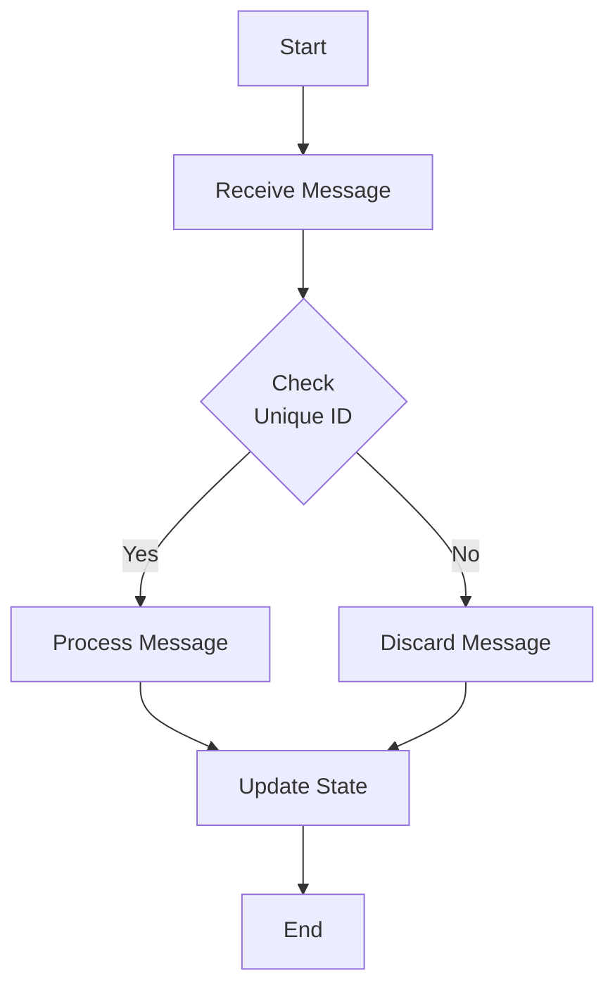

## 1. Introduction
In stream processing systems, managing duplicates is crucial for maintaining data integrity and avoiding redundant computations. Duplicate Detection is a pattern that helps in identifying and filtering duplicate messages using various strategies, thereby ensuring that each message is processed exactly once.

## 2. Problem
Stream processing systems can receive duplicate messages due to network retries, distributed system delays, or operational errors. These duplicates, if unchecked, can lead to erroneous data processing, double-counting, and incorrect analytics.

## 3. Solution
A Duplicate Detection pattern ensures that only unique messages are processed. This can be achieved by associating a unique identifier with each message and maintaining a state to track processed IDs.

### Implementation Strategies:

- **Deduplication Keys**: Use unique identifiers such as UUIDs, timestamps, or business-specific keys to distinguish messages.
- **Stateful Processing**: Cache message IDs in a stateful storage and check incoming IDs against this cache.
- **Sliding Window Algorithms**: Implement time-based or count-based sliding windows to hold recent IDs for comparison.

## 4. Example Code

The following example demonstrates message deduplication using Apache Kafka Streams with a state store to track processed IDs.

```java
import org.apache.kafka.streams.*;
import org.apache.kafka.streams.state.*;
import org.apache.kafka.streams.kstream.*;

import java.util.Properties;

public class DuplicateDetectionExample {
    public static void main(String[] args) {
        Properties props = new Properties();
        props.put(StreamsConfig.APPLICATION_ID_CONFIG, "duplicate-detection");
        props.put(StreamsConfig.BOOTSTRAP_SERVERS_CONFIG, "localhost:9092");

        StreamsBuilder builder = new StreamsBuilder();
        KStream<String, String> source = builder.stream("input-topic");

        // Store to keep track of processed message IDs
        KeyValueBytesStoreSupplier storeSupplier = Stores.persistentKeyValueStore("processed-ids");
        StoreBuilder<KeyValueStore<String, Boolean>> storeBuilder =
                Stores.keyValueStoreBuilder(storeSupplier, 
                                            Serdes.String(), 
                                            Serdes.Boolean());

        builder.addStateStore(storeBuilder);

        source.transform(() -> new DeduplicationTransformer("processed-ids"), "processed-ids")
              .to("output-topic");

        KafkaStreams streams = new KafkaStreams(builder.build(), props);
        streams.start();
    }

    static class DeduplicationTransformer implements Transformer<String, String, KeyValue<String, String>> {
        private final String storeName;
        private KeyValueStore<String, Boolean> kvStore;

        DeduplicationTransformer(String storeName) {
            this.storeName = storeName;
        }

        @Override
        public void init(ProcessorContext context) {
            this.kvStore = (KeyValueStore<String, Boolean>) context.getStateStore(this.storeName);
        }

        @Override
        public KeyValue<String, String> transform(String key, String value) {
            if (kvStore.get(key) == null) {
                kvStore.put(key, true);
                return KeyValue.pair(key, value);
            }
            return null; // Skip duplicates
        }

        @Override
        public void close() {}
    }
}
```

## 5. Diagram



## 6. Related Patterns

- **Idempotent Receiver**: A pattern that ensures that repeating the same operation multiple times yields the same result, often used alongside Duplicate Detection.
- **Replayable Logs**: Utilizes persistent logs to replay events and ensure all are processed correctly even if duplication occurs.

## 7. Additional Resources

- [Kafka Streams Documentation](https://kafka.apache.org/documentation/)
- [Flink CEP for Complex Event Processing](https://ci.apache.org/projects/flink/flink-docs-stable/dev/libs/cep.html)

## 8. Summary

The Duplicate Detection pattern is vital in modern stream processing systems to ensure data integrity by preventing redundant processing of messages. By leveraging unique identifiers and maintaining a stateful cache, systems can efficiently filter out duplicates, contributing to accurate data processing and analytics.
