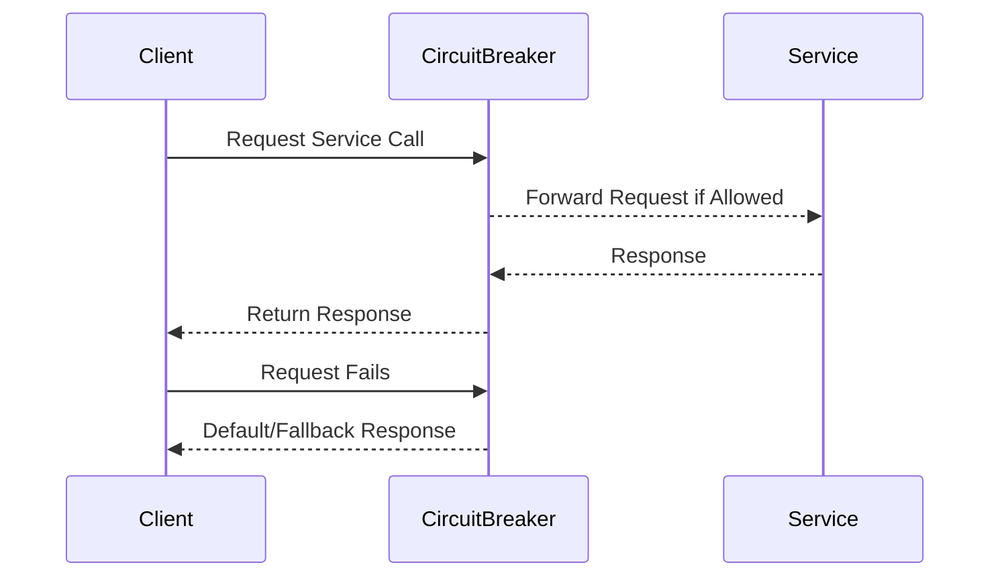

## Fault Isolation

### Description

Fault Isolation is a design pattern aimed at containing and managing faults within a confined component or service of a larger system. This design pattern is crucial in distributed and microservice architectures where localized failures can potentially cascade and disrupt the entire system. Fault isolation ensures that errors in one component do not propagate, thus safeguarding the availability and reliability of the system as a whole.

### Architectural Approaches

1. **Microservices Architecture**: Splitting a system into smaller, isolated services allows each service to fail independently without causing the entire system to crash. Each microservice could be deployed in separate processes or containers that encapsulate their failures.

2. **Circuit Breaker Pattern**: This pattern prevents an application from repeatedly trying to execute an operation that's likely to fail. It acts like a switch that “trips” and stops calls to a service that is experiencing repeated failures.

3. **Bulkhead Pattern**: By dividing a system into isolated partitions or “bulkheads,” each partition can be protected from the failures of others. It limits the number of resources consumed by failing components and prevents resource exhaustion.

4. **Retry and Fallback Mechanisms**: Implementing retries can overcome transient faults, while fallback mechanisms ensure there is a default behavior if a part of the system fails.

### Example Code

Below is an example demonstrating a simple implementation of a Circuit Breaker using a microservices approach in a Java-based system:

```java
public class CircuitBreaker {
    private enum State { CLOSED, OPEN, HALF_OPEN }
    private State state;

    private int failureThreshold;
    private int currentFailures;
    private long timeout;
    private long lastFailureTime;

    public CircuitBreaker(int failureThreshold, long timeout) {
        this.failureThreshold = failureThreshold;
        this.timeout = timeout;
        this.state = State.CLOSED;
    }

    public boolean allowRequest() {
        if (state == State.OPEN) {
            if (System.currentTimeMillis() - lastFailureTime > timeout) {
                state = State.HALF_OPEN;
                return true;
            }
            return false;
        }
        return true;
    }

    public void recordSuccess() {
        state = State.CLOSED;
        currentFailures = 0;
    }

    public void recordFailure() {
        currentFailures++;
        if (currentFailures >= failureThreshold) {
            state = State.OPEN;
            lastFailureTime = System.currentTimeMillis();
        }
    }
}
```

### Diagram

Below is a sequence diagram illustrating fault isolation using the Circuit Breaker pattern.



### Related Patterns

- **Retry Pattern**: Complements fault isolation by attempting failed operations again, ideally used for transient faults.
- **Fallback Pattern**: Provides an alternative option or degraded service if the primary service fails.
- **Strangler Fig Pattern**: Allows incremental migration of old system components to new architectures while maintaining the isolation of new features.

### Best Practices

- Establish clear boundaries for isolation in your system's architecture to ensure that failure in one component doesn’t impact others.
- Monitor the system comprehensively to detect patterns of failure and correctly determine where fault isolation is needed.
- Regularly test isolation mechanisms to ensure they effectively contain faults.
- Combine with auto-scaling features in cloud environments to maintain performance under isolation constraints.

### Additional Resources

- [Microservices Patterns: With examples in Java](https://microservices.io/patterns/fault-tolerance/circuit-breaker.html)
- [Building Microservices by Sam Newman](https://www.oreilly.com/library/view/building-microservices/9781491950357/)
- [Resilience4j - A Java library](https://resilience4j.readme.io/docs/circuitbreaker)

### Summary

Implementing Fault Isolation is a fundamental strategy in designing resilient cloud-native applications. By carefully isolating errors, applications can continue to function properly even in the face of component-level failures, improving both availability and reliability. Adopting architectural patterns like microservices, circuit breakers, and bulkheads plays an integral role in achieving robust error handling and recovery in a distributed environment.
