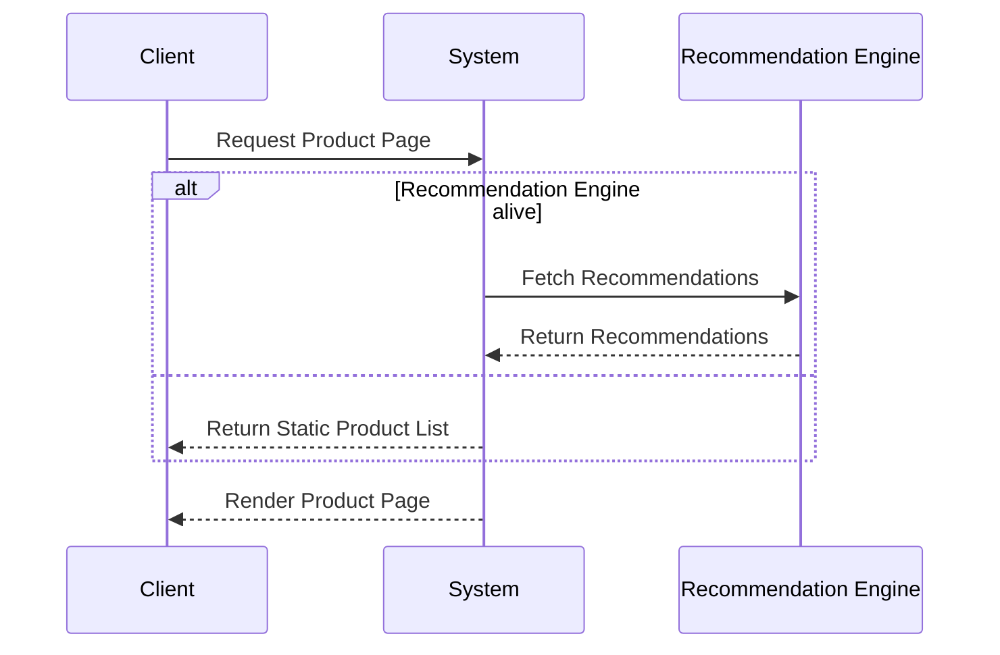

## Introduction

In the realm of cloud computing and stream processing, ensuring high availability and resiliency is paramount. The **Graceful Degradation** pattern offers a robust strategy for maintaining service continuity amidst component failures by temporarily reducing the system's functionality, focusing on maintaining core services while temporarily compromising on non-essential features.

## Detailed Explanation

### Key Concepts

- **Core Services**: These are essential functionalities that must remain operational to maintain user engagement and service integrity. For instance, a video streaming platform should continue to deliver video content even if features like recommendations are unavailable.
  
- **Non-Essential Features**: These can be temporarily disabled or degraded without severely affecting the user experience. Examples include personalized recommendations, enhanced graphics, or supplementary content.

- **Real-World Example**: Imagine an e-commerce website where the recommendation engine crashes. Instead of alarming users with errors, the site may continue displaying static product lists without personalized recommendations, thus applying the Graceful Degradation pattern.

### Implementation Strategies

1. **Feature Flags**: Incorporate feature toggles to dynamically enable or disable specific functionalities based on system health or availability.

2. **Redundant Architecture**: Design the system components with redundancy. This means employing backup services that can kick in when the primary services fail.

3. **Heartbeats and Monitoring**: Implement regular health checks for system components. Detection of unhealthy components can trigger a fail-safe mode through automatic degradation.

4. **Circuit Breaker Pattern**: Use circuit breakers to avoid cascading failures by cutting off access to a failing component, thus preventing its malfunction from affecting other parts of the system.

5. **Service Prioritization**: Establish a priority list for services and degrade lower-priority ones first when failures occur, thereby preserving those deemed more critical.

## Example Code

Below is a simplified illustration in JavaScript, demonstrating how feature flags can be used to degrade a recommendation engine safely:

```javascript
const FEATURE_FLAGS = {
  recommendationEngine: false, // Toggle feature availability
};

function getProductRecommendations() {
  if (FEATURE_FLAGS.recommendationEngine) {
    return fetchRecommendationsFromEngine();
  } else {
    return fetchStaticProductList();
  }
}
```

## Diagram

Below is a Mermaid sequence diagram illustrating a typical flow in a Graceful Degradation scenario:



## Related Patterns

- **Circuit Breaker Pattern**: A related pattern that helps contain component failures by preventing them from impacting the whole system.

- **Bulkhead Pattern**: Segregates components to isolate failures and limit their scope.

- **Retry Pattern**: Attempts to recover from transient failures by reissuing failed requests after a delay.

## Additional Resources

- "Patterns of Enterprise Application Architecture" by Martin Fowler – Offers further insights into error handling and resiliency.

- "Building Microservices" by Sam Newman – Provides real-world insights into implementing resilient microservices architectures.

## Summary

The Graceful Degradation pattern is vital for systems aiming to provide continuous service availability despite failures in some components. By prioritizing essential functions and strategically degrading non-critical features, it preserves the user experience and minimizes service disruptions, being particularly useful in cloud-based applications where reliability is crucial.
