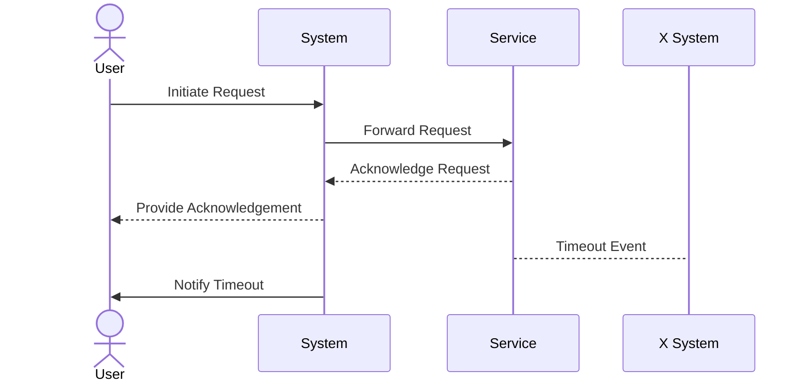

## Overview

Timeout Handling is a critical design pattern used in software systems to set maximum time limits for operations. It prevents operations from blocking indefinitely, which can cause system slowdowns or deadlocks. This pattern is especially important in distributed systems, where network requests or resource access times may vary. By implementing timeouts, systems can handle delays gracefully, maintaining responsiveness and stability.

## Context

In systems where operations involve waiting for external resources, such as database queries, API calls, or message processing, unpredictable delays can occur. Without proper timeout handling, any component waiting for a response might wait indefinitely, potentially leading to resource exhaustion or cascading failures.

## Problem

How can a system prevent operations from blocking indefinitely while ensuring that necessary tasks are completed efficiently and without unnecessary failure?

## Solution

Implement timeouts by specifying a maximum duration an operation is allowed to take. If the operation exceeds this time, handle the timeout with appropriate error handling mechanisms such as retries, fallbacks, or escalating errors to the user or a monitoring system.

### Example Code: Timing Out an API Call in Java

```java
import java.net.http.HttpClient;
import java.net.http.HttpRequest;
import java.net.http.HttpResponse;
import java.net.URI;
import java.time.Duration;
import java.util.concurrent.CompletableFuture;

public class TimeoutExample {

    public static void main(String[] args) {
        HttpClient client = HttpClient.newBuilder()
                .connectTimeout(Duration.ofSeconds(10))
                .build();

        HttpRequest request = HttpRequest.newBuilder()
                .uri(URI.create("https://api.example.com/resource"))
                .timeout(Duration.ofSeconds(5))
                .GET()
                .build();

        CompletableFuture<Void> future = client.sendAsync(request, HttpResponse.BodyHandlers.ofString())
                .orTimeout(5, TimeUnit.SECONDS)
                .exceptionally(e -> {
                    System.out.println("Request failed or timed out: " + e.getMessage());
                    return null;
                });

        future.join(); // Wait for completion
    }
}
```

## Diagram: Timeout Sequence



## Best Practices

- **Timeout Configuration**: Timeout durations should be configurable and based on SLA requirements.
- **Error Handling**: Implement retries with exponential backoff and circuit breakers to handle timeouts resiliently.
- **Monitoring and Logging**: Monitor timeout occurrences for performance tuning and insight into system bottlenecks.
- **Graceful Degradation**: Provide alternative solutions or fallbacks in case of persistent timeouts.

## Related Patterns

- **Retry Pattern**: Re-attempt fails operations with modified conditions.
- **Circuit Breaker Pattern**: Prevents execution of operations known to fail and allows time for recovery.
- **Bulkhead Pattern**: Isolates elements of an application to contain failing components.

## Additional Resources

- *Release It!: Design and Deploy Production-Ready Software* by Michael T. Nygard
- *Building Resilient Systems* documentation from relevant cloud providers' technical documentation.
  
## Summary

The Timeout Handling pattern is integral in maintaining system responsiveness and stability. By setting defined time limits on operations, systems can prevent indefinite blocking, manage delays efficiently, and enhance the overall robustness of the application. Effective implementation involves configurable timeouts, resilient error handling strategies, and integrated monitoring solutions to address and mitigate potential issues dynamically.
