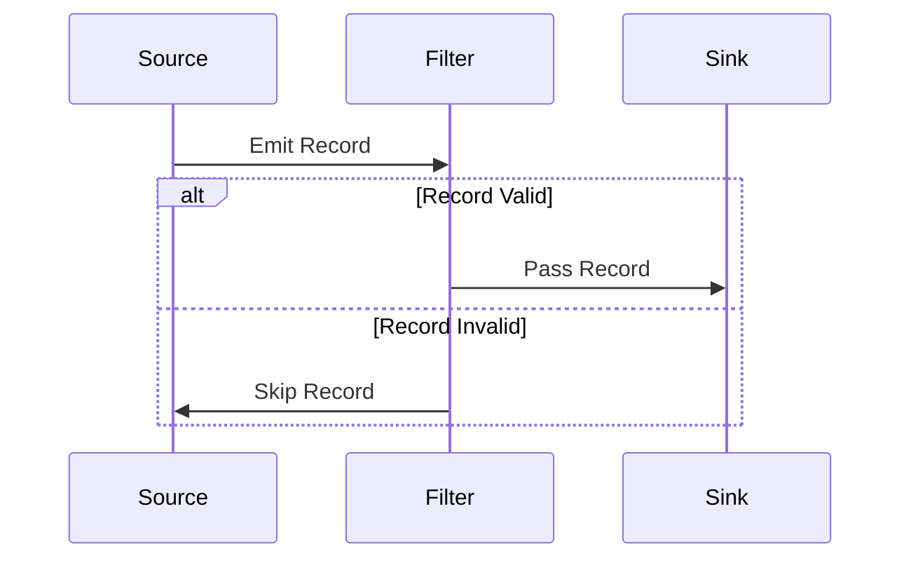
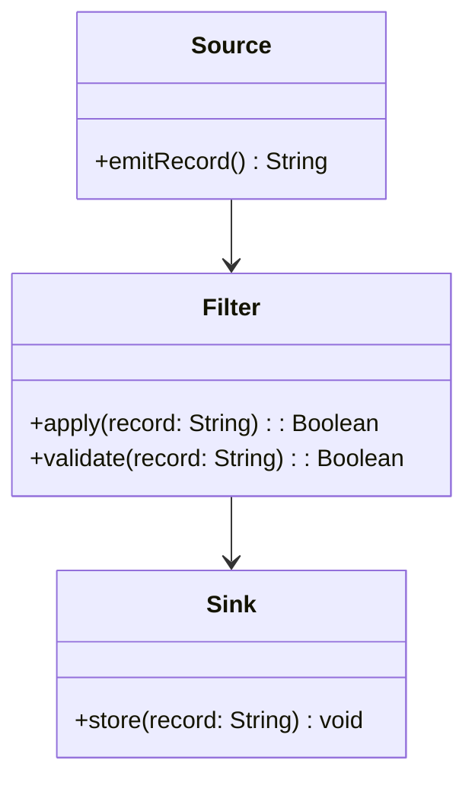

## Introduction

In distributed stream processing systems, data inconsistencies and corrupt records can interrupt the flow of data processing. The **Data Skipping** pattern helps manage these disruptions by skipping over problematic data records, thereby maintaining the integrity and liveness of the data processing pipeline.

## Detailed Explanation

The primary goal of Data Skipping is to ensure that the data processing system remains resilient to errors caused by corrupt or incompatible data entries. This pattern dismisses erroneous records and continues processing the subsequent valid records, foregoing complex error handling logic that may otherwise complicate the system.

### Key Characteristics:
- **Fault Tolerance**: Enhances the system's ability to handle unexpected data issues without human intervention.
- **Minimized Latency**: By quickly discarding problematic data, the pattern prevents bottlenecks within the system.
- **Simplified Handling**: Reduces code complexity related to error handling and exception management.

### Architectural Approach

In a typical implementation, the stream processing pipeline is equipped with a filtering mechanism or validator that inspects each record. Recognized invalid records are skipped, and a log entry is generated for review. This is particularly beneficial in systems dealing with high-velocity data streams where pausing to handle each anomaly would be impractical.

#### Example

```scala
import akka.stream.scaladsl._
import akka.actor.ActorSystem

implicit val system: ActorSystem = ActorSystem("DataSkippingExample")

val source = Source(1 to 1000)
val isValid = (n: Int) => n % 5 != 0 // Let's assume multiples of 5 are problematic

val skippingFlow = Flow[Int].filter(isValid)

val runnableGraph = source.via(skippingFlow).to(Sink.foreach(println))

runnableGraph.run()
```

In this Scala Akka Stream example, the flow processes integers from 1 to 1000 and skips any multiple of 5. These problematic records are simply filtered out, allowing the stream to continue uninterrupted.

## Diagrams

### Sequence Diagram



### Class Diagram



## Best Practices

- **Granular Logging**: Implement granular logs for skipped records to facilitate post-mortem analysis and debugging.
- **Parameterizable Filtering**: Make the validation criteria configurable, enabling easy tuning based on evolving data characteristics.
- **Robust Monitoring**: Incorporate real-time monitoring of skippings with alert mechanisms to identify patterns in data corruption quickly.

## Related Patterns

- **Retry Pattern**: While Data Skipping quickly discards problematic data, the Retry Pattern involves retrying operations to maximize successful processing.
- **Dead Letter Queue Pattern**: In cases where retaining skipped data is necessary for later analysis, use a Dead Letter Queue to temporarily hold these records.

## Additional Resources

- [Stream Processing Patterns & Best Practices](https://example.com/stream-processing-patterns)
- [Akka Streams Documentation](https://doc.akka.io/docs/akka/current/stream/index.html)
- [Fault Tolerant Stream Processing](https://example.com/fault-tolerant-stream-processing)

## Summary

The Data Skipping pattern is a crucial strategy in maintaining the throughput and efficiency of stream processing systems by discarding corrupted or invalid data without compromising the flow of vital information. By simplifying error management and maintaining operational continuity, it supports robust system performance across varied use cases.
