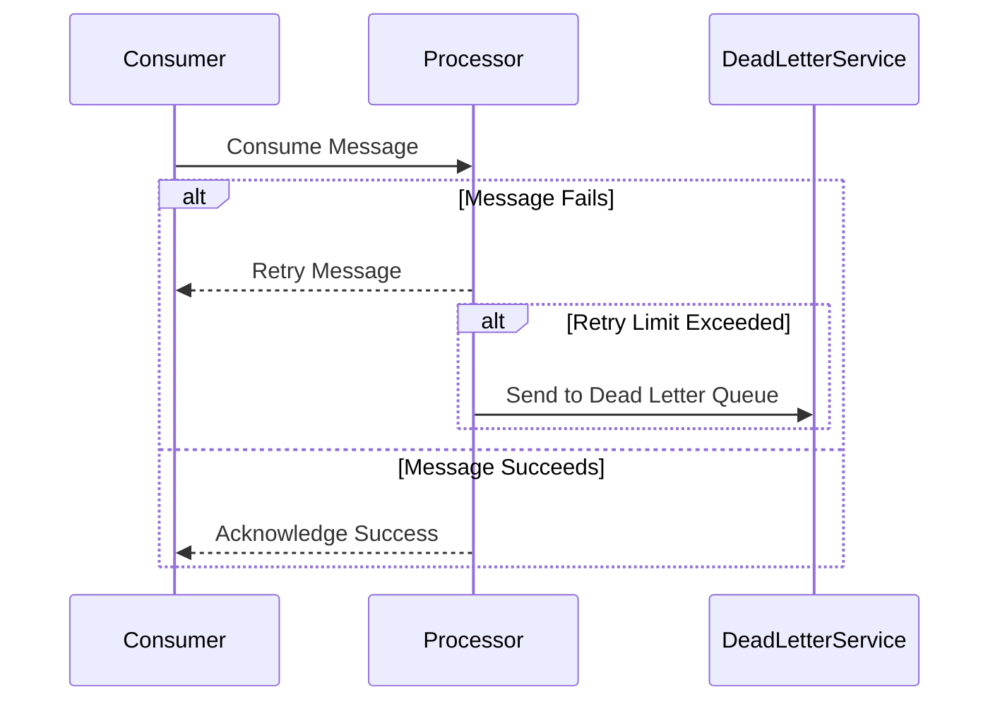

## Poison Pill Detection

Poison Pill Detection is a design pattern crucial for ensuring reliable operations of stream processing systems. These systems often encounter "poison pills," or messages that consistently lead to processing failures. This pattern focuses on identifying such problematic messages and applying specific strategies to handle them without endangering system throughput and stability.

### Pattern Explanation

In distributed systems where messages or events are processed continuously, some inputs may cause processors to fail consistently. These are referred to as "poison pills." If not detected and handled specifically, poison pills can lead to excessive processing retries, which in turn can disrupt system performance, delay processing of subsequent messages, and escalate costs, particularly in cloud environments where computation time is at a premium.

### Architectural Approaches

1. **Detection Methods**:
   - **Error Log Monitoring**: Track repeated failures stemming from specific messages within error logs.
   - **Retry Counters**: Utilize counters to track the number of retries on message processing, flagging messages that have breached a retry threshold as poison pills.
   - **Dead Letter Channels**: Route persistently failing messages to a dead letter queue after a predefined number of failed attempts.

2. **Handling Strategies**:
   - **Quarantine and Analyze**: Move poison pills to a quarantine list for detailed inspection and batch analysis to identify root causes.
   - **Alerting Mechanisms**: Implement alerts to notify system operators or developers about recurring poison pills, enabling faster remediation.
   - **Automated Solutions**: Deploy automated compensating actions, such as data transformation or enrichment, to correct or bypass processing impediments.

### Best Practices

- **Implement Circuit Breakers**: Limit the impact of poison pills by pausing retries after a specified number of failures.
- **Use Message Metadata**: Enrich messages with metadata that includes retry count and timestamps, allowing for better traceability and decision-making.
- **Continuously Tune Retry Logic**: Avoid excessive retries by dynamically adjusting retry strategies using machine learning models that predict potential processing outcomes based on historical data.

### Example Code

Here's a conceptual example of how you might implement poison pill detection using a message queue system:

```scala
val maxRetries = 5

def processMessage(message: Message): Unit = {
  try {
    // Attempt message processing
  } catch {
    case e: ProcessingException =>
      if (message.retryCount >= maxRetries) {
        sendToDeadLetterQueue(message)
      } else {
        message.retryCount += 1
        requeueMessage(message)
      }
  }
}
```

### Diagrams

Below is a conceptual Mermaid UML Sequence Diagram illustrating the handling of poison pills in a stream processing system:



### Related Patterns

- **Retry Pattern**: Complements poison pill detection by defining systematic retry algorithms.
- **Dead Letter Channel**: Specifically designed to handle messages that couldn't be processed successfully after multiple attempts.
- **Circuit Breaker**: Protects systems from being overwhelmed by disabling message processing after consecutive failures.

### Additional Resources

- [Enterprise Integration Patterns](https://www.enterpriseintegrationpatterns.com)
- [Stream Processing Design Patterns with Apache Kafka](https://kafka.apache.org/documentation/streams/)
- [Message Queue Theory](https://en.wikipedia.org/wiki/Message_queue)

### Summary

The Poison Pill Detection pattern is indispensable for maintaining the robustness of streaming data systems. By identifying and appropriately handling messages that consistently cause failures, we can safeguard the system's overall health and ensure reliable message processing without unnecessary resource expenditure.
