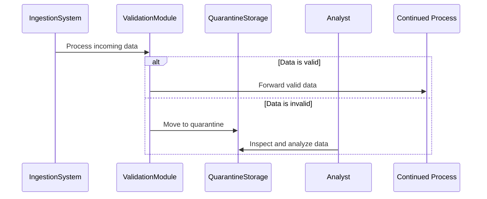

## Introduction

In complex data processing systems, especially those dealing with real-time stream processing, data integrity and reliability are critical. The Data Quarantine pattern is an essential tool to address situations where data cannot be processed reliably due to errors or irregularities. This pattern involves isolating such problematic data in a designated quarantine area. This ensures that the main data pipeline remains unaffected while problematic data can be analyzed, and corrective actions can be taken without risking the integrity of the entire system.

## Problem

Issues often arise in data processing systems due to malformed, invalid, or suspicious data entries. These can cause disruptions, data loss, compromises in data quality, or even complete system failures. Handling such data typically requires the development of sophisticated error handling mechanisms. The challenge is how to manage and analyze these data entries without allowing them to disrupt the main processing pipeline.

## Solution

The Data Quarantine pattern proposes a structured approach to manage data integrity issues:

1. **Detection**: Identify and categorize problematic data entries. This can be achieved using validation rules, anomaly detection algorithms, or monitoring tools.
2. **Isolation**: Move identified problematic data to a quarantine area that is separate from the main data flow.
3. **Analysis and Resolution**: Analyze quarantined data to diagnose issues. This may involve manual inspection or automated analysis tools.
4. **Reprocessing or Disposal**: Depending on the findings, data can either be corrected and reintroduced into the main pipeline or safely discarded if irreparable.

## Architectural Approach

### Components

- **Ingestion System**: Responsible for collecting and initially processing data as it enters the system.
- **Validation and Anomaly Detection**: Ensures data adheres to predefined standards; anomalies trigger the quarantine process.
- **Quarantine Storage**: A separate storage area to hold problematic data, such as a dedicated database table or a separate Kafka topic.
- **Analysis Tools**: Systems or tools configured to perform detailed inspections on quarantined data.
- **Reintroduction Mechanism**: Process to clean up and reintroduce valid data into the main stream after remediation efforts.

### Workflow Diagram



## Best Practices

- **Automation**: Automate the detection and isolation processes as much as possible with validation and anomaly detection tools to reduce manual oversight and increase efficiency.
- **Monitoring and Alerts**: Implement monitoring dashboards and alert systems for rapid detection and awareness of quarantined data that requires attention.
- **Workflow Integration**: Ensure that quarantine processes seamlessly integrate with existing data workflows.
- **Review and Feedback Loops**: Establish protocols for periodic reviews of quarantined data and use feedback to refine detection mechanisms and improve data quality checks.
- **Data Security**: Maintain high security and privacy standards for quarantined data, as it may contain sensitive or personally identifiable information.

## Example Code

Below is a hypothetical implementation of the Data Quarantine pattern using a typical data stream processing setup:

```java
import org.apache.kafka.clients.consumer.KafkaConsumer;
import org.apache.kafka.clients.producer.KafkaProducer;
import org.apache.kafka.clients.producer.ProducerRecord;

public class DataProcessor {
    private KafkaConsumer<String, String> consumer;
    private KafkaProducer<String, String> producer;
    private KafkaProducer<String, String> quarantineProducer;

    public void processMessages() {
        consumer.subscribe(List.of("input-topic"));
        while (true) {
            var records = consumer.poll(Duration.ofMillis(100));
            for (var record : records) {
                if (isValid(record.value())) {
                    producer.send(new ProducerRecord<>("output-topic", record.value()));
                } else {
                    quarantineProducer.send(new ProducerRecord<>("quarantine-topic", record.value()));
                }
            }
        }
    }

    private boolean isValid(String data) {
        // Perform validation logic
        return data.matches("some-pattern");
    }
}
```

## Related Patterns

- **Compensating Transaction**: Often used to undo actions when valid data is later determined to be questionable.
- **Retry Pattern**: Complements Data Quarantine by providing mechanisms to reprocess quarantined data after issues are resolved.
- **Circuit Breaker**: Prevents system overload by controlling the flow of data when continuous data issues are detected.

## Additional Resources

- **Books**: "Designing Data-Intensive Applications" by Martin Kleppmann provides insights into data processing patterns including error handling.
- **Articles**: [Stream Processing Error Handling](https://developer.com/stream-processing-error-handling) offers resources on dealing with errors in stream processing.
- **Tools and Libraries**: Look into Apache Kafka and AWS Kinesis for practical tools to implement data quarantine solutions within streaming architectures.

## Summary

The Data Quarantine pattern provides a strategic approach to manage data integrity challenges in stream processing systems. By isolating problematic data from the main processing flow, it helps maintain the reliability and quality of data outputs while allowing detailed analysis and remediation of errors. Through automation and structured workflows, it maximizes processing efficiency and minimizes the impact of errors on data-driven operations.
