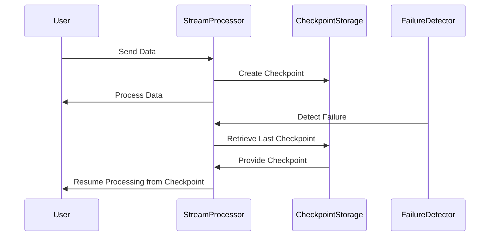

## Description

Recovery from Checkpoints is a crucial pattern in stream processing systems aimed at achieving fault tolerance and ensuring continuity in data processing. In events of failures, systems can encounter disruption in the flow and processing of data. To mitigate this, checkpoints are regularly created which save the state of the system at specific points. When a failure occurs, the system can restart the process from the last successful checkpoint, ensuring minimal data loss and reprocessing.

## Architectural Overview

The Recovery from Checkpoints pattern is typically implemented in distributed streaming platforms, such as Apache Kafka Streams, Apache Flink, or Spark Streaming. These platforms provide built-in support for checkpoints, enabling automatic state management and recovery. The architecture involves:

- **Checkpoint Creation**: At defined intervals, the system captures the state and progress of data processing, storing it as a checkpoint.
- **Failure Detection**: Mechanisms to identify failures in the system, such as node crashes or network issues.
- **Recovery Initiation**: Upon detection of a failure, the system automatically stops processing and resets to the last successful checkpoint.
- **State Restoration**: The system restores the state from the checkpoint, enabling processing to resume from the exact point it left off.

## Example Code

Here’s an example of Recovery from Checkpoints using Apache Flink:

```scala
import org.apache.flink.streaming.api.scala._
import org.apache.flink.streaming.api.CheckpointingMode

object FlinkCheckpointExample {
  def main(args: Array[String]): Unit = {
    val env = StreamExecutionEnvironment.getExecutionEnvironment

    // Enabling checkpointing every 5000 milliseconds
    env.enableCheckpointing(5000, CheckpointingMode.EXACTLY_ONCE)

    // Example source
    val textStream = env.socketTextStream("localhost", 9999)

    // Example transformation
    val wordCounts = textStream
      .flatMap(_.split("\\s+"))
      .map((_, 1))
      .keyBy(0)
      .sum(1)

    wordCounts.print()

    env.execute("Flink Checkpoint Example")
  }
}
```

## Diagrams

Below is a Mermaid Sequence Diagram illustrating the flow of data and checkpoint recovery in a stream processing system:



## Related Patterns

- **Circuit Breaker**: Provides a solution for handling failures in distributed systems by opening a circuit when failures exceed a threshold, redirecting traffic or failing fast.
- **Retry Pattern**: Implements retries with exponential backoff to handle transient failures, which can also be used alongside checkpoint recovery.

## Additional Resources

- [Apache Flink Checkpointing Documentation](https://flink.apache.org/features/2023/04/05/checkpointing.html)
- [Kafka Streams Fault Tolerance](https://kafka.apache.org/documentation/streams/)
- [Spark Streaming Checkpoints](https://spark.apache.org/docs/latest/streaming-programming-guide.html#checkpointing)

## Summary

The Recovery from Checkpoints pattern is an essential aspect of designing resilient streaming applications. By leveraging this pattern, developers can ensure their processing systems are robust against failures, promote efficient state management, and provide reliable data processing outputs. Efficient use of this pattern requires understanding of the underlying stream processing frameworks and their specific checkpointing mechanisms.
