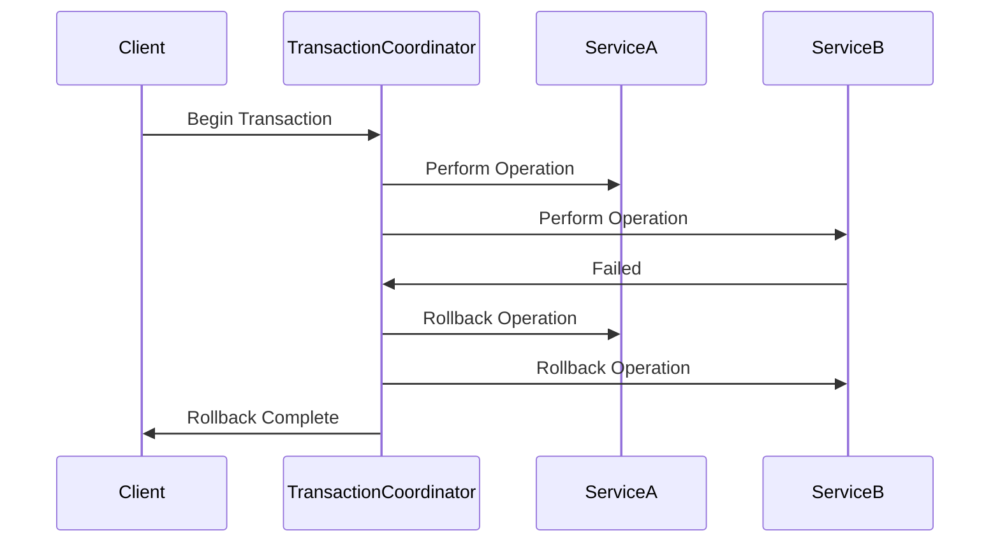

## Description

Transaction Rollback is a critical error handling and recovery pattern in stream processing systems and databases. It is an essential mechanism for ensuring data consistency by undoing all changes made during a transaction if any component of that transaction fails. This functionality is crucial in maintaining the integrity and consistency of the system's state, especially in distributed environments where operations may span across different nodes and services.

## Architectural Context

In a typical distributed stream processing application, numerous transactions are processed almost simultaneously. Each transaction may involve multiple operations, such as reading, computing, and writing data to different services (e.g., databases, message queues). If one operation fails, it can potentially leave the system in a partial state, which can corrupt the data integrity. Implementing a rollback mechanism ensures that all operations within a transaction can be undone, leaving the system in a consistent state.

## Patterns and Best Practices

- **Two-Phase Commit (2PC):** This coordination protocol ensures that all nodes in a distributed transaction agree to commit or rollback the transaction.

- **Compensation Transactions:** An approach where compensating actions are defined for each step which, when executed, effectively roll back the system to its previous state.

- **Idempotency:** Ensure operations can be retried safely without risking data corruption. Idempotent operations do not create new effects if applied more than once.

- **Checkpointing:** Periodically save system state such that, in case of failure, the system can rollback to the last consistent state.

- **Event Sourcing:** Record all changes as a sequence of immutable events. In case of failure, the system state can be reconstructed from these events up to the desired point before the error.

## Example Code

Below is a simplified example of how transaction rollback might be handled in a stream processing application using Java:

```java
import java.sql.Connection;
import java.sql.SQLException;

public class TransactionExample {

    public void processTransaction(Connection connection) throws SQLException {
        try {
            // Start transaction
            connection.setAutoCommit(false);

            // Perform multiple operations
            operation1(connection);
            operation2(connection);

            // If all operations are successful, commit transaction
            connection.commit();
        } catch (Exception e) {
            // On exception, rollback to undo changes
            connection.rollback();
            throw e;
        } finally {
            // Restore auto-commit mode
            connection.setAutoCommit(true);
        }
    }

    private void operation1(Connection connection) {
        // Perform some database operation
    }

    private void operation2(Connection connection) {
        // Perform some database operation
    }
}
```

## Diagrams

Below is a basic representation of the transaction rollback via a sequence diagram.



## Related Patterns

- **Circuit Breaker:** Temporarily halts transactions to a component after a certain number of failures is detected to prevent cascading failures.
  
- **Saga Pattern:** Manages long-living transactions by breaking down a transaction into a sequence of smaller idempotent steps with individual rollbacks.

- **Retry:** Automatically retries a failed operation a specified number of times or until it succeeds, essential for transient errors.

## Additional Resources

- [Database Transactions - An Introduction](https://www.ibm.com/cloud/learn/database-transactions)
- [Microservices - Patterns for Transactional Integrity](https://microservices.io/patterns/data/transactional.html)
- [Distributed Transactions in Apache Kafka](https://kafka.apache.org/documentation/#transactions)

## Summary

The Transaction Rollback pattern is a cornerstone in ensuring data integrity and consistency within stream processing applications. By anchoring strong rollbacks, developers can enforce reliability and robustness against failures, especially in today's distributed and cloud-native systems. Leveraging patterns like Two-Phase Commit, Compensation, and Idempotency within your architecture will align systems for high availability, durability, and strong error recovery. Understanding and applying this pattern can greatly enhance a system's trustworthiness and operability across complex environments.
