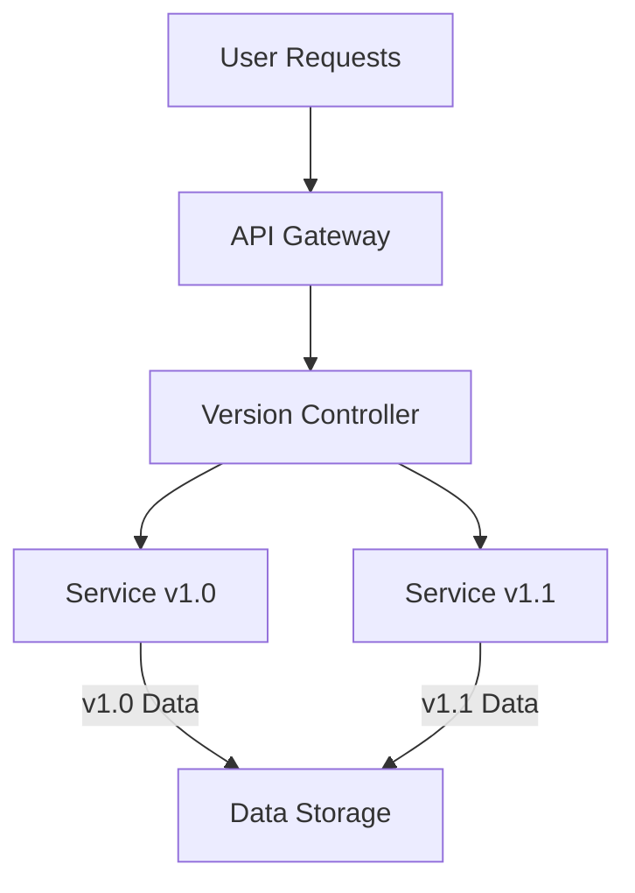

## Introduction

In today's fast-paced software development environment, frequent deployments are necessary to maintain a competitive edge. However, these changes can sometimes introduce errors that disrupt system functionality. The "Versioning for Recovery" pattern is a strategic approach that allows systems to maintain stability by managing both data and code versions efficiently. This pattern ensures that systems can recover gracefully by reverting to previous stable states when errors occur during new deployments.

## Design Pattern: Versioning for Recovery

### Description

Versioning for Recovery involves meticulously maintaining versions of both the codebase and datasets used within an application. In case of deployment errors or data corruption, these versions act as checkpoints that allow developers to restore a previous stable state effectively. This significantly minimizes downtime and impacts on end-users while providing a safety net during rapid deployment iterations.

### Architectural Approaches

1. **Semantic Versioning**:
   - Adopt semantic versioning (MAJOR.MINOR.PATCH) for code to rapidly identify the scope and potential impact of changes.

2. **Immutable Data Storage**:
   - Store data versions in an immutable format (using append-only logs) to facilitate recovery and auditing.

3. **Automated Backup and Restore**:
   - Use automation scripts or tools to back up code and data at strategic points during the deployment process, ensuring that rollbacks can be quickly executed if needed.

4. **Version Control Systems (VCS)**:
   - Leverage VCS tools such as Git to track changes in codebases. Use branches and tags for maintaining production-ready code versions.

5. **Distributed Data Version Control**:
   - Use distributed data version control systems for managing large datasets across multiple nodes to ensure consistency across different deployment environments.

### Best Practices

- Regularly test recovery processes and rollback procedures to ensure they work as intended during actual failure events.
- Continuously monitor system performance post-deployment to quickly identify anomalies.
- Document all version changes and decisions comprehensively for future audits and compliance needs.
- Educate teams on efficient versioning and recovery strategies to minimize human errors.

### Example Code

Here's a simplified example illustrating how semantic versioning can be managed with a feature toggle for controlled rollbacks in a microservices architecture using a language like Kotlin with Spring Boot.

```kotlin
@RestController
@RequestMapping("/api")
class VersionedApiController {

    // Semantic versioning
    @Value("\${api.version}")
    private lateinit var apiVersion: String

    @GetMapping("/version")
    fun getApiVersion(): ResponseEntity<String> {
        return ResponseEntity.ok("Current API Version: $apiVersion")
    }

    @GetMapping("/feature")
    fun getFeature(@RequestParam version: String): ResponseEntity<String> {
        // Feature toggle logic
        return if (version == apiVersion) {
            ResponseEntity.ok("Feature enabled in version $version")
        } else {
            ResponseEntity.status(HttpStatus.NOT_FOUND).body("Feature not available in version $version")
        }
    }
}
```

### Diagrams

#### System Architecture Diagram



### Related Patterns

- **Feature Toggles**: Use alongside versioning to enable or disable features in specific code versions without redeploying.
- **Blue-Green Deployment**: Employ this pattern to minimize downtime during version transitions by routing traffic between independent environments.
- **Circuit Breaker**: Implement to temporarily halt new deployments while fallback to stable versions is carried out.

### Additional Resources

- [Semantic Versioning Specification](https://semver.org/)
- [The Twelve-Factor App](https://12factor.net/)
- [Git Version Control General Concept](https://git-scm.com/about)

## Summary

Versioning for Recovery is an essential pattern in modern software development, addressing the need for robust error handling and minimizing disruptions caused by deployment errors. By managing and systematically deploying code and data versions, organizations can achieve greater reliability and user confidence in their systems. Embracing this pattern involves tooling and process adaptations, but the trade-off is a significantly more resilient system capable of withstanding the pressures of rapid evolution.
