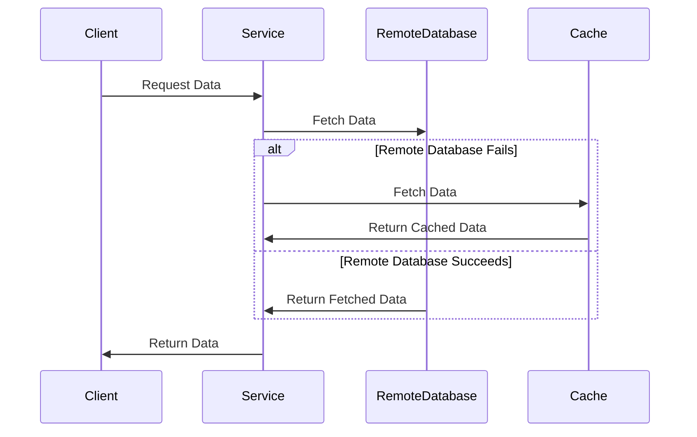

## Overview

In cloud computing environments, especially those employing stream processing, systems must be resilient to failures. The **Alternate Path Execution** design pattern addresses this requirement by providing mechanisms to switch to a secondary or backup code path when the primary route encounters failures.

### Intent

The purpose of this pattern is to ensure continuous service availability and reliability by defining alternate paths in service execution, which are activated when standard paths are either unavailable or less optimal.

### Problem

In distributed systems and stream processing, networks or service endpoints can occasionally fail. If a system relies on a single path, it becomes a single point of failure, resulting in service disruptions.

### Solution

With the Alternate Path Execution pattern, you can configure a system to detect failures and execute an alternative path or strategy. This might involve:

- Using a cached copy of data.
- Redirecting requests to a backup server.
- Employing default or static data values.

### Applicability

Use the Alternate Path Execution pattern when:

- Your services rely on external systems or services prone to failure.
- Service continuity, rather than performance, is the primary business requirement.
- You need a mechanism to minimize user impact during genuine service outages.

## Architectural Approaches

### Steps to Implement

1. **Error Monitoring**: Implement mechanisms to detect failures or anomalies in the primary execution path.
2. **Fallback Trigger**: Define criteria that trigger the switch to an alternate path.
3. **Alternate Path Definition**: Design alternative solutions for key service operations. This could mean diverting traffic to another node, using local resources, or deploying default responses.
4. **Reversion and Recovery**: Ensure you have a mechanism to revert back to the original path once it is operational again.

### Example

Consider a web service that primarily fetches data from a remote database. If the database becomes inaccessible, the service could retrieve data from a local cache until the database is restored.

#### Sample Code

```scala
def fetchData(userId: String): String = {
  try {
    // Primary path
    remoteDatabase.getData(userId)
  } catch {
    case _: ConnectionException => 
      // Alternate path
      println("Falling back to cache due to database failure.")
      cache.getData(userId)
  }
}
```

## Diagrams

### Sequence Diagram



## Related Patterns

- **Circuit Breaker**: Prevents a system from continuously attempting operations likely to fail.
- **Fallback Pattern**: Provides alternative actions when the primary action fails, and is commonly used in resilient systems.

## Additional Resources

- [Resilient Distributed Datasets (RDD)](https://spark.apache.org/docs/latest/rdd-programming-guide.html): Understanding resilient systems with Spark.
- [AWS Well-Architected Best Practices](https://aws.amazon.com/architecture/well-architected/): Explores best practices focusing on resilience and operational excellence.

## Summary

The Alternate Path Execution pattern is pivotal in building resilient cloud systems. By preparing alternate routes for data and service execution, systems maintain performance and reliability, which is crucial for user satisfaction and business continuity.
