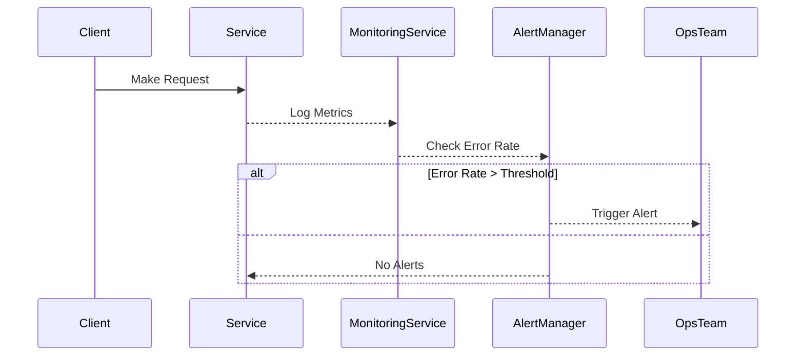

## Alerting and Monitoring

### Overview

The Alerting and Monitoring design pattern provides a framework for identifying, alerting, and resolving errors in real-time systems, particularly within stream processing environments. This pattern helps teams maintain high levels of availability and reliability by enabling early detection and proactive responses to issues before they impact users.

### Key Concepts

- **Alerting**: Automatically notify designated stakeholders or systems when certain conditions or thresholds are met, such as error rate spikes, latencies, or service downtimes.
- **Monitoring**: Continuous observation of system metrics to provide a real-time view of operations, allowing for trend analysis and historical data review.

### Architectural Approach

1. **Instrumentation**:
   - Use libraries and tools to instrument services, capturing metrics, events, logs, and traces.
   - Implement custom metrics for nuanced insights into application behaviors.

2. **Metric Collection**:
   - Gather metrics on resource usage, performance, and error rates.
   - Common metrics include CPU, memory, network usage, request counts, and failure rates.

3. **Centralized Logging**:
   - Aggregate logs for easier correlation and analysis.
   - Integrate with services like Elasticsearch, Logstash, and Kibana (ELK Stack), or use cloud-native solutions such as AWS CloudWatch, Google Cloud Logging, or Azure Monitor.

4. **Real-time Alerting**:
   - Set up alerting rules in tools like Prometheus Alertmanager, PagerDuty, Splunk, or directly in cloud monitoring solutions.
   - Alert policies can be threshold-based, anomaly detection, or trend-based.

5. **Dashboard Visualization**:
   - Create dashboards using tools like Grafana or DataStudio to visualize system health and key performance indicators.
   - Enable easy access for stakeholders to monitor system status.

6. **Incident Response and Management**:
   - Define workflows for incident response, mapping alerts to responsible teams or individuals.
   - Use tools like ServiceNow or JIRA Incident Management for tracking and resolution.

### Example Code

Here is an example using Prometheus to configure a basic alerting rule for error rate monitoring.

```yaml
rule_files:
  - "alert.rules"

groups:
- name: example
  rules:
  - alert: HighErrorRate
    expr: rate(http_requests_total{job="myapp", status!="200"}[5m]) > 0.05
    for: 10m
    labels:
      severity: critical
    annotations:
      summary: "High error rate detected"
      description: "Instance {{ $labels.instance }} has a high error rate"
```

### Diagrams

#### Sequence Diagram



### Related Patterns

- **Circuit Breaker**: Protects systems from continuous failures by temporarily blocking requests.
- **Retry Pattern**: Automatically retry failed requests with a delay.
- **Bulkhead Isolation**: Limit system failure impacts by isolating resources.

### Additional Resources

- [Prometheus Documentation](https://prometheus.io/docs/introduction/overview/)
- [Grafana](https://grafana.com/)
- [AWS CloudWatch](https://aws.amazon.com/cloudwatch/)
- [Azure Monitor](https://azure.microsoft.com/en-us/services/monitor/)

### Summary

The Alerting and Monitoring pattern is vital for ensuring system resilience and reliability in modern cloud-based applications. By implementing robust monitoring and alerting strategies, teams can quickly detect issues, respond effectively, and maintain service quality. This pattern plays a crucial role in supporting the overall health and performance of the service ecosystem, ensuring that teams are informed and prepared to react to any anomalies.
