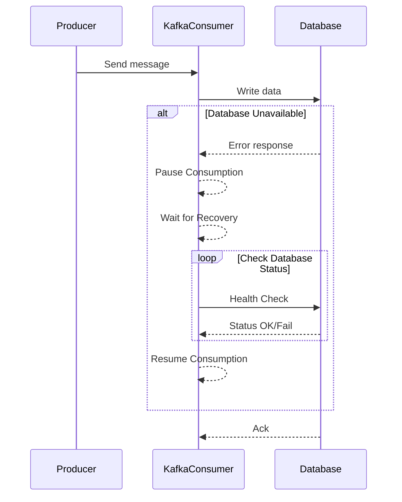

## Introduction

The "Pause and Resume Processing" pattern is a robust strategy used in stream processing environments. This pattern ensures that when errors occur, particularly transient ones, processing can be paused to prevent data corruption or loss, and then resumed without manual intervention once the error conditions are addressed.

## Architectural Approach

### Motivation

In real-time data processing, systems often need to interact with various external services or databases. There can be situations where these external services become temporarily unavailable, leading to potential processing errors. Directly proceeding without handling these errors can lead to data inconsistencies or loss.

### Applicability

- When interacting with external systems prone to transient errors.
- In systems requiring high availability and correctness, such as financial data processing.
- When cost-effective error recovery is required over resource-intensive retries.

## Pattern Implementation

Implementing a Pause and Resume processing entails:

1. **Error Detection**:
   - Monitor streams for exceptions or unusual states (e.g., database connection failures).
   
2. **Pausing the Stream**:
   - Temporarily suspend the consumption until conditions normalize. In platforms like Apache Kafka, this can be implemented using Kafka client APIs where you can pause the message processing.

3. **Notification and Logging**:
   - Log the error state and notify the system for monitoring and alerting purposes.

4. **Conditional Resumption**:
   - Continuously check if the error condition has been resolved (e.g., database is available).
   - Upon resolution, automatically resume processing.

### Example Code

Below is a simplified example in Java using Apache Kafka's `Consumer` API:

```java
import org.apache.kafka.clients.consumer.Consumer;
import org.apache.kafka.clients.consumer.ConsumerRecords;

public class KafkaPauseResumeExample {

    private final Consumer<String, String> consumer;

    public KafkaPauseResumeExample(Consumer<String, String> consumer) {
        this.consumer = consumer;
    }

    public void processMessages() {
        while (true) {
            try {
                ConsumerRecords<String, String> records = consumer.poll(Duration.ofMillis(100));
                records.forEach(record -> {
                    try {
                        processRecord(record);
                    } catch (DatabaseUnavailableException e) {
                        consumer.pause(consumer.assignment());
                        waitForDatabaseRecovery();
                        consumer.resume(consumer.assignment());
                    }
                });
            } catch (Exception e) {
                // Log and handle unexpected exceptions
            }
        }
    }

    private void processRecord(ConsumerRecord<String, String> record) throws DatabaseUnavailableException {
        // Processing logic that might throw DatabaseUnavailableException
    }

    private void waitForDatabaseRecovery() {
        // Logic to wait for the database to become available
    }
}
```

## Diagram

Below is a Mermaid UML Sequence diagram visualizing the Pause and Resume Processing pattern in action:



## Related Patterns

- **Retry Pattern**: Re-attempting failed operations after a specified delay.
- **Circuit Breaker Pattern**: Prevents a series of failures from continuously affecting system performance by breaking faulty paths temporarily.

## Additional Resources

- [Apache Kafka Consumer API Documentation](https://kafka.apache.org/documentation/#consumerapi)
- "Building Streaming Applications" by Ben Stopford - A comprehensive guide on stream processing architectures.

## Summary

The Pause and Resume Processing pattern provides a pragmatic solution to handling external service failures in stream processing. By pausing and then resuming processing in response to transient errors, systems can enhance reliability and consistency, supporting more resilient data pipelines. Through integration with effective monitoring, this pattern ensures that failures are transient and self-healing without manual intervention.
