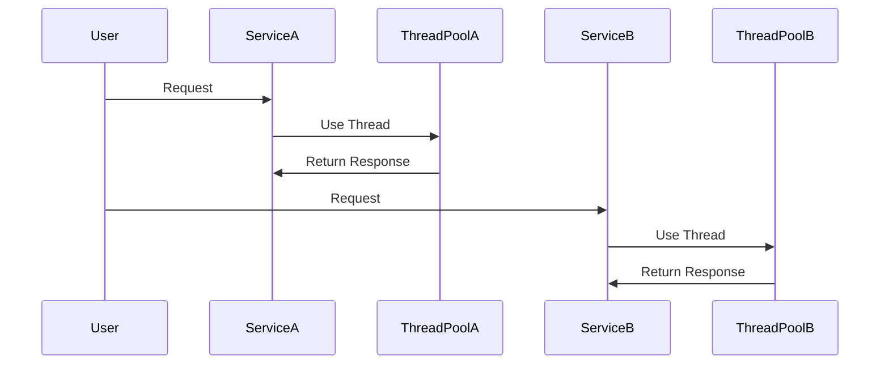

## Introduction

In the world of cloud computing and software architecture, achieving resilience is critical for keeping systems robust and reliable, especially under failure conditions. The Bulkhead Pattern is a potent tool designed to improve fault tolerance in distributed systems by dividing system resources into isolated groups, akin to the compartments of a ship designed to prevent water from flooding the entire vessel. This way, failure in one section does not cascade through the entire system.

## Detailed Explanation

### Conceptual Overview

The Bulkhead Pattern is inspired by shipbuilding practices where ships are built with multiple watertight compartments. If one compartment is breached, the others remain unaffected, keeping the vessel afloat. Translating this idea to software architecture means partitioning a system's resources to ensure that a failure in one part does not compromise the entire system.

### Key Principles

1. **Isolation**: Resources such as thread pools, memory, and database connections are partitioned. Each partition or "bulkhead" operates independently, safeguarding other parts from ripple failures.

2. **Resilience**: By isolating components, the system remains operational—even if one service experiences issues, other services unaffected by that particular issue continue to function.

3. **Resource Management**: Effective allocation of finite resources prevents resource starvation by ensuring no single component monopolizes critical system resources.

### Application in Architecture

In cloud-native applications, particularly those following a microservices architecture, the Bulkhead Pattern is especially effective. Here are some common implementations:

- **Thread Pool Isolation**: Allocate dedicated thread pools for different subsystems. A failure consuming up all threads in one pool will not impact another service's functionality.
  
- **Connection Pool Isolation**: Segregate database connections across different services or tenants. Isolation ensures that high traffic to one database does not drain connections for another.

- **Circuit Breakers**: Often used in conjunction with bulkheads, circuit breakers can limit the number of interactions attempted with failing services, further stabilizing the system.

### Implementation Example

Consider a microservices architecture where you perform isolated API calls for various third-party services:

```java
public class ApiBulkhead {
    private static final int THREAD_POOL_SIZE = 10;
    private static final ExecutorService bulkheadExecutor = Executors.newFixedThreadPool(THREAD_POOL_SIZE);

    public void executeApiCall(Runnable apiTask) {
        bulkheadExecutor.submit(apiTask);
    }

    public void shutdown() {
        bulkheadExecutor.shutdown();
    }
}
```

This example demonstrates how each third-party API can be handled independently, using separate thread pools. More intricate setups might use libraries like Hystrix or Resilience4j in a Spring Boot application.

### Diagram



## Related Patterns

- **Circuit Breaker Pattern**: Serves to prevent requests that are likely to fail, reducing the load on the service and avoiding failures.

- **Retry Pattern**: Implements re-invocation of failed services to improve reliability.

- **Timeout Pattern**: Defines a finite period for which to wait for service responses, supplementing bulkheads in preventing resource exhaustion.

## Best Practices

- **Proper Configuration**: Isolating resources with configuration tailored to each component's needs avoids over or under-provisioning.
  
- **Monitoring and Alerts**: Implement monitoring and logging to quickly identify and adjust resource allocations during unexpected loads or failures.

- **Dynamic Allocation**: Where feasible, automatically tuning resource pools based on runtime metrics can enhance resilience further.

## Additional Resources

- "[Release It!: Design and Deploy Production-Ready Software](https://www.goodreads.com/book/show/117099.Releasing)" by Michael T. Nygard, which explores resilient software architecture patterns.
  
- "[Resilience4j](https://resilience4j.readme.io/)" library: A reliable tool for resilience patterns customized for functional programming in Java, including Bulkhead support.

## Summary

The Bulkhead Pattern is a powerful design strategy for creating resilient cloud-based applications, particularly in environments that are subject to failure and fluctuations. By isolating resources and applying strategic architectural practices, software architects ensure continuity of service across complex and dynamic cloud infrastructures. This approach not only insulates the system against failures but also optimizes resource allocation, ultimately maximizing application reliability and scalability.
