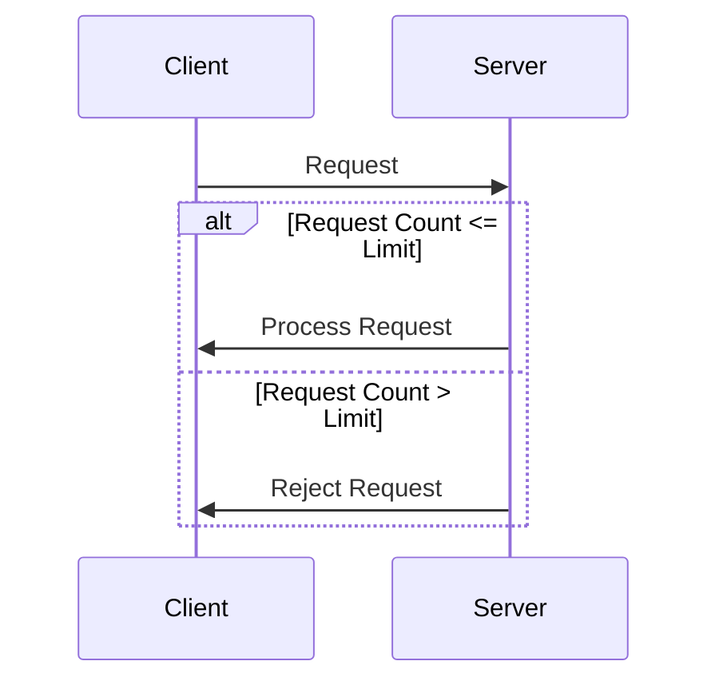

## Resource Limiting

### Description

Resource Limiting is a critical design pattern in cloud computing and stream processing systems that ensures the robust stability of applications by constraining the utilization of finite system resources. The primary objective of this pattern is to protect the system from resource exhaustion, which can lead to degraded performance, denial of service, or even system crashes.

### Architectural Approaches

Several architectural strategies can be employed for implementing the Resource Limiting pattern:

- **Rate Limiting**: Control the rate at which requests can be accommodated by the system, effectively managing the flow of incoming data or operations.
  
- **Concurrency Limits**: Set limits on the number of simultaneous operations, such as database connections or threads, to maintain optimal performance without overwhelming the system resources.

- **Quota Management**: Allocate predefined resource quotas per user, application, or service to ensure fair usage and prevent one entity from monopolizing the resources.

### Best Practices

- **Monitor Resource Usage**: Implement comprehensive logging and monitoring tools to track resource utilization and identify potential bottlenecks or overuse scenarios.

- **Adaptive Resource Limiting**: Utilize adaptive algorithms that dynamically adjust limits based on current load and performance metrics to optimize resource utilization while preventing overload.

- **Graceful Degradation**: Ensure systems degrade gracefully in response to reaching limits, by prioritizing essential functionality and downscaling non-critical operations.

### Example Code

Below is a simplified example for limiting concurrent HTTP requests in a web application using Java and the Semaphore class:

```java
import java.util.concurrent.Semaphore;

public class ResourceLimitedServer {
    private static final int MAX_CONCURRENT_REQUESTS = 10;
    private final Semaphore semaphore = new Semaphore(MAX_CONCURRENT_REQUESTS);

    public void handleRequest(Runnable requestHandler) {
        if (semaphore.tryAcquire()) {
            try {
                requestHandler.run();
            } finally {
                semaphore.release();
            }
        } else {
            rejectRequest();
        }
    }

    private void rejectRequest() {
        // Implement request rejection strategy here
        System.out.println("Request rejected due to resource limits.");
    }
}
```

### Diagrams

Here is a basic Mermaid sequence diagram illustrating the flow of rate limiting in a system:



### Related Patterns

- **Circuit Breaker Pattern**: Prevents the system from being overwhelmed by excessive requests by opening a "circuit" when a failure threshold is met.
  
- **Throttling Pattern**: Manages the rate of outbound requests to avoid overwhelming the downstream service.

- **Bulkhead Pattern**: Isolates different system components to prevent failure escalation and resource exhaustion.

### Additional Resources

- **[Rate Limiting Algorithms](https://en.wikipedia.org/wiki/Rate_limiting)**: Detailed overview and comparison of various algorithms used for rate limiting.
- **[Semaphore in Java](https://docs.oracle.com/javase/7/docs/api/java/util/concurrent/Semaphore.html)**: Official Java documentation on the Semaphore class used for managing concurrent access to a limited resource pool.

### Summary

Resource Limiting is a vital design pattern for ensuring cloud system stability and reliability by preventing resource overconsumption. By implementing limiters on resources like database connections or API requests, systems can maintain optimal performance, minimize downtime, and enhance user satisfaction.
