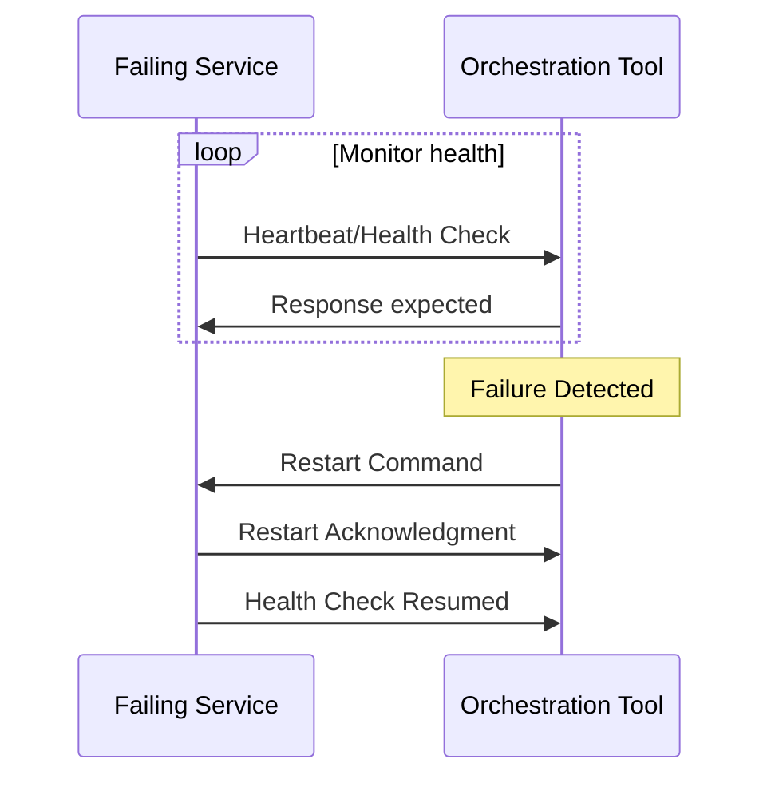

In today's dynamic and often unpredictable cloud and distributed computing environments, the ability to quickly recover from failures is vital. One effective strategy for maintaining high availability and resilience is the **Automatic Restart** pattern, which involves the automatic restarting of failed components or services. This feature is critical within stream processing design patterns, where processes need to handle ongoing data streams reliably.

## Architectural Overview

The Automatic Restart pattern is a recovery strategy often implemented using container orchestration tools such as Kubernetes, Docker Swarm, or Apache Mesos, which automatically handle the lifecycle management of containerized applications. When a service or component fails, these tools will detect the failure and restart the affected components, minimizing downtime and ensuring continuous operation.

### Key Concepts

- **Failure Detection**: Automatically identifying when a service or component has failed using health checks, logs, or monitoring tools.
  
- **Restart Logic**: Defining policies for when and how to restart failed services, which might include immediate restarts, delaying restarts after a sequence of failures, or switching to fallback mechanisms.

- **State Management**: Ensuring that any state required for services to resume operations is either recovered or reconstructed upon restart.

- **Integration with Deployment Platform**: Leveraging features of platforms like AWS Fargate, Google Kubernetes Engine (GKE), or Azure Kubernetes Service (AKS) to manage service lifecycles.

## Example Code

Below is a simple example of using a Kubernetes `Deployment` resource with a `livenessProbe` to automatically restart a pod that fails health checks.

```yaml
apiVersion: apps/v1
kind: Deployment
metadata:
  name: example-service
spec:
  replicas: 3
  selector:
    matchLabels:
      app: example-service
  template:
    metadata:
      labels:
        app: example-service
    spec:
      containers:
      - name: example-service-container
        image: example/service:latest
        livenessProbe:
          httpGet:
            path: /health
            port: 8080
          initialDelaySeconds: 5
          periodSeconds: 10
```

In this YAML definition, the `livenessProbe` instructs Kubernetes to check the health of the service at the `/health` endpoint every 10 seconds, starting 5 seconds after the container is created. If the health check fails, Kubernetes will automatically restart the container.

## Diagram

Here's how the automatic restart process functions using container orchestration in a simplified UML Sequence Diagram:



## Related Patterns

- **Circuit Breaker Pattern**: Used to prevent cascading failures by temporarily stopping requests to a particular service if it fails repeatedly.

- **Bulkhead Pattern**: Segregates distinct aspects of an application to isolate failures and prevent them from affecting unrelated parts of the system.

- **Retry Pattern**: Attempts to recover from transient failures by retrying failed operations.

## Additional Resources

- [Kubernetes Patterns, Reusable Elements for Designing Cloud-Native Applications](https://www.oreilly.com/library/view/kubernetes-patterns/9781492050285/)
- [The Site Reliability Workbook: Practical Ways to Implement SRE](https://sre.google/workbook/)

## Summary

The Automatic Restart pattern is an essential component of robust and resilient stream processing systems, especially when dealing with large-scale microservices architectures. By leveraging tools from distributed container orchestration platforms, you can ensure that failures are managed seamlessly, maintaining the continuity and reliability of your services. The adoption of this pattern, in combination with other error-handling mechanisms such as Circuit Breaker and Retry patterns, facilitates the creation of a fault-tolerant cloud-native environment.
