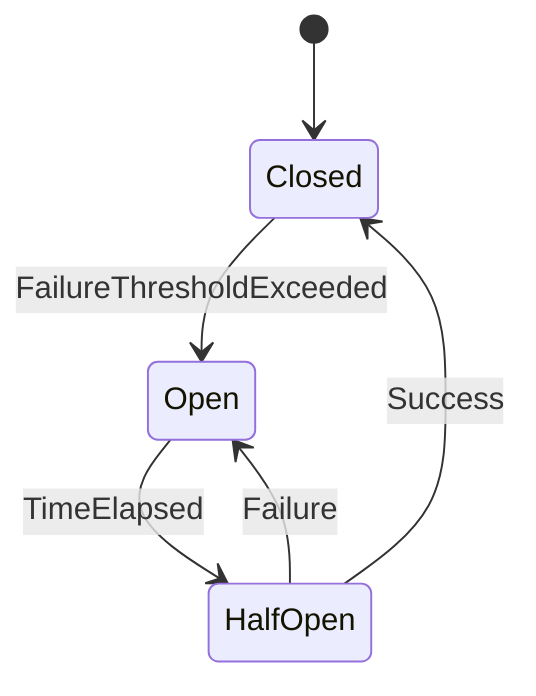

### Introduction

In modern distributed systems, particularly those employing stream processing, fault tolerance and resilience are key attributes. The Circuit Breaker is a design pattern used to detect failures and encapsulate the logic of preventing a failure from continuously recurring while dealing with unexpected system errors. This pattern helps maintain the availability of processing nodes by managing failures efficiently and preventing the entire system from collapsing.

### Detailed Explanation

#### Circuit Breaker States

1. **Closed**: Operations proceed as normal. The Circuit Breaker monitors for failures and counts the number of recent failures.
2. **Open**: Operations are short-circuited; this stops the flow and allows the system to rest, preventing further overloads. Open is triggered when failures surpass a pre-defined threshold.
3. **Half-Open**: A trial period where a limited number of calls are allowed. This determines if the underlying issue has been resolved.

The transition between these states is driven by logic that evaluates both immediate and historical health of communication paths or components under test.

#### Architectural Approaches

- **Failure Detection**: Automatically monitor the success and failure metrics for operations. 
- **State Management**: Use a state machine to track the circuit’s condition. This can implement in-memory states using non-blocking data structures for high-frequency updates.
- **Fallback Strategies**: Graceful degradation or alternative responses during failure conditions can ensure continuity of service.
- **Timeout Control**: Define precise timeout settings for responses from external services to prevent slow accumulations of failure.

### Best Practices

- **Threshold Configuration**: Properly configure failure thresholds and recovery policies. Choose thresholds and time-to-reset carefully to balance false positives and rapid recovery.
- **Monitoring**: Implement sufficient logging and monitoring to understand why the circuit breaker trips.
- **Dynamic Tuning**: Implement logic to dynamically adjust thresholds based on current operating conditions and historical data.

### Example Code

Here's a simple example in Java using Netflix Hystrix to implement Circuit Breaker:

```java
import com.netflix.hystrix.HystrixCommand;
import com.netflix.hystrix.HystrixCommandGroupKey;

public class CommandHelloWorld extends HystrixCommand<String> {

    private final String name;

    public CommandHelloWorld(String name) {
        super(HystrixCommandGroupKey.Factory.asKey("ExampleGroup"));
        this.name = name;
    }

    @Override
    protected String run() {
        // Simulate remote call or computation
        return "Hello " + name + "!";
    }

    @Override
    protected String getFallback() {
        // Fallback response
        return "Fallback Hello " + name + "!";
    }
}
```

### Diagrams

Using Mermaid UML to describe the state transitions of Circuit Breaker:



### Related Patterns

- **Retry Pattern**: Works alongside the Circuit Breaker to attempt call recovery by retrying operations.
- **Bulkhead Pattern**: Provides isolation of different processing lanes, reducing risk of failure propagation.
- **Timeout Pattern**: Supports the Circuit Breaker by setting operation time restrictions to prevent long waits.

### Additional Resources

- *Microservices Patterns* by Chris Richardson
- Netflix Hystrix: https://github.com/Netflix/Hystrix
- Resilience4j: https://resilience4j.readme.io/

### Summary

The Circuit Breaker pattern is invaluable for building resilient and responsive microservices architectures. It helps prevent a cascading failure in distributed systems by halting operations during critical failure periods to enable recovery. Properly implemented, it can enhance system resilience, leading to improved user experience and stability.

Incorporating the Circuit Breaker into your system requires careful consideration of its configuration and integration with other error handling patterns to maximize its efficacy.
