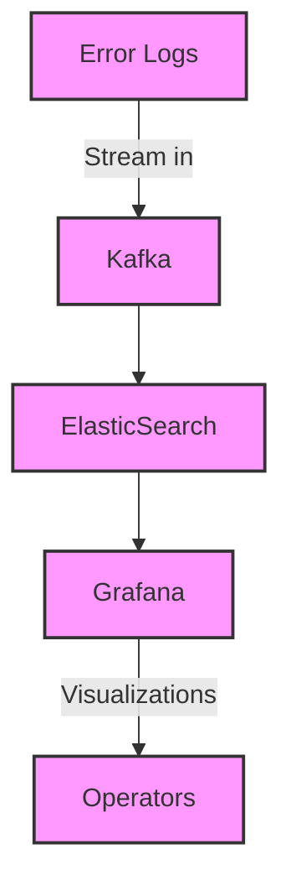

---

linkTitle: "Error Visualizations"
title: "Error Visualizations: Tracking and Managing Errors in Real-Time Systems"
category: "Error Handling and Recovery Patterns"
series: "Stream Processing Design Patterns"
description: "Utilizing dashboards or visual tools to monitor and analyze error occurrences and patterns in real-time processing systems, helping in proactive error management and recovery."
categories:
- stream-processing
- error-handling
- data-visualization
tags:
- error-management
- real-time-monitoring
- dashboards
- data-analytics
- proactive-recovery
date: 2024-07-07
type: docs

canonical: "https://softwarepatternslexicon.com/101/9/30"
license: "© 2024 Tokenizer Inc. CC BY-NC-SA 4.0"
---

## Overview

In distributed and real-time processing systems, errors can impact system performance and data accuracy, leading to potential business disruptions. The "Error Visualizations" pattern helps teams monitor and manage errors using visual tools and dashboards. These tools provide insights into error rates, occurrences, and patterns, enabling proactive management and recovery strategies.

## Design Pattern Category

This pattern is part of the "Error Handling and Recovery Patterns" category within the broader "Stream Processing Design Patterns" series, focusing on maintaining data integrity and system reliability in the face of errors.

## Objectives

- **Real-Time Monitoring**: Enable teams to observe error occurrences as they happen.
- **Historical Analysis**: Offer insights into historical error trends to identify recurring issues.
- **Decision Making**: Aid in making informed decisions for error management and prevention.
- **Alerting**: Support timely alerts and notifications when anomalies are detected.

## Architectural Approaches

### 1. Using Monitoring Tools
Implement monitoring tools like Prometheus, Grafana, or Kibana that ingest logs and error reports in real-time. Integrate these tools with your application log streams to capture detailed error information.

### 2. Dashboard Creation
Create tailored dashboards that display key metrics and visualizations, such as error rates over time, error type distribution, and geographic error occurrence if applicable.

### 3. Anomaly Detection
Incorporate machine learning models to detect and highlight anomalies within error patterns, alerting teams to unexpected spikes or changes.

### 4. Integration with Alerting Systems
Link dashboards to alerting systems (e.g., PagerDuty, Slack alerts) to notify teams immediately of significant issues requiring immediate attention.

## Example Implementation

Utilize a combination of Kafka for processing streams of error logs and Grafana for visualization. The process involves:

- **Kafka**: Consume error logs using Kafka consumers.
- **ElasticSearch**: Store logs in ElasticSearch for easy querying and aggregation.
- **Grafana**: Visualize data with custom dashboards to track error rates, identify patterns, and understand trends over time.

```json
{
  "errorType": "ServiceUnavailable",
  "timestamp": "2024-07-06T14:23:00Z",
  "service": "AuthService",
  "message": "Failed to reach external service",
  "details": {
    "retryAttempts": 3,
    "clientIP": "192.168.1.100"
  }
}
```

## Diagrams



## Related Patterns

- **Retry Pattern**: Automatically retry operations that failed due to transient issues.
- **Circuit Breaker Pattern**: Prevent repeated errors from cascading and overwhelming the system by temporarily halting requests until resiliency is restored.
- **Compensating Transaction Pattern**: Provide alternatives for failed operations to ensure data consistency.

## Additional Resources

- [Prometheus Monitoring](https://prometheus.io/docs/introduction/overview/)
- [Grafana Dashboards](https://grafana.com/docs/grafana/latest/)
- [ELK Stack Documentation](https://www.elastic.co/guide/index.html)

## Summary

Error Visualizations empower engineering teams to mitigate and respond to errors proactively by providing comprehensive and real-time insights into error phenomena across systems. By integrating visualization tools with active monitoring solutions, businesses can prevent minor issues from snowballing into major incidents, ensuring smoother operations and better user experiences.
