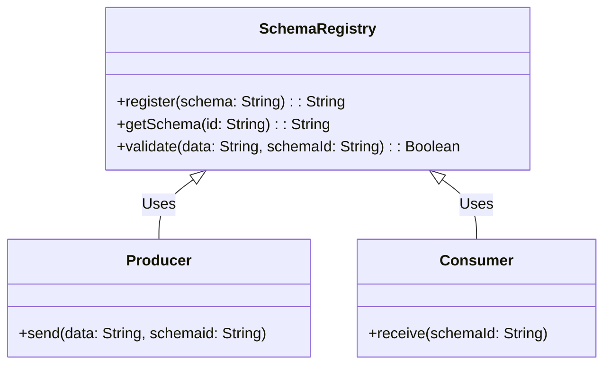

## Overview

In the realm of stream processing systems, ensuring the integrity and correctness of streaming data is vital. Data Validation Schemas serve as a blueprint that defines the structural format and permissible values of data. By utilizing schemas such as Avro or JSON Schema, developers can validate incoming message formats, thus safeguarding the system from processing malformed data and enhancing reliability.

## Detailed Explanation

### Architectural Approach

- **Schema Definition**: The first step involves defining a rigid schema for your data. Schemas take shape as JSON documents that stipulate the required data types, fields, and optional constraints such as minimum and maximum values for numeric fields.
  
- **Enforcing Schemas**: Implement middleware or processing stages that enforce these schemas. When data enters the system, it’s validated against the defined schema. If it diverges from the schema, the data is rejected or flagged for error handling purposes.

- **Schema Evolution**: Data evolves over time, and the ability to adapt to changing schemas without interrupting service is crucial. Strategies such as backward compatibility, where new fields can be added without affecting the existing structure, or optional fields that don’t require immediate changes, are implemented.

### Paradigms and Tools

- **Message Format Representation**: Use Avro or Parquet for binary serialization, offering compact and fast serialization of massive data. JSON Schema is more human-readable and often used for its flexibility and ease of integration into web-based systems.

- **Schema Registry**: Implement a centralized Schema Registry, like Confluent's Schema Registry for Kafka, to act as a repository for all schema versions. This ensures schema consistency across producers and consumers.

## Example Code

Here's a simple example of using JSON Schema for validation in a Node.js application:

```javascript
const Ajv = require('ajv');
const ajv = new Ajv();

const schema = {
  type: "object",
  properties: {
    id: { type: "integer" },
    name: { type: "string" },
    email: { type: "string", format: "email" }
  },
  required: ["id", "name", "email"]
};

const validate = ajv.compile(schema);

const data = {
  id: 123,
  name: "John Doe",
  email: "john.doe@example.com"
};

const valid = validate(data);
if (!valid) console.log(validate.errors);
else console.log("Data is valid.");
```

## Mermaid UML Class Diagram

Here's an illustration of a simple schema registry interaction using a Class Diagram:



## Related Patterns

- **Schema Evolution Patterns**: Strategies to manage changing schemas over time, including versioning and compatibility approaches.

- **Schema Enforcement Gateways**: Dedicated components that act as entry and enforce schemas before data is further processed.

## Additional Resources

- [Confluent's Schema Registry Documentation](https://docs.confluent.io/platform/current/schema-registry/index.html)
- [JSON Schema Official Website](https://json-schema.org/)

## Final Summary

Data Validation Schemas are an indispensable design pattern in stream processing architectures, ensuring data consistency and integrity. By enforcing schemas, systems can mitigate data-related errors and enhance reliability. The adoption of Schema Registries, coupled with tools like Avro and JSON Schema, provides a robust framework for data validation, evolving gracefully as data structures change over time.
