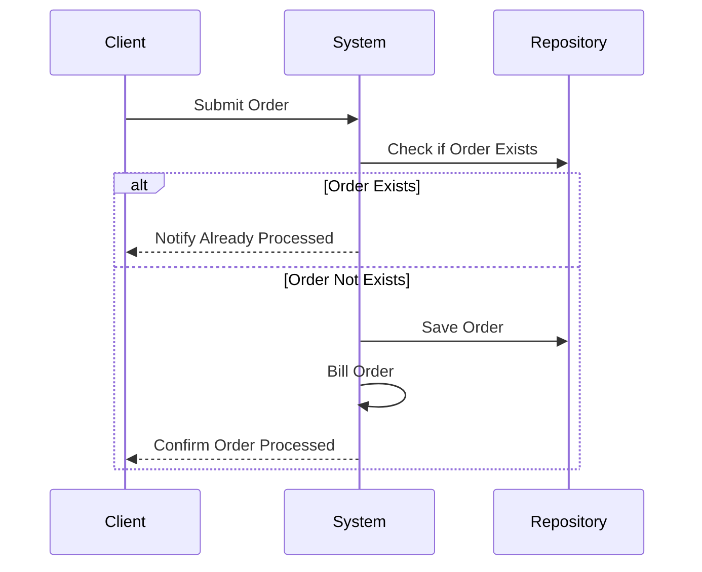

## Introduction

In the world of distributed systems and cloud computing, ensuring the robustness of operations in the face of unexpected failures and retries is paramount. The Idempotent Processing pattern is an essential strategy that guarantees operations can be repeated safely, preventing inadvertent side effects such as duplicate entries, charges, or updates. This pattern is particularly significant when dealing with streams, message queues, and external service interactions where failures happen frequently, and retries are the norm.

## Key Concepts and Principles

**Idempotency**: An operation is idempotent if performing it multiple times has the same effect as performing it once. The outcome should remain consistent regardless of how many times the action is repeated.

### Importance

- **Error Resilience**: Systems can maintain consistency by safely handling retries on failure.
- **Data Integrity**: Protects against issues like double billing, duplicate records, and incorrect data states.
- **Simplification of Retry Logic**: Reduces complexity when implementing retry strategies.

## Architectural Approach

**Designing Idempotent Operations**:

1. **Unique Identifiers**: Use unique identifiers to track operations. For example, transactions can use a `transaction_id` to ensure processing uniqueness.
   
2. **State Inspection Before Action**: Check the current state before making changes. If the intended change has already been applied, the operation can be safely skipped.

3. **Use of Conditional Logic**: For example, `INSERT ... ON CONFLICT DO NOTHING` in SQL ensures that duplicate entries are not created.

4. **Stateless Designs**: Leverage designs that do not depend on previous operations, allowing each operation to be independently verified and repeated safely.

## Code Example

Here's an example of ensuring idempotency when processing orders in a web application:

```java
public void processOrder(Order order) {
    if (!orderRepository.existsById(order.getId())) {
        orderRepository.save(order);
        billingService.bill(order);
    } else {
        System.out.println("Order has already been processed.");
    }
}
```

In this code snippet, an order is processed only if it hasn't been processed before, ensuring idempotency through a check with the repository.

## UML Sequence Diagram



## Related Patterns

- **Retry Pattern**: Works with idempotent operations to safely repeat failed operations.
- **Compensating Transaction**: Involves undoing the effects of an operation, often in cases where idempotency cannot be enforced.

## Additional Resources

- [Designing Distributed Systems by Brendan Burns](https://www.amazon.com/Designing-Distributed-Systems-Patterns-Architecture/dp/1491983647)
- [RESTful Web APIs Patterns, Principles, and Best Practices by Ronnie Mitra](https://www.amazon.com/RESTful-Web-APIs-Patterns-Principles/dp/1788999337)
- Martin Fowler's Article on [Idempotency Patterns](https://martinfowler.com/articles/patterns-of-distributed-systems/idempotency.html)

## Summary

The Idempotent Processing pattern is a vital component of building resilient and reliable distributed systems. By ensuring operations can be safely repeated, organizations can mitigate risks associated with retries and duplicates. This pattern streamlines error handling, preserves data integrity, and complements other patterns like retry mechanisms and compensating transactions. Understanding and implementing idempotency is crucial when designing robust cloud-native applications.
