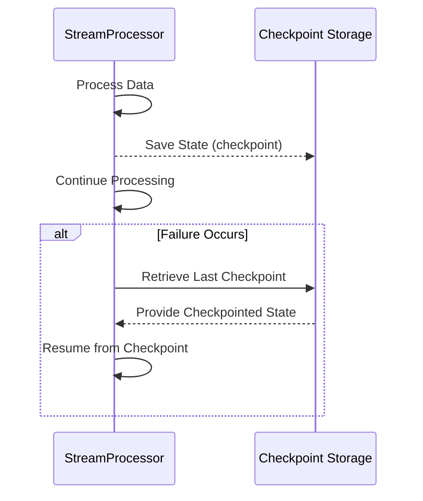

---

linkTitle: "Checkpointing"
title: "Checkpointing: Robust State Management in Stream Processing"
category: "Error Handling and Recovery Patterns"
series: "Stream Processing Design Patterns"
description: "Checkpointing is an error recovery pattern that involves periodically saving the processing state in stream processing systems to enable recovery from failures and ensure data integrity."
categories:
- Error Handling
- Recovery Patterns
- Stream Processing
tags:
- checkpointing
- fault-tolerance
- stream-processing
- state-management
- data-integrity
date: 2024-07-07
type: docs

canonical: "https://softwarepatternslexicon.com/101/9/6"
license: "© 2024 Tokenizer Inc. CC BY-NC-SA 4.0"
---

## Checkpointing

Checkpointing is an essential pattern in error handling and recovery within stream processing systems. It involves periodically saving the state of processing, such as processed data, offsets, or computational states, to enable the system to recover from failures and continue processing without losing data or duplicating results.

### Detailed Explanation

In distributed stream processing systems, the risk of nodes or processes failing is ever-present. To mitigate the effects of such failures, checkpointing mechanisms are employed. A system implementing checkpointing will intermittently capture and persist the current state of a processing task. Should the system experience a failure, it can resume operations from the last checkpoint, minimizing data loss and ensuring consistency.

Checkpointing is advantageous in various scenarios:

1. **Fault-Tolerance**: It provides a mechanism to recover from unexpected system failures while preserving the exact state before the failure.
2. **Consistency**: Checkpoints ensure that stateful computations can maintain strong or eventual consistency, depending on the configuration.
3. **Performance**: By adjusting checkpoint intervals, systems can balance between overhead and recovery speed.

### Example

Consider a real-time messaging system, such as Apache Kafka, where messages are consumed and processed from a stream. Using checkpointing:

- The system can record offsets of consumed messages. 
- In case of a failure, the consumer can resume processing from the most recent checkpoint without re-reading all messages from the beginning.

```scala
val ssc = new StreamingContext(conf, Seconds(10))

// Setting up checkpointing
ssc.checkpoint("hdfs://checkpoints")

// Assuming a stream of data with stateful transformation
val incomingStream = ...
val updatedStream = incomingStream.updateStateByKey(updateFunction)

// Start the computation
ssc.start()
ssc.awaitTermination()
```

This Scala snippet demonstrates setting up checkpointing in Spark Streaming to maintain state across batch intervals, ensuring the ability to recover seamlessly during node failures.

### Diagrams

Below is a simple Mermaid sequence diagram illustrating the checkpointing process:



### Related Patterns

- **Stateful Stream Processing**: A pattern focusing on maintaining state across events within stream processing tasks, often leveraging checkpointing for durability.
- **Event Sourcing**: Storing all changes to an application state as a sequence of events, providing another layer for state recovery.

### Additional Resources

- "Stream Processing with Apache Flink" by Fabian Hueske
- "Kafka: The Definitive Guide" by Neha Narkhede, Gwen Shapira, and Todd Palino

### Summary

Checkpointing is a fundamental design pattern for implementing fault-tolerance and state recovery in stream processing systems. It ensures data consistency and reliability despite failures, allowing for scalable, resilient designs in distributed systems. By periodically saving state, systems can recover quickly and seamlessly, preventing data loss and duplication. Configuring an appropriate checkpointing strategy is crucial for maintaining performance while achieving desired reliability.


