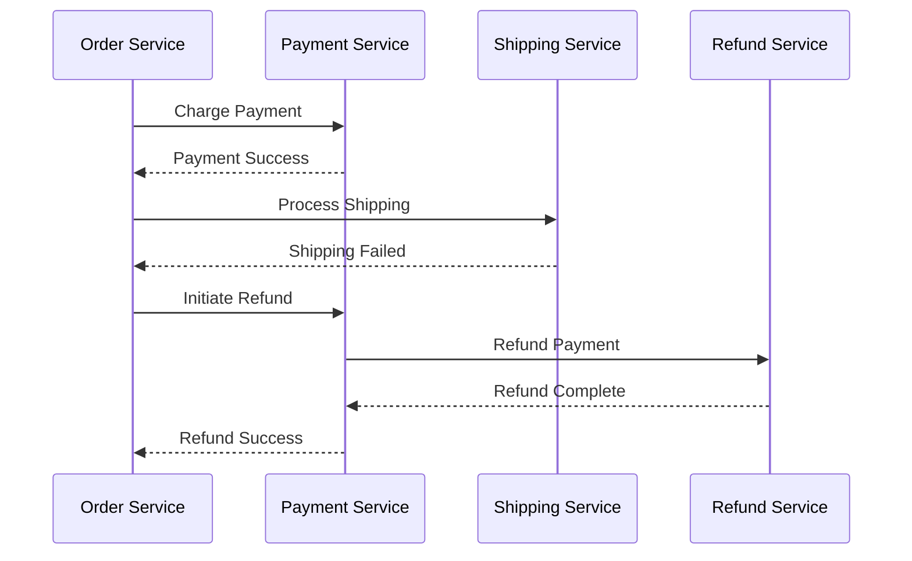

## Introduction to Compensating Transactions

In distributed systems and microservices architectures, the integrity and consistency of operations that span different services or systems can be challenging to maintain. Often, we deal with multiple services performing operations as part of a single logical unit. When one of these operations fails, it's crucial to revert the system to a consistent state. This is where **Compensating Transactions** come into play.

## Design Pattern Description

Compensating Transactions are a key pattern within error handling and recovery. They involve executing specific compensatory actions to offset or reverse changes made by completed operations when subsequent steps in a process fail. This approach is essential in environments where atomic transactions covering all operations aren't feasible.

A common example is a multi-step financial transaction where an initial payment is made, and a failure occurs subsequently during product availability updating or shipping arrangements. To maintain consistency, the payment should be rolled back by issuing a refund, which is a compensating transaction.

## Architectural Approach

Compensating transactions require careful design considerations to ensure that reversible operations can be performed cleanly and reliably. Here are some approaches to architecting compensulating transactions:

### 1. **Define Idempotent Operations**

Ensure that operations can be safely repeated without causing undesired effects. This enables the compensating actions to be retried in the event of a partial failure or intermittent issue.

### 2. **Use Sagas for Coordination**

The Saga pattern is an excellent fit here, allowing long-running transactions to be coordinated without requiring centralized control. Each service executes its operation and provides a compensating transaction in case of failure.

Mermaid Sequence Diagram Example:


### 3. **Log and Audit**

Maintain logs of operations to track completed actions and guide compensatory measures. This not only provides traceability but also facilitates audits and debugging.

## Example Code

Consider a hypothetical language-agnostic pseudocode implementing a compensating transaction:

```plaintext
try:
    pay(payment_details)
    update_order_status("paid")
    initiate_shipping(order_id)
except ShippingFailure as e:
    log_error(e)
    issue_refund(payment_details)
    notify_user_of_failure()
```

## Related Patterns

- **Retry Pattern**: Attempt an operation periodically until it succeeds, with limitations based on failure scenarios.
- **Circuit Breaker**: Prevents an application from performing operations likely to fail, providing an immediate response and time for other services to recover.
- **Saga Pattern**: Coordinates distributed transactions where compensating transactions are part of the inherent design.

## Additional Resources

- [Microservices Patterns Book](https://microservices.io/patterns/)
- [Designing Data-Intensive Applications by Martin Kleppmann](https://dataintensive.net/)
- [Cloud Design Patterns on CSPs](https://docs.microsoft.com/en-us/azure/architecture/patterns/)

## Summary

Compensating Transactions are vital for ensuring the consistency and reliability of distributed systems where operations cannot be contained in a single transaction scope. This pattern not only assists in error recovery but also bolsters system robustness in microservices and cloud environments. By defining clear processes and accommodating the asynchronous nature of distributed systems, Compensating Transactions provide a practical path to maintain integrity through potential failures.
