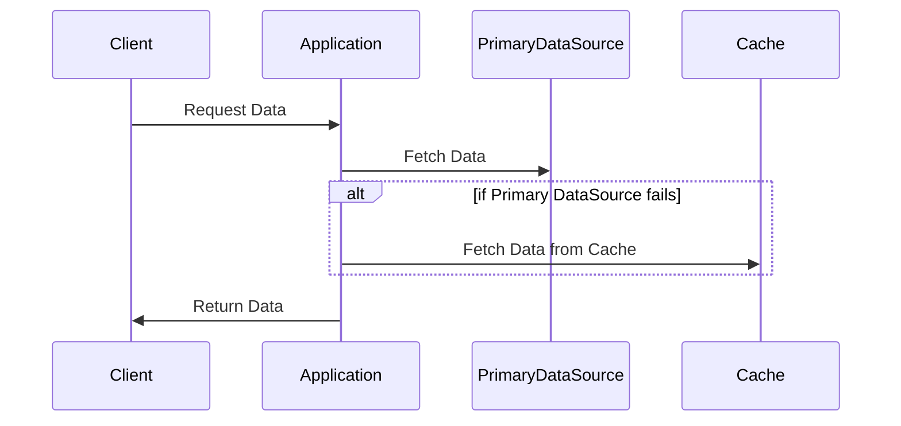

## Introduction

In distributed and stream processing systems, failures are inevitable. The Fallback Procedures design pattern addresses the need for systems to gracefully handle failures by providing alternative processing paths. When the primary processing method encounters an issue, systems can switch to these predefined alternatives, thereby ensuring resilience and maintaining operations without interruptions.

## Architectural Approaches

### 1. Cache Fallback

A common approach is to maintain a cache that acts as an emergency data source. When the primary database or service is unavailable, the application retrieves necessary data from the cache.

- **Implementation**: Use in-memory or distributed caches such as Redis or Memcached.
- **Considerations**: Ensure cache consistency and determine an appropriate cache expiration strategy.

### 2. Circuit Breaker Pattern Integration

The Circuit Breaker Pattern can complement fallback procedures by monitoring failures and preventing repeated attempts when a component is known to be down.

- **Implementation**: Integrate with tools like Hystrix or Resilience4j.
- **Considerations**: Set thresholds for triggering fallback operations.

### 3. Redundant Service Providers

Establish multiple service providers to ensure that if one service fails, alternative providers shoulder the load.

- **Implementation**: Use service mesh technologies such as Istio or Linkerd.
- **Considerations**: Coordinate among providers to prevent overload and maintain data integrity.

## Paradigms and Best Practices

- **Graceful Degradation**: Always aim to reduce service quality rather than complete service failure. This can mean lower data precision or data staleness.
- **Monitoring and Alerts**: Use monitoring tools to alert operators to fallback activations and underlying issues.
- **Data Staleness Management**: Balance between using consistent, fresh data and stale data retrieved quickly from caches.

## Example Code

Below is an illustration of a basic fallback mechanism in Java, using a cached data source when primary source access fails:

```java
public class DataService {

    private DatabaseService primaryDatabase;
    private CacheService cacheService;

    public DataService(DatabaseService primaryDatabase, CacheService cacheService) {
        this.primaryDatabase = primaryDatabase;
        this.cacheService = cacheService;
    }

    public Data getData(String id) {
        try {
            // Attempt to fetch data from the primary data source
            return primaryDatabase.getData(id);
        } catch (DatabaseConnectionException e) {
            // Fallback to the cache service
            return cacheService.getData(id);
        }
    }
}
```

## Diagrams

A basic UML Sequence Diagram showing fallback procedure:



## Related Patterns with Descriptions

1. **Circuit Breaker Pattern**: Avoid retrying operations or requesting services likely to fail, while detecting failures early.
  
2. **Retry Pattern**: Allows retrying a specific operation a predefined number of times before failing permanently.

3. **Bulkhead Pattern**: Isolates different parts of a system to prevent a failure from cascading across the entire system.

## Additional Resources

- **Book**: "Designing Data-Intensive Applications" by Martin Kleppmann
- **Documentation**: Resilience4j [documentation](http://resilience4j.readme.io/)
- **API Reference**: Hystrix [GitHub Repository](https://github.com/Netflix/Hystrix)

## Summary

The Fallback Procedures pattern is essential in the architecture of resilient distributed systems. By incorporating alternate processing paths, such as caches or redundant services, systems achieve fault tolerance. However, successful implementation requires careful consideration of consistency, monitoring, and integration with other patterns like Circuit Breakers and Bulkheads. Emphasizing seamless user experience despite underlying disruptions, this pattern supports ongoing service delivery and system reliability.
